# Agent instructions

## Index

- [Research discipline](#research-discipline)
- [CLI usage](#cli-usage)
- [Grapher](#grapher)
- [Research ledgers](#research-ledgers)
- [Epistemic rule](#epistemic-rule)
- [Appendix — Process flow](#appendix--process-flow)

## Research discipline

Dreadnought is being developed as both software and a research study. Preserve both machine-readable provenance and a human-readable development record. Follow [`docs/DIAGRAM_STANDARD.md`](docs/DIAGRAM_STANDARD.md) for documentation diagrams and commit provenance, and [`docs/ARCHITECTURE.md`](docs/ARCHITECTURE.md) for the root component/trust-boundary map. [Process map](#appendix--process-flow)

## CLI usage

Before invoking or scripting Dreadnought commands, read [`docs/CLI_USAGE.md`](docs/CLI_USAGE.md). It is the shared human/agent operational reference for command families, typed artifact locations, validation, protocol ingest, Project Arm dispatch, scratch requirements, adapter tokens, exit codes, and authority boundaries. The parser in [`src/dreadnought/cli.py`](src/dreadnought/cli.py) is executable authority for available flags; if `--help` differs from the guide, update the guide in the same change set. Do not infer that `init`, successful process exit, or protocol ingestion means acceptance or closure. [Process map](#appendix--process-flow)

## Grapher

**Mandatory repository rule: always use Grapher for repository work.** At the start of every change, inspect the repository's Grapher state before re-deriving project knowledge. Before a substantive code, documentation, configuration, workflow, or governance change is considered complete, invoke the repository-supported Grapher mutation path to record the durable decision, discovery, implementation result, evidence, or supersession created by that work.

For this repository, canonical state is `.grapher/knowledge.json` with append-only mutation history in `.grapher/history.jsonl`. A valid change set must modify both through Grapher. Do not directly hand-author canonical Grapher JSON as a normal change path. Hand-authored files under `.grapher/shared/`, pass records, commit messages, PR descriptions, or chat statements are publication/evidence only and **never substitute for actually invoking Grapher**. Direct repair of Grapher storage is allowed only as an explicit recovery operation and must itself be journaled with provenance.

CI must reject substantive changes when canonical Grapher state and structured Grapher mutation history do not advance. Record durable discoveries, decisions, evidence, and supersession through Grapher rather than relying on chat history alone. Do not rewrite finalized historical evidence to make later conclusions look cleaner. [Process map](#appendix--process-flow)

## Research ledgers

For substantive changes, update the appropriate file in `docs/`: `DEVELOPMENT_LEDGER.md`, `DECISION_LEDGER.md`, `EXPERIMENT_LEDGER.md`, `FAILURE_LEDGER.md`, and any specialized ledger listed in [`docs/INDEX.md`](docs/INDEX.md). New durable Markdown must be indexed, contain its own index, and include a provenance-bearing Mermaid process-flow appendix. Architecture-bearing documents must also include an architecture diagram linked to the root architecture. Process nodes representing implementation must identify concrete `code:` paths in addition to `inception:` and `current:` hashes. Use UTC and local time when practical. Reference commit hashes, PRs, Grapher node IDs, and external evidence where available. Do not invent missing timestamps or provenance. [Process map](#appendix--process-flow)

## Epistemic rule

Structured machine state and human commentary are distinct. Natural-language notes are useful for humans but must not silently become authoritative claims. Machine-significant claims must use normalized schema-backed records. [Process map](#appendix--process-flow)

## Appendix — Process flow

```mermaid
flowchart LR
    I["Inspect project knowledge\ncode: src/dreadnought/grapher.py\ninception: 96725840db44eef1d982b32376c69be3050cba3d\ncurrent: governance/always-use-grapher"] --> W["Use documented CLI contract\ncode: src/dreadnought/cli.py\ninception: 2ddda47a622cc66b90e4a5ec65ea09262e002644\ncurrent: governance/always-use-grapher"]
    W --> P["Perform repository change\ncode: src/dreadnought/protocol.py; src/dreadnought/verify.py\ninception: d6692863d9d43372f3fffc7b5c6fb821b6dafee1\ncurrent: governance/always-use-grapher"]
    P --> G["Invoke Grapher canonical mutation\ncode: src/dreadnought/grapher.py\ninception: 4630ac84da52677b343e7a3737844da683b25202\ncurrent: governance/always-use-grapher"]
    G --> C["CI verifies canonical graph + structured history\ncode: .github/workflows/test.yml\ninception: 05ca003b02385472f15a16911350c8f4b9683304\ncurrent: governance/always-use-grapher"]
    C --> D["Publish shared evidence + human ledger\ncode: tests/test_documentation.py\ninception: 96725840db44eef1d982b32376c69be3050cba3d\ncurrent: governance/always-use-grapher"]
```

Commit references: [research substrate](https://github.com/seanbman/dreadnought/commit/96725840db44eef1d982b32376c69be3050cba3d), [mission/CLI contract](https://github.com/seanbman/dreadnought/commit/2ddda47a622cc66b90e4a5ec65ea09262e002644), [typed protocol](https://github.com/seanbman/dreadnought/commit/d6692863d9d43372f3fffc7b5c6fb821b6dafee1), [Grapher control plane](https://github.com/seanbman/dreadnought/commit/4630ac84da52677b343e7a3737844da683b25202), [original Grapher CI gate](https://github.com/seanbman/dreadnought/commit/05ca003b02385472f15a16911350c8f4b9683304).
