# Agent instructions

## Index

- [Research discipline](#research-discipline)
- [Grapher](#grapher)
- [Research ledgers](#research-ledgers)
- [Epistemic rule](#epistemic-rule)
- [Appendix — Process flow](#appendix--process-flow)

## Research discipline

Dreadnought is being developed as both software and a research study. Preserve both machine-readable provenance and a human-readable development record. Follow [`docs/DIAGRAM_STANDARD.md`](docs/DIAGRAM_STANDARD.md) for documentation diagrams and commit provenance. [Process map](#appendix--process-flow)

## Grapher

This repository uses Grapher at `.grapher/knowledge.json`. At the start of substantive work, inspect Grapher before re-deriving project knowledge. Record durable discoveries, decisions, evidence, and supersession through Grapher rather than relying on chat history alone. Do not rewrite finalized historical evidence to make later conclusions look cleaner. [Process map](#appendix--process-flow)

## Research ledgers

For substantive changes, update the appropriate file in `docs/`: `DEVELOPMENT_LEDGER.md`, `DECISION_LEDGER.md`, `EXPERIMENT_LEDGER.md`, `FAILURE_LEDGER.md`, and any specialized ledger listed in [`docs/INDEX.md`](docs/INDEX.md). New durable Markdown must be indexed, contain its own index, and include a provenance-bearing Mermaid process-flow appendix. Use UTC and local time when practical. Reference commit hashes, PRs, Grapher node IDs, and external evidence where available. Do not invent missing timestamps or provenance. [Process map](#appendix--process-flow)

## Epistemic rule

Structured machine state and human commentary are distinct. Natural-language notes are useful for humans but must not silently become authoritative claims. Machine-significant claims must use normalized schema-backed records. [Process map](#appendix--process-flow)

## Appendix — Process flow

```mermaid
flowchart LR
    I["Inspect project knowledge<br/>inception: 96725840db44eef1d982b32376c69be3050cba3d<br/>current: f8f40d1d072d0c37a1ba4d63c430a234339c1a54"] --> W["Perform bounded work<br/>inception: 2ddda47a622cc66b90e4a5ec65ea09262e002644<br/>current: f8f40d1d072d0c37a1ba4d63c430a234339c1a54"]
    W --> P["Typed protocol / evidence<br/>inception: d6692863d9d43372f3fffc7b5c6fb821b6dafee1<br/>current: f8f40d1d072d0c37a1ba4d63c430a234339c1a54"]
    P --> G["Canonical Grapher write<br/>inception: 4630ac84da52677b343e7a3737844da683b25202<br/>current: f8f40d1d072d0c37a1ba4d63c430a234339c1a54"]
    G --> D["Human ledger + indexed docs<br/>inception: 96725840db44eef1d982b32376c69be3050cba3d<br/>current: f8f40d1d072d0c37a1ba4d63c430a234339c1a54"]
```

Commit references: [research substrate](https://github.com/seanbman/dreadnought/commit/96725840db44eef1d982b32376c69be3050cba3d), [mission contract](https://github.com/seanbman/dreadnought/commit/2ddda47a622cc66b90e4a5ec65ea09262e002644), [typed protocol](https://github.com/seanbman/dreadnought/commit/d6692863d9d43372f3fffc7b5c6fb821b6dafee1), [Grapher control plane](https://github.com/seanbman/dreadnought/commit/4630ac84da52677b343e7a3737844da683b25202), [current snapshot](https://github.com/seanbman/dreadnought/commit/f8f40d1d072d0c37a1ba4d63c430a234339c1a54).
