# Dreadnought

Dreadnought is an experimental agent control plane for turning human intent into bounded, inspectable agent work. It separates mission authority, execution, agent testimony, independent observation, verification, and durable knowledge instead of treating an agent's prose as trusted state.

**Current public beta: v0.2.0b1**  
**Matched Grapher compatibility line: v0.7.0b1**

## Index

- [Quick start — Linux](#quick-start--linux)
- [Start here](#start-here)
- [Mental model](#mental-model)
- [Minimal controlled workflow](#minimal-controlled-workflow)
- [Dreadnought and Grapher](#dreadnought-and-grapher)
- [Updating](#updating)
- [Current beta boundary](#current-beta-boundary)
- [Documentation and governance](#documentation-and-governance)
- [Appendix — Process flow](#appendix--process-flow)

## Quick start — Linux

Requires Python 3.10+.

```bash
curl -fsSL https://raw.githubusercontent.com/seanbman/dreadnought/main/install.sh | bash
export PATH="$HOME/.local/bin:$PATH"
dreadnought --version
```

Initialize Dreadnought-managed Grapher state in a project:

```bash
cd /path/to/project
dreadnought grapher init --root .
dreadnought grapher doctor --root .
```

The installer uses `~/.local/share/dreadnought/venv`, requires no `sudo`, and installs the matched Grapher dependency.

## Start here

| I want to… | Read |
|---|---|
| Install, update, or troubleshoot | [`docs/INSTALLATION_AND_UPDATES.md`](docs/INSTALLATION_AND_UPDATES.md) |
| Run a project end-to-end | [`docs/PROJECT_EXECUTION_TUTORIAL.md`](docs/PROJECT_EXECUTION_TUTORIAL.md) |
| Use interactive menu, agent chat, token accounting | [`docs/INTERACTIVE_CLI_AND_TOKEN_USAGE.md`](docs/INTERACTIVE_CLI_AND_TOKEN_USAGE.md) |
| Look up commands | [`docs/CLI_USAGE.md`](docs/CLI_USAGE.md) |
| Understand architecture/trust boundaries | [`docs/ARCHITECTURE.md`](docs/ARCHITECTURE.md) |
| Understand Dreadnought ↔ Grapher brokering | [`docs/GRAPHER_INTEGRATION.md`](docs/GRAPHER_INTEGRATION.md) |
| Browse all durable documentation | [`docs/INDEX.md`](docs/INDEX.md) |
| Contribute as a human or agent | [`AGENTS.md`](AGENTS.md) |

## Mental model

```text
Human intent
    ↓
Mission → Doctrine → Campaign → Order
    ↓
Project Arm / Sarcophagus execution
    ↓
typed agent testimony
    ↓
Dreadnought admission + authority boundary
    ↓
Grapher durable knowledge / truth / history
```

**Agent testimony is not automatically observer truth.** Dreadnought mediates admission and authority; Grapher owns canonical graph semantics, truth policy, semantic integrity, provenance, history, and publication.

## Minimal controlled workflow

```bash
MISSION_PATH="$(dreadnought mission init "Human directive" --root . --actor human:user)"
MISSION_ID="$(basename "$MISSION_PATH" .json)"
dreadnought grapher query "known failures" --root . --mission "$MISSION_ID" --limit 8
dreadnought protocol validate /path/to/record.json
dreadnought protocol ingest /path/to/record.json --root .
```

Use [`docs/PROJECT_EXECUTION_TUTORIAL.md`](docs/PROJECT_EXECUTION_TUTORIAL.md) for Doctrine, Campaign, Order, external scratch, Project Arm dispatch, verification, and publication.

## Dreadnought and Grapher

Grapher remains independently operable. In a Dreadnought-controlled workspace, subordinate agents do not mutate Grapher directly. `GrapherControlPlane` mediates writes and brokers reads, preventing a worker from promoting its own testimony into canonical observer state. See [`docs/GRAPHER_INTEGRATION.md`](docs/GRAPHER_INTEGRATION.md).

## Updating

```bash
curl -fsSL https://raw.githubusercontent.com/seanbman/dreadnought/main/install.sh | bash
```

Interactive release checks are best-effort, non-blocking, and quiet for automation. Disable explicitly with `DREADNOUGHT_NO_UPDATE_CHECK=1`. Updates are never installed automatically.

## Current beta boundary

v0.2.0b1 includes Mission/Doctrine/Campaign/Order, typed protocol, Project Arm dispatch infrastructure, Sarcophagus isolation, Grapher mediation, interactive CLI surfaces, token accounting, Linux installation, and release-aware update discovery. The next empirical milestone remains a real vendor adapter and bounded real-workspace Project Arm run. Process exit alone is not acceptance.

## Documentation and governance

[`docs/INDEX.md`](docs/INDEX.md) is canonical. Durable documents are indexed and carry provenance. Repository changes carry versioned Grapher evidence under `.grapher/shared/`; local runtime brain state is distinct from Git-shared evidence.

## Appendix — Process flow

```mermaid
flowchart LR
    H["Human intent / Doctrine\ncode: src/dreadnought/mission.py; src/dreadnought/doctrine.py\ninception: db2c89af7ffa2c803020739eec578f20bcf5850c\ncurrent: cae9fc9ef9a1f5ae8313cce0811fcdb0ae1d1d2e"] --> O["Order / Project Arm\ncode: src/dreadnought/order.py; src/dreadnought/dispatch.py\ninception: db2c89af7ffa2c803020739eec578f20bcf5850c\ncurrent: cae9fc9ef9a1f5ae8313cce0811fcdb0ae1d1d2e"]
    O --> S["Sarcophagus execution\ncode: src/dreadnought/sarcophagus.py\ninception: ce853e50706259b32585e7311b1d74638cb2bda5\ncurrent: cae9fc9ef9a1f5ae8313cce0811fcdb0ae1d1d2e"]
    S --> A["Typed testimony\ncode: src/dreadnought/result_channel.py; src/dreadnought/protocol.py\ninception: d6692863d9d43372f3fffc7b5c6fb821b6dafee1\ncurrent: cae9fc9ef9a1f5ae8313cce0811fcdb0ae1d1d2e"]
    A --> G["Dreadnought-mediated Grapher state\ncode: src/dreadnought/grapher.py\ninception: 4630ac84da52677b343e7a3737844da683b25202\ncurrent: cae9fc9ef9a1f5ae8313cce0811fcdb0ae1d1d2e"]
```


