# Dreadnought

## Index

- [Overview](#overview)
- [Documentation](#documentation)
- [Appendix — Process flow](#appendix--process-flow)

## Overview

Dreadnought is an experimental agent control plane focused on normalized mission protocols, capability-bounded execution, independent observation, deterministic verification, and provenance-preserving evidence. [Process map](#appendix--process-flow)

This repository intentionally begins as a new architecture rather than an Agent Hub continuation. Agent Hub and Grapher are research inputs: what worked, what failed, and why will be recorded as part of the development record.

## Documentation

Start with [`docs/INDEX.md`](docs/INDEX.md). It is the canonical map of the architecture charter, roadmap, ledgers, protocol record, repository operating instructions, and machine-readable counterparts. The documentation provenance convention is defined in [`docs/DIAGRAM_STANDARD.md`](docs/DIAGRAM_STANDARD.md). [Process map](#appendix--process-flow)

Human-readable development rationale lives in [`docs/`](docs/). Repository operating instructions live in [`AGENTS.md`](AGENTS.md). Machine-readable project knowledge and provenance live under [`.grapher/`](.grapher/) at the repository root.

## Appendix — Process flow

```mermaid
flowchart LR
    H["Human intent / Doctrine<br/>inception: db2c89af7ffa2c803020739eec578f20bcf5850c<br/>current: f8f40d1d072d0c37a1ba4d63c430a234339c1a54"] --> O["Order / Project Arm<br/>inception: db2c89af7ffa2c803020739eec578f20bcf5850c<br/>current: f8f40d1d072d0c37a1ba4d63c430a234339c1a54"]
    O --> S["Sarcophagus execution<br/>inception: ce853e50706259b32585e7311b1d74638cb2bda5<br/>current: f8f40d1d072d0c37a1ba4d63c430a234339c1a54"]
    S --> A["Agent testimony<br/>inception: d6692863d9d43372f3fffc7b5c6fb821b6dafee1<br/>current: f8f40d1d072d0c37a1ba4d63c430a234339c1a54"]
    A --> G["Dreadnought / Grapher evidence<br/>inception: 4630ac84da52677b343e7a3737844da683b25202<br/>current: f8f40d1d072d0c37a1ba4d63c430a234339c1a54"]
```

Commit references: [Doctrine/Orders](https://github.com/seanbman/dreadnought/commit/db2c89af7ffa2c803020739eec578f20bcf5850c), [typed protocol](https://github.com/seanbman/dreadnought/commit/d6692863d9d43372f3fffc7b5c6fb821b6dafee1), [Grapher control plane](https://github.com/seanbman/dreadnought/commit/4630ac84da52677b343e7a3737844da683b25202), [Sarcophagus](https://github.com/seanbman/dreadnought/commit/ce853e50706259b32585e7311b1d74638cb2bda5), [current snapshot](https://github.com/seanbman/dreadnought/commit/f8f40d1d072d0c37a1ba4d63c430a234339c1a54).
