# Dreadnought

## Index

- [Overview](#overview)
- [Documentation](#documentation)
- [CLI usage](#cli-usage)
- [Appendix — Process flow](#appendix--process-flow)

## Overview

Dreadnought is an experimental agent control plane focused on normalized mission protocols, capability-bounded execution, independent observation, deterministic verification, and provenance-preserving evidence. [Process map](#appendix--process-flow)

This repository intentionally begins as a new architecture rather than an Agent Hub continuation. Agent Hub and Grapher are research inputs: what worked, what failed, and why will be recorded as part of the development record.

## Documentation

Start with [`docs/INDEX.md`](docs/INDEX.md). For the system itself, use [`docs/ARCHITECTURE.md`](docs/ARCHITECTURE.md) as the high-level component and trust-boundary map, then follow links into subsystem architecture documents. The diagram/provenance contract is defined in [`docs/DIAGRAM_STANDARD.md`](docs/DIAGRAM_STANDARD.md). [Process map](#appendix--process-flow)

Human-readable development rationale lives in [`docs/`](docs/). Repository operating instructions live in [`AGENTS.md`](AGENTS.md). Machine-readable project knowledge and provenance live under [`.grapher/`](.grapher/) at the repository root.

## CLI usage

Humans and agents should use [`docs/CLI_USAGE.md`](docs/CLI_USAGE.md) as the operational command reference. It covers installation, command families, common workflows, agent-specific authority rules, exit codes, scratch requirements, and implementation-file references. The executable parser in [`src/dreadnought/cli.py`](src/dreadnought/cli.py) remains authoritative when documentation and `--help` differ. [Process map](#appendix--process-flow)

## Appendix — Process flow

```mermaid
flowchart LR
    H["Human intent / Doctrine\ncode: src/dreadnought/mission.py; src/dreadnought/doctrine.py\ninception: db2c89af7ffa2c803020739eec578f20bcf5850c\ncurrent: 27e69a59ebdc5c0a8d8cdf64dda86e50516bf12d"] --> O["Order / Project Arm\ncode: src/dreadnought/order.py; src/dreadnought/dispatch.py\ninception: db2c89af7ffa2c803020739eec578f20bcf5850c\ncurrent: 27e69a59ebdc5c0a8d8cdf64dda86e50516bf12d"]
    O --> S["Sarcophagus execution\ncode: src/dreadnought/sarcophagus.py\ninception: ce853e50706259b32585e7311b1d74638cb2bda5\ncurrent: 27e69a59ebdc5c0a8d8cdf64dda86e50516bf12d"]
    S --> A["Agent testimony\ncode: src/dreadnought/result_channel.py; src/dreadnought/protocol.py\ninception: d6692863d9d43372f3fffc7b5c6fb821b6dafee1\ncurrent: 27e69a59ebdc5c0a8d8cdf64dda86e50516bf12d"]
    A --> G["Dreadnought / Grapher evidence\ncode: src/dreadnought/grapher.py; src/dreadnought/verify.py\ninception: 4630ac84da52677b343e7a3737844da683b25202\ncurrent: 27e69a59ebdc5c0a8d8cdf64dda86e50516bf12d"]
```

Commit references: [Doctrine/Orders](https://github.com/seanbman/dreadnought/commit/db2c89af7ffa2c803020739eec578f20bcf5850c), [typed protocol](https://github.com/seanbman/dreadnought/commit/d6692863d9d43372f3fffc7b5c6fb821b6dafee1), [Grapher control plane](https://github.com/seanbman/dreadnought/commit/4630ac84da52677b343e7a3737844da683b25202), [Sarcophagus](https://github.com/seanbman/dreadnought/commit/ce853e50706259b32585e7311b1d74638cb2bda5), [current architecture snapshot](https://github.com/seanbman/dreadnought/commit/27e69a59ebdc5c0a8d8cdf64dda86e50516bf12d).
