# Dreadnought

Dreadnought is an experimental agent control plane for turning human intent into bounded, inspectable agent work. It separates mission authority, execution, agent testimony, independent observation, verification, and durable knowledge instead of treating an agent's prose as trusted state.

**Current public beta: v0.2.0b1**  
**Matched Grapher compatibility line: v0.7.0b1**

## Quick start — Linux

Requires Python 3.10+.

```bash
curl -fsSL https://raw.githubusercontent.com/seanbman/dreadnought/main/install.sh | bash
```

If needed:

```bash
export PATH="$HOME/.local/bin:$PATH"
```

Verify the installation:

```bash
dreadnought --version
dreadnought --help
```

Initialize Dreadnought-managed Grapher state in a project:

```bash
cd /path/to/project
dreadnought grapher init --root .
dreadnought grapher doctor --root .
```

The installer uses an isolated environment under `~/.local/share/dreadnought/venv`, requires no `sudo`, and installs the matched Grapher dependency.

## Start here

| I want to… | Read |
|---|---|
| Install, update, or troubleshoot the Linux beta | [`docs/INSTALLATION_AND_UPDATES.md`](docs/INSTALLATION_AND_UPDATES.md) |
| Run a project from setup through Project Arm execution | [`docs/PROJECT_EXECUTION_TUTORIAL.md`](docs/PROJECT_EXECUTION_TUTORIAL.md) |
| Use the interactive menu, agent chat, and token accounting | [`docs/INTERACTIVE_CLI_AND_TOKEN_USAGE.md`](docs/INTERACTIVE_CLI_AND_TOKEN_USAGE.md) |
| Look up commands quickly | [`docs/CLI_USAGE.md`](docs/CLI_USAGE.md) |
| Understand the complete architecture/trust boundaries | [`docs/ARCHITECTURE.md`](docs/ARCHITECTURE.md) |
| Understand Dreadnought ↔ Grapher authority/brokering | [`docs/GRAPHER_INTEGRATION.md`](docs/GRAPHER_INTEGRATION.md) |
| Understand Doctrine, protocol, Project Arms, or Sarcophagus | [`docs/INDEX.md`](docs/INDEX.md) |
| Contribute to the repository as a human or agent | [`AGENTS.md`](AGENTS.md) |
| Browse every durable document and ledger | [`docs/INDEX.md`](docs/INDEX.md) |

## Mental model

```text
Human intent
    ↓
Mission → Doctrine → Campaign → Order
    ↓
Project Arm / Sarcophagus execution
    ↓
typed agent testimony
    ↓
Dreadnought admission + authority boundary
    ↓
Grapher durable knowledge / truth / history
```

The critical rule is that **agent testimony is not automatically observer truth**. Project Arms report typed claims, actions, artifacts, risks, and evidence. Dreadnought mediates what may enter the durable knowledge system. Grapher owns canonical graph semantics, truth policy, semantic integrity, provenance, history, and publication.

## A minimal controlled workflow

Create control-plane records:

```bash
MISSION_PATH="$(dreadnought mission init "Human directive" --root . --actor human:user)"
MISSION_ID="$(basename "$MISSION_PATH" .json)"

DOCTRINE_PATH="$(dreadnought doctrine init "Authoritative objective" --root . --actor human:user)"
DOCTRINE_ID="$(basename "$DOCTRINE_PATH" .json)"
```

Query durable context through the broker:

```bash
dreadnought grapher query "known failures" --root . --mission "$MISSION_ID" --limit 8
dreadnought grapher get <node-id> --root .
```

Validate and ingest typed testimony:

```bash
dreadnought protocol validate /path/to/record.json
dreadnought protocol ingest /path/to/record.json --root .
```

For Campaign, Order, external scratch, Project Arm dispatch, verification, and Grapher publication, use the full [`PROJECT_EXECUTION_TUTORIAL.md`](docs/PROJECT_EXECUTION_TUTORIAL.md).

## Dreadnought and Grapher

Grapher remains independently operable. Inside a Dreadnought-controlled workspace, however, subordinate agents do not mutate Grapher directly. `GrapherControlPlane` is the Dreadnought-side software authority for mediated writes and brokered reads. This prevents a worker from promoting its own testimony into canonical observer state merely by choosing a record type or editing graph files.

The complete contract and API boundaries are documented in [`docs/GRAPHER_INTEGRATION.md`](docs/GRAPHER_INTEGRATION.md).

## Updating

Re-run the installer:

```bash
curl -fsSL https://raw.githubusercontent.com/seanbman/dreadnought/main/install.sh | bash
```

Interactive launches perform a best-effort GitHub Release check. Network failure never blocks execution and non-interactive use stays quiet. Disable checks explicitly with `DREADNOUGHT_NO_UPDATE_CHECK=1`. Updates are never installed automatically.

## Current beta boundary

The beta contains the normalized Mission/Doctrine/Campaign/Order model, typed protocol, Project Arm dispatch infrastructure, Sarcophagus isolation model, Dreadnought-mediated Grapher integration, guided/interactive CLI surfaces, token accounting, Linux release installation, and release-aware update discovery.

The next empirical milestone remains a verified real vendor adapter and bounded real-workspace Project Arm run. A successful subprocess exit is evidence, not acceptance.

## Documentation and governance

[`docs/INDEX.md`](docs/INDEX.md) is the canonical documentation index. Durable documents are indexed and carry process/architecture provenance where required. Repository changes are expected to carry versioned Grapher evidence under `.grapher/shared/`; local runtime brain state is distinct from Git-shared publication/governance evidence.

## Appendix — Process flow

```mermaid
flowchart LR
    H["Human intent / Doctrine\ncode: src/dreadnought/mission.py; src/dreadnought/doctrine.py\ninception: db2c89af7ffa2c803020739eec578f20bcf5850c\ncurrent beta: cae9fc9ef9a1f5ae8313cce0811fcdb0ae1d1d2e"] --> O["Order / Project Arm\ncode: src/dreadnought/order.py; src/dreadnought/dispatch.py\ninception: db2c89af7ffa2c803020739eec578f20bcf5850c\ncurrent beta: cae9fc9ef9a1f5ae8313cce0811fcdb0ae1d1d2e"]
    O --> S["Sarcophagus execution\ncode: src/dreadnought/sarcophagus.py\ninception: ce853e50706259b32585e7311b1d74638cb2bda5\ncurrent beta: cae9fc9ef9a1f5ae8313cce0811fcdb0ae1d1d2e"]
    S --> A["Typed agent testimony\ncode: src/dreadnought/result_channel.py; src/dreadnought/protocol.py\ninception: d6692863d9d43372f3fffc7b5c6fb821b6dafee1\ncurrent beta: cae9fc9ef9a1f5ae8313cce0811fcdb0ae1d1d2e"]
    A --> G["Dreadnought-mediated Grapher state\ncode: src/dreadnought/grapher.py\ninception: 4630ac84da52677b343e7a3737844da683b25202\ncurrent beta: cae9fc9ef9a1f5ae8313cce0811fcdb0ae1d1d2e"]
```


