# Dreadnought

Dreadnought is an experimental agent control plane for turning human intent into bounded, inspectable agent work. It separates mission authority, execution, agent testimony, independent observation, verification, and durable knowledge instead of treating an agent's prose as trusted state.

**Current public beta: v0.2.0b5**  
**Matched Grapher compatibility line: v0.7.0b1**

## Index

- [Quick start — Linux](#quick-start--linux)
- [Start here](#start-here)
- [Workspace bootstrap](#workspace-bootstrap)
- [Mission Builder](#mission-builder)
- [Mental model](#mental-model)
- [Updating](#updating)
- [Current beta boundary](#current-beta-boundary)
- [Documentation and governance](#documentation-and-governance)
- [Appendix — Process flow](#appendix--process-flow)

## Quick start — Linux

Requires Python 3.11+.

```bash
curl -fsSL https://raw.githubusercontent.com/seanbman/dreadnought/main/install.sh | bash
export PATH="$HOME/.local/bin:$PATH"
dreadnought --version
```

Then, from the workspace Dreadnought should control:

```bash
dreadnought initialize
```

`dreadnought init` is an alias. The interactive bootstrap captures human intent, detects the managed project, initializes or adopts Grapher, creates a ready bootstrap Mission, generates `.dreadnought/INSTRUCTIONS.md`, and can configure the primary Dreadnought agent.

## Start here

| I want to… | Read |
|---|---|
| Initialize a workspace or adopt an existing Grapher project | [`docs/BOOTSTRAP.md`](docs/BOOTSTRAP.md) |
| Build or refine a project mission | [`docs/MISSION_BUILDER.md`](docs/MISSION_BUILDER.md) |
| Install or update | [`docs/INSTALLATION_AND_UPDATES.md`](docs/INSTALLATION_AND_UPDATES.md) |
| Run a project end-to-end | [`docs/PROJECT_EXECUTION_TUTORIAL.md`](docs/PROJECT_EXECUTION_TUTORIAL.md) |
| Use interactive menu, agent chat, token accounting | [`docs/INTERACTIVE_CLI_AND_TOKEN_USAGE.md`](docs/INTERACTIVE_CLI_AND_TOKEN_USAGE.md) |
| Look up commands | [`docs/CLI_USAGE.md`](docs/CLI_USAGE.md) |
| Understand architecture/trust boundaries | [`docs/ARCHITECTURE.md`](docs/ARCHITECTURE.md) |
| Understand Dreadnought ↔ Grapher brokering | [`docs/GRAPHER_INTEGRATION.md`](docs/GRAPHER_INTEGRATION.md) |
| Browse all durable documentation | [`docs/INDEX.md`](docs/INDEX.md) |

## Workspace bootstrap

A fresh Dreadnought workspace may contain an existing standalone project. For example:

```text
csw-070926/
└── pt-site-overhaul/
    └── .grapher/
```

Running `dreadnought initialize` from `csw-070926` detects the nested project and routes Dreadnought's Grapher control plane to `pt-site-overhaul/.grapher`. If that brain is already schema v2, Dreadnought adopts it without rewriting historical nodes. Existing `unclassified` nodes are grandfathered through Grapher's legacy allowlist before explicit-status policy is enabled.

The generated workspace instructions preserve the architecture boundary: Grapher is the durable brain, Dreadnought is the encapsulating control plane, and Project Arms / Sarcophagus agents do not mutate Grapher directly.

## Mission Builder

From an interactive terminal:

```bash
dreadnought
# choose Missions
```

Or enter directly:

```bash
dreadnought mission build --root .
dreadnought mission list --root .
dreadnought mission edit <mission-id> --root .
dreadnought mission review <mission-id> --root .
dreadnought mission ready <mission-id> --root .
```

Mission Builder uses the existing authoritative Mission schema. It captures the human directive, primary objective, typed sources such as workspace paths, files, GitHub, Google Drive, and URLs, requirements/constraints, notes, and capability bounds. Existing `mission init/show/validate` automation remains supported.

## Mental model

```text
Human intent
    ↓
Workspace bootstrap → generated instructions + bootstrap Mission
    ↓
Mission Builder → Mission → Doctrine → Campaign → Order
    ↓
Project Arm / Sarcophagus execution
    ↓
typed agent testimony
    ↓
Dreadnought admission + authority boundary
    ↓
Grapher durable knowledge / truth / history
```

**Agent testimony is not automatically observer truth.** Dreadnought mediates admission and authority; Grapher owns canonical graph semantics, truth policy, semantic integrity, provenance, history, and publication.

## Updating

Existing managed installation:

```bash
dreadnought update
```

Existing local repository checkout:

```bash
git pull
./install.sh --local
```

Or rerun the release installer:

```bash
curl -fsSL https://raw.githubusercontent.com/seanbman/dreadnought/main/install.sh | bash
```

Interactive release checks are best-effort and quiet for automation. Updates are explicit; they are never installed automatically.

## Current beta boundary

v0.2.0b5 preserves Dreadnought's outer Bubblewrap authority while applying the managed Codex requirement needed to keep UnifiedExec disabled inside primary and Sarcophagus Codex runtimes. The current line retains guided Mission Builder, workspace bootstrap, nested-project Grapher routing, inherited-brain adoption, generated instructions, the Mission/Doctrine/Campaign/Order model, typed protocol, Project Arm infrastructure, Sarcophagus isolation, Grapher mediation, interactive CLI, token accounting, and the Linux distribution baseline.

## Documentation and governance

[`docs/INDEX.md`](docs/INDEX.md) is canonical. Durable documents are indexed and carry provenance. Repository changes carry versioned Grapher evidence under `.grapher/shared/`; local runtime brain state is distinct from Git-shared evidence.

## Appendix — Process flow

```mermaid
flowchart LR
    H["Human workspace intent\ncode: src/dreadnought/bootstrap.py\ninception: a72edbfe4df191e5d9570c9dcf6d55909a1893ce\ncurrent: fix/bootstrap-initialization-flow"] --> B["Bootstrap Mission + generated instructions\ncode: src/dreadnought/bootstrap.py; src/dreadnought/mission.py\ninception: a72edbfe4df191e5d9570c9dcf6d55909a1893ce\ncurrent: fix/bootstrap-initialization-flow"]
    B --> M["Mission / Doctrine / Campaign / Order\ncode: src/dreadnought/mission.py; doctrine.py; campaign.py; order.py\ninception: db2c89af7ffa2c803020739eec578f20bcf5850c\ncurrent: fix/bootstrap-initialization-flow"]
    M --> A["Project Arm / typed testimony\ncode: src/dreadnought/dispatch.py; protocol.py\ninception: d6692863d9d43372f3fffc7b5c6fb821b6dafee1\ncurrent: fix/bootstrap-initialization-flow"]
    A --> G["Dreadnought-mediated Grapher state\ncode: src/dreadnought/grapher.py\ninception: 4630ac84da52677b343e7a3737844da683b25202\ncurrent: fix/bootstrap-initialization-flow"]
```


