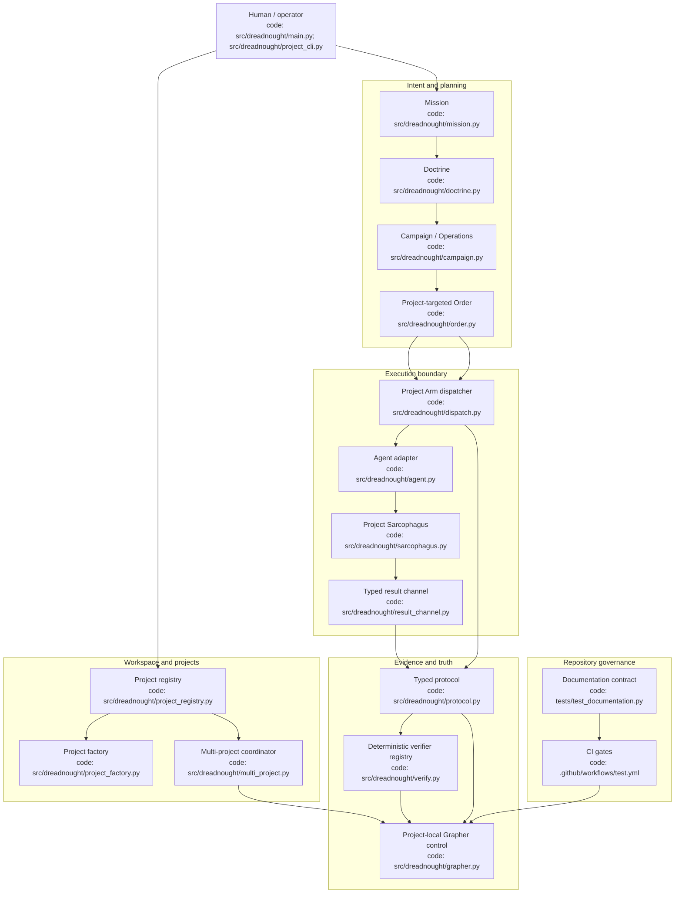

# Dreadnought Architecture

## Index

- [Purpose](#purpose)
- [Root architecture](#root-architecture)
- [Subsystem documents](#subsystem-documents)
- [Trust boundaries](#trust-boundaries)
- [Architecture diagram](#architecture-diagram)
- [Appendix — Process flow](#appendix--process-flow)

## Purpose

This is the root architecture map for Dreadnought. It shows the major control-plane components, where authority changes hands, and which code files implement each component. Subsystem documents expand individual nodes without redefining the whole system. [Process map](#appendix--process-flow)

## Root architecture

Dreadnought is a workspace-level control plane that can own several independently versioned projects at once. The workspace registry identifies project roots; project creation can initialize complete Git/Grapher projects; the multi-project coordinator addresses project brains without changing global selection; human directives become typed planning artifacts; project-targeted Orders execute through Project Arms inside Sarcophagus; agent testimony and observer evidence remain separate; Dreadnought writes canonical evidence into the targeted project's Grapher brain; CI enforces repository governance.

## Subsystem documents

- [`ARCHITECTURE_CHARTER.md`](ARCHITECTURE_CHARTER.md) — architectural principles and authority model.
- [`PROJECTS.md`](PROJECTS.md) — workspace registry, project creation, synchronous multi-project control, and targeted Orders.
- [`PROJECT_ARM_LEDGER.md`](PROJECT_ARM_LEDGER.md) — dispatch, adapters, result channel, and Project Arm boundaries.
- [`SARCOPHAGUS_LEDGER.md`](SARCOPHAGUS_LEDGER.md) — Linux isolation and scratch/canonical workspace boundary.
- [`PROTOCOL_LEDGER.md`](PROTOCOL_LEDGER.md) — typed claims, observations, verdicts, and perspective authority.
- [`DIAGRAM_STANDARD.md`](DIAGRAM_STANDARD.md) — architecture/process diagram maintenance contract.

## Trust boundaries

The Dreadnought workspace registry is control-plane-owned metadata; each registered project's canonical files, Git history, and Grapher store remain project-local. Project selection is only a default route. Explicit project IDs route operations directly and do not mutate that default. Agents receive bounded execution authority through Project Arms. Agent-authored records remain testimony; observer and evaluation records remain Dreadnought-owned. Sarcophagus is the current kernel-enforced process/filesystem boundary. For Codex providers, Dreadnought/Sarcophagus are explicitly the external sandbox: Codex is launched with its own approval and sandbox layer bypassed so nested provider sandboxes cannot break shell/process execution.
For Codex, Dreadnought is the sole Linux sandbox boundary: primary and Project Arm launches disable Codex's nested filesystem sandbox (`danger-full-access` from Codex's perspective) while the outer Dreadnought Bubblewrap boundary continues enforcing canonical read-only mounts, credential masking, scratch access, and private temporary storage.

## Architecture diagram

## Appendix — Process flow

```mermaid
flowchart LR
    H["Human directive / project intent\ncode: src/dreadnought/project_cli.py; src/dreadnought/mission.py\ninception: 2ddda47a622cc66b90e4a5ec65ea09262e002644\ncurrent: feature/multi-project-control"] --> R["Resolve registered project set\ncode: src/dreadnought/project_registry.py; src/dreadnought/multi_project.py\ninception: b0d1f2bc1c0973d9df253987e4b6ec43bf1566cc\ncurrent: feature/multi-project-control"]
    R --> P["Doctrine / campaign / project-targeted order\ncode: src/dreadnought/doctrine.py; src/dreadnought/campaign.py; src/dreadnought/order.py\ninception: db2c89af7ffa2c803020739eec578f20bcf5850c\ncurrent: feature/multi-project-control"]
    P --> E["Project-scoped execution\ncode: src/dreadnought/dispatch.py; src/dreadnought/agent.py; src/dreadnought/sarcophagus.py\ninception: ce853e50706259b32585e7311b1d74638cb2bda5\ncurrent: feature/multi-project-control"]
    E --> T["Agent testimony / observer evidence\ncode: src/dreadnought/result_channel.py; src/dreadnought/protocol.py; src/dreadnought/dispatch.py\ninception: d6692863d9d43372f3fffc7b5c6fb821b6dafee1\ncurrent: feature/multi-project-control"]
    T --> V["Verification\ncode: src/dreadnought/verify.py\ninception: 07721476c042df38edf6fc6fed1777a3f3c7004b\ncurrent: feature/multi-project-control"]
    V --> G["Target project provenance\ncode: src/dreadnought/grapher.py; src/dreadnought/multi_project.py\ninception: 4630ac84da52677b343e7a3737844da683b25202\ncurrent: feature/multi-project-control"]
```

Commit references: [mission](https://github.com/seanbman/dreadnought/commit/2ddda47a622cc66b90e4a5ec65ea09262e002644), [Doctrine/Orders](https://github.com/seanbman/dreadnought/commit/db2c89af7ffa2c803020739eec578f20bcf5850c), [protocol](https://github.com/seanbman/dreadnought/commit/d6692863d9d43372f3fffc7b5c6fb821b6dafee1), [Grapher](https://github.com/seanbman/dreadnought/commit/4630ac84da52677b343e7a3737844da683b25202), [verification](https://github.com/seanbman/dreadnought/commit/07721476c042df38edf6fc6fed1777a3f3c7004b), [Sarcophagus](https://github.com/seanbman/dreadnought/commit/ce853e50706259b32585e7311b1d74638cb2bda5), [project registry](https://github.com/seanbman/dreadnought/commit/b0d1f2bc1c0973d9df253987e4b6ec43bf1566cc), [multi-project coordinator](https://github.com/seanbman/dreadnought/commit/aa1a18daad647a23ece3c6c8cb6ef458b1762471).
