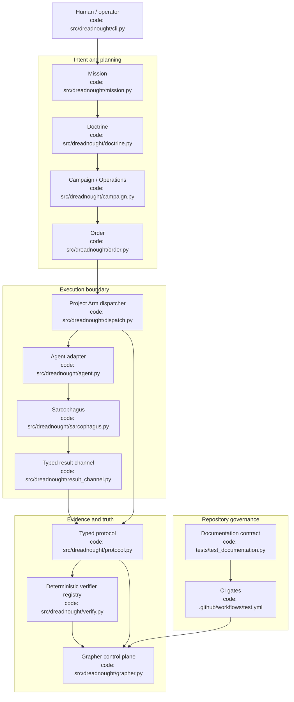

# Dreadnought Architecture

## Index

- [Purpose](#purpose)
- [Root architecture](#root-architecture)
- [Subsystem documents](#subsystem-documents)
- [Trust boundaries](#trust-boundaries)
- [Architecture diagram](#architecture-diagram)
- [Appendix — Process flow](#appendix--process-flow)

## Purpose

This is the root architecture map for Dreadnought. It shows the major control-plane components, where authority changes hands, and which code files implement each component. Subsystem documents expand individual nodes without redefining the whole system. [Process map](#appendix--process-flow)

## Root architecture

Dreadnought is organized into four cooperating layers: intent/planning, execution, evidence/verification, and governance. Human directives become typed planning artifacts; Project Arms execute inside Sarcophagus; agent testimony and observer evidence remain separate; Dreadnought writes canonical evidence into Grapher; CI enforces repository governance.

## Subsystem documents

- [`ARCHITECTURE_CHARTER.md`](ARCHITECTURE_CHARTER.md) — architectural principles and authority model.
- [`PROJECT_ARM_LEDGER.md`](PROJECT_ARM_LEDGER.md) — dispatch, adapters, result channel, and Project Arm boundaries.
- [`SARCOPHAGUS_LEDGER.md`](SARCOPHAGUS_LEDGER.md) — Linux isolation and scratch/canonical workspace boundary.
- [`PROTOCOL_LEDGER.md`](PROTOCOL_LEDGER.md) — typed claims, observations, verdicts, and perspective authority.
- [`DIAGRAM_STANDARD.md`](DIAGRAM_STANDARD.md) — architecture/process diagram maintenance contract.

## Trust boundaries

The canonical workspace and Grapher store are control-plane-owned. Agents receive bounded execution authority through Project Arms. Agent-authored records remain testimony; observer and evaluation records remain Dreadnought-owned. Sarcophagus is the current kernel-enforced process/filesystem boundary.

## Architecture diagram

## Appendix — Process flow

```mermaid
flowchart LR
    H["Human directive\ncode: src/dreadnought/cli.py; src/dreadnought/mission.py\ninception: 2ddda47a622cc66b90e4a5ec65ea09262e002644\ncurrent: 437b3c512aefbc40d591c3322188c6d2732e31b2"] --> P["Doctrine / campaign / order\ncode: src/dreadnought/doctrine.py; src/dreadnought/campaign.py; src/dreadnought/order.py\ninception: db2c89af7ffa2c803020739eec578f20bcf5850c\ncurrent: 437b3c512aefbc40d591c3322188c6d2732e31b2"]
    P --> E["Project Arm execution\ncode: src/dreadnought/dispatch.py; src/dreadnought/agent.py; src/dreadnought/sarcophagus.py\ninception: ce853e50706259b32585e7311b1d74638cb2bda5\ncurrent: 437b3c512aefbc40d591c3322188c6d2732e31b2"]
    E --> T["Agent testimony / observer evidence\ncode: src/dreadnought/result_channel.py; src/dreadnought/protocol.py; src/dreadnought/dispatch.py\ninception: d6692863d9d43372f3fffc7b5c6fb821b6dafee1\ncurrent: 437b3c512aefbc40d591c3322188c6d2732e31b2"]
    T --> V["Verification\ncode: src/dreadnought/verify.py\ninception: 07721476c042df38edf6fc6fed1777a3f3c7004b\ncurrent: 437b3c512aefbc40d591c3322188c6d2732e31b2"]
    V --> G["Canonical provenance\ncode: src/dreadnought/grapher.py\ninception: 4630ac84da52677b343e7a3737844da683b25202\ncurrent: 437b3c512aefbc40d591c3322188c6d2732e31b2"]
```

Commit references: [mission](https://github.com/seanbman/dreadnought/commit/2ddda47a622cc66b90e4a5ec65ea09262e002644), [Doctrine/Orders](https://github.com/seanbman/dreadnought/commit/db2c89af7ffa2c803020739eec578f20bcf5850c), [protocol](https://github.com/seanbman/dreadnought/commit/d6692863d9d43372f3fffc7b5c6fb821b6dafee1), [Grapher](https://github.com/seanbman/dreadnought/commit/4630ac84da52677b343e7a3737844da683b25202), [verification](https://github.com/seanbman/dreadnought/commit/07721476c042df38edf6fc6fed1777a3f3c7004b), [Sarcophagus](https://github.com/seanbman/dreadnought/commit/ce853e50706259b32585e7311b1d74638cb2bda5), [documentation baseline](https://github.com/seanbman/dreadnought/commit/437b3c512aefbc40d591c3322188c6d2732e31b2).
