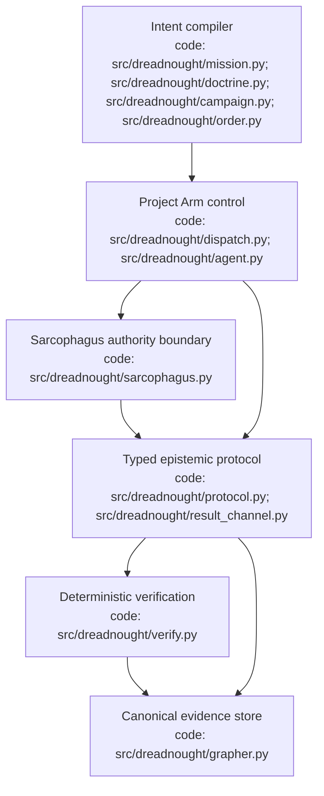
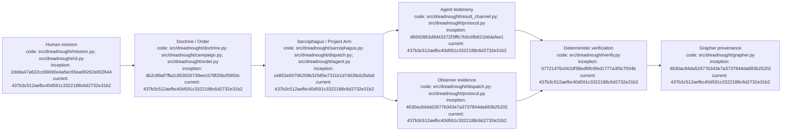

# Dreadnought Architecture Charter

**Status:** initial working charter  
**Date:** 2026-09-06

## Index

- [Purpose](#purpose)
- [Working principles](#working-principles)
- [Initial conceptual components](#initial-conceptual-components)
- [Architecture diagram](#architecture-diagram)
- [Appendix — Process flow](#appendix--process-flow)

## Purpose

Dreadnought is an experimental agent control plane. Its purpose is not merely to prompt agents but to mediate their authority, normalize missions and machine-significant claims, observe execution independently, preserve provenance, and verify claims against deterministic evidence where possible. See the root [`ARCHITECTURE.md`](ARCHITECTURE.md) and this document's [process map](#appendix--process-flow).

## Working principles

1. **Human intent is compiled, not blindly executed.** Natural-language directives are normalized into schema-backed mission protocols bounded by explicit policy.
2. **Authority lives in the control plane.** Agents receive capabilities; they do not inherit unrestricted control-plane authority.
3. **Agent testimony and observer evidence are separate.** What an agent claims happened must remain distinguishable from what Dreadnought observed.
4. **Verification is predicate-based.** Dreadnought assigns hard machine verdicts only where a claim maps to a deterministic verifier. `unverified`/`unverifiable` are legitimate outcomes.
5. **History is preserved.** Corrections, contradictions, supersession, and later evidence should not erase earlier records.
6. **Natural language is primarily human-facing.** Notes and rationale remain important, but machine-significant semantics should migrate to typed protocol records.
7. **Grapher is the evidence substrate.** Dreadnought may own privileged Grapher interaction while Grapher remains separable as a component.
8. **Taxonomy is empirical.** Start small; extend enums and schemas in response to actual missions, ambiguous mappings, and failures.
9. **Fail closed on authoritative mutation.** A missing evidence/control path should not silently downgrade into unrecorded mutation.
10. **The system itself is studied.** Development decisions, experiments, regressions, and failures are versioned as research evidence.

[Process map](#appendix--process-flow)

## Initial conceptual components

Mission compiler; Agent/control API; capability and policy layer; agent adapters; Sarcophagus execution boundary; observer/event recorder; deterministic verifier registry; Grapher adapter/evidence store; human-facing inspection and audit interface. This charter is intentionally not frozen. Changes should be recorded in the Decision Ledger and, where testable, the Experiment Ledger. [Process map](#appendix--process-flow)

## Architecture diagram

This charter diagram is a principles-level view; [`ARCHITECTURE.md`](ARCHITECTURE.md) is the root component map and subsystem ledgers expand individual boundaries.

## Appendix — Process flow

Commit references: [mission](https://github.com/seanbman/dreadnought/commit/2ddda47a622cc66b90e4a5ec65ea09262e002644), [Doctrine/Orders](https://github.com/seanbman/dreadnought/commit/db2c89af7ffa2c803020739eec578f20bcf5850c), [protocol](https://github.com/seanbman/dreadnought/commit/d6692863d9d43372f3fffc7b5c6fb821b6dafee1), [Grapher](https://github.com/seanbman/dreadnought/commit/4630ac84da52677b343e7a3737844da683b25202), [verification](https://github.com/seanbman/dreadnought/commit/07721476c042df38edf6fc6fed1777a3f3c7004b), [Sarcophagus](https://github.com/seanbman/dreadnought/commit/ce853e50706259b32585e7311b1d74638cb2bda5), [documentation baseline](https://github.com/seanbman/dreadnought/commit/437b3c512aefbc40d591c3322188c6d2732e31b2).
