# Dreadnought workspace bootstrap

## Index

- [Purpose](#purpose)
- [Recommended flow](#recommended-flow)
- [Existing Grapher projects](#existing-grapher-projects)
- [Generated artifacts](#generated-artifacts)
- [Nested project routing](#nested-project-routing)
- [Non-interactive usage](#non-interactive-usage)
- [Authority boundary](#authority-boundary)
- [Appendix — Process flow](#appendix--process-flow)

## Purpose

`dreadnought initialize` is the human-facing workspace bootstrap. It takes operator intent, discovers or accepts the managed project root, creates a ready bootstrap Mission, initializes or adopts the project Grapher brain, and generates durable Dreadnought instructions. `dreadnought init` is an alias.

## Recommended flow

Run from the Dreadnought workspace root:

```bash
dreadnought initialize
```

The interactive flow asks for the managed project, project ID, bootstrap directive, primary objective, and optional primary Dreadnought agent. A single nested project is selected automatically. Multiple detected projects require an explicit choice.

## Existing Grapher projects

If the managed project already contains `.grapher/knowledge.json`, Dreadnought adopts it instead of reinitializing it. Adoption requires Grapher schema v2. Existing graph nodes are not rewritten. Existing custom node types and legacy truth-status exemptions are preserved, Dreadnought projection types are added, and inherited nodes that were already `unclassified` are grandfathered into Grapher's legacy allowlist before explicit-status policy is enabled.

This is intentionally different from `dreadnought grapher init`, which still fails closed on an existing graph.

## Generated artifacts

Bootstrap writes:

- `.dreadnought/config.json` — workspace identity, managed `project_root`, bootstrap Mission reference, instruction path, Grapher mode, and configured agents.
- `.dreadnought/missions/<mission-id>.json` — normalized ready bootstrap Mission derived from operator intent.
- `.dreadnought/INSTRUCTIONS.md` — generated workspace instructions containing directive, objective, constraints, Grapher authority, and inherited-state rules.
- `AGENTS.md` — a small generated entrypoint pointing compatible agents to the Dreadnought instructions. An existing human-authored `AGENTS.md` is never overwritten.

## Nested project routing

Dreadnought state may live at a workspace root while Grapher remains inside a nested standalone project. Once `project_root` is stored in `.dreadnought/config.json`, `GrapherControlPlane(workspace)` transparently resolves the managed project brain. Existing query, ingest, observer, verification, and dispatch code therefore continues using the Dreadnought workspace root without bypassing the project's `.grapher` state.

## Non-interactive usage

A bootstrap brief may be supplied directly:

```bash
dreadnought initialize \
  "Adopt the existing project brain and continue work without rewriting historical provenance" \
  --root /path/to/workspace \
  --project-root pt-site-overhaul \
  --project-id pt-site-overhaul \
  --requirement "Dreadnought is the sole Grapher writer" \
  --non-interactive
```

If a non-interactive invocation omits the directive, Dreadnought creates a minimal control-establishment directive for backward compatibility.

## Authority boundary

Bootstrap does not grant Project Arms direct Grapher mutation authority. Grapher remains independently operable, but inside a Dreadnought-controlled workspace Dreadnought is the sole Grapher writer. Inherited records remain historical evidence; new missions must create new evidence and explicit supersession rather than silently recasting legacy state as current truth.

## Appendix — Process flow

```mermaid
flowchart LR
    H["Human bootstrap intent\ncode: src/dreadnought/bootstrap.py\ninception: a72edbfe4df191e5d9570c9dcf6d55909a1893ce\ncurrent: fix/bootstrap-initialization-flow"] --> D["Discover/select managed project\ncode: src/dreadnought/bootstrap.py\ninception: a72edbfe4df191e5d9570c9dcf6d55909a1893ce\ncurrent: fix/bootstrap-initialization-flow"]
    D --> G["Initialize or adopt Grapher brain\ncode: src/dreadnought/grapher.py\ninception: ac77be7ef7749df2ecfc9e2cf13fde795a6f5b21\ncurrent: fix/bootstrap-initialization-flow"]
    G --> M["Ready bootstrap Mission\ncode: src/dreadnought/bootstrap.py; src/dreadnought/mission.py\ninception: a72edbfe4df191e5d9570c9dcf6d55909a1893ce\ncurrent: fix/bootstrap-initialization-flow"]
    M --> I["Generated Dreadnought instructions\ncode: src/dreadnought/bootstrap.py\ninception: a72edbfe4df191e5d9570c9dcf6d55909a1893ce\ncurrent: fix/bootstrap-initialization-flow"]
    I --> C["Control-plane operations route to managed project brain\ncode: src/dreadnought/grapher.py\ninception: ac77be7ef7749df2ecfc9e2cf13fde795a6f5b21\ncurrent: fix/bootstrap-initialization-flow"]
```


