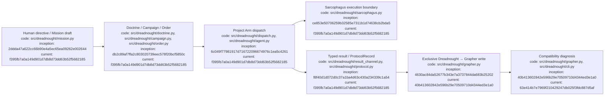

# Dreadnought CLI usage

## Index

- [Purpose](#purpose)
- [Install and help](#install-and-help)
- [Human workflow](#human-workflow)
- [Agent workflow](#agent-workflow)
- [Grapher compatibility check](#grapher-compatibility-check)
- [Command reference](#command-reference)
- [Exit codes and authority notes](#exit-codes-and-authority-notes)
- [Appendix — Process flow](#appendix--process-flow)

## Purpose

This guide is the operational reference for humans and agents using the `dreadnought` command-line interface. The CLI implementation lives in [`src/dreadnought/cli.py`](../src/dreadnought/cli.py). It creates and inspects typed control-plane artifacts, writes protocol records through the Dreadnought Grapher boundary, checks embedded Grapher compatibility, and dispatches compartmentalized Orders through Sarcophagus. [Process map](#appendix--process-flow)

## Install and help

Requires Python 3.11 or newer.

```bash
python -m pip install -e .
dreadnought --help
```

The console entry point is declared in [`pyproject.toml`](../pyproject.toml) as `dreadnought = dreadnought.cli:main`.

Every command/subcommand supports argparse help, for example:

```bash
dreadnought mission --help
dreadnought mission init --help
dreadnought grapher doctor --help
dreadnought arm dispatch --help
```

## Human workflow

A typical human-driven flow is:

```bash
# 1. Preserve the human directive as a typed Mission draft.
dreadnought mission init "Improve the track editing workflow" --root . --actor human:user

# 2. Create the authoritative Doctrine draft.
dreadnought doctrine init "Improve track editing without regressions" --root . --actor human:user

# 3. Create a Campaign Plan associated with a Doctrine ID.
dreadnought campaign init --doctrine <doctrine-id> --task-group task-group-1 --root .

# 4. Create a compartmentalized Order for one operation / Project Arm.
dreadnought order init "Make track clearing deterministic" \
  --doctrine <doctrine-id> \
  --campaign <campaign-id> \
  --operation <operation-id> \
  --project-arm project-arm-1 \
  --root .
```

`init` commands write drafts beneath `.dreadnought/` in the selected root. They do not by themselves grant runtime authority, accept work, close work, or prove that a requirement has been satisfied.

Use `validate` before relying on an edited typed document:

```bash
dreadnought mission validate .dreadnought/missions/<mission-id>.json
dreadnought doctrine validate .dreadnought/doctrine/<doctrine-id>.json
dreadnought campaign validate .dreadnought/campaigns/<campaign-id>.json
dreadnought order validate .dreadnought/orders/<order-id>.json
```

Use `show` for a normalized JSON view:

```bash
dreadnought order show .dreadnought/orders/<order-id>.json
```

## Agent workflow

Agents should treat the CLI as an authority boundary, not as a conversational convenience layer.

Machine-significant agent testimony should be emitted as a typed `ProtocolRecord` and ingested through Dreadnought:

```bash
dreadnought protocol validate /path/to/record.json
dreadnought protocol ingest /path/to/record.json --root /canonical/workspace
```

`protocol ingest` validates the record and writes the canonical projection through [`src/dreadnought/grapher.py`](../src/dreadnought/grapher.py), which is Dreadnought's exclusive Grapher mutation boundary. A Project Arm must not write `.grapher` state directly. An agent-authored claim remains agent testimony; ingesting it does not convert it into observer evidence or an evaluation verdict.

Project Arm execution uses `arm dispatch`:

```bash
dreadnought arm dispatch /path/to/order.json \
  --root /canonical/workspace \
  --scratch /external/dreadnought-scratch/arm-001 \
  --adapter codex \
  --executable codex \
  --agent-arg "exec" \
  --agent-arg "{order}" \
  --agent-arg "--result" \
  --agent-arg "{result}" \
  --timeout 300
```

The adapter arguments are provider-specific. Supported template tokens are defined by [`src/dreadnought/agent.py`](../src/dreadnought/agent.py), including `{order}`, `{scratch}`, `{workspace}`, `{project_arm}`, `{objective}`, and `{result}`. Do not invent an adapter syntax and assume it is supported; inspect the adapter implementation and the target vendor CLI first.

The scratch directory must be outside the canonical workspace. Dispatch runs through [`src/dreadnought/dispatch.py`](../src/dreadnought/dispatch.py) and [`src/dreadnought/sarcophagus.py`](../src/dreadnought/sarcophagus.py). The canonical workspace is not intended to become writable merely because an external agent was launched.

## Grapher compatibility check

Before operating a Dreadnought workspace after installation, upgrade, or configuration changes, run:

```bash
dreadnought grapher doctor --root /canonical/workspace
```

The command reports the installed Grapher version and verifies that the embedded API exists, the local graph and configuration exist, the graph is version 2, explicit truth status is enabled, and all Dreadnought protocol projection node types are registered. It exits `0` only when the required integration checks pass; otherwise it exits `1` and prints the failed checks as JSON.

This command diagnoses compatibility; it does not mutate Grapher or grant write authority.

## Command reference

| Command | Purpose | Primary implementation |
| --- | --- | --- |
| `dreadnought mission init <directive>` | Create a Mission draft from human intent | `src/dreadnought/mission.py`, `src/dreadnought/cli.py` |
| `dreadnought mission validate <path>` | Validate a Mission | `src/dreadnought/mission.py` |
| `dreadnought mission show <path>` | Print normalized Mission JSON | `src/dreadnought/mission.py` |
| `dreadnought doctrine init <objective>` | Create a Doctrine draft | `src/dreadnought/doctrine.py` |
| `dreadnought doctrine validate/show <path>` | Validate or display Doctrine | `src/dreadnought/doctrine.py` |
| `dreadnought campaign init --doctrine <id>` | Create a Campaign Plan draft | `src/dreadnought/campaign.py` |
| `dreadnought campaign validate/show <path>` | Validate or display Campaign Plan | `src/dreadnought/campaign.py` |
| `dreadnought order init <objective> ...` | Create a Project Arm Order | `src/dreadnought/order.py` |
| `dreadnought order validate/show <path>` | Validate or display an Order | `src/dreadnought/order.py` |
| `dreadnought protocol validate/show <path>` | Validate or inspect a ProtocolRecord | `src/dreadnought/protocol.py` |
| `dreadnought protocol ingest <path> --root <workspace>` | Canonically ingest a typed record through Dreadnought into Grapher | `src/dreadnought/grapher.py` |
| `dreadnought grapher doctor --root <workspace>` | Verify embedded Grapher compatibility/configuration without mutation | `src/dreadnought/grapher.py`, `src/dreadnought/cli.py` |
| `dreadnought arm dispatch <order> ...` | Dispatch one Order through Sarcophagus | `src/dreadnought/dispatch.py`, `src/dreadnought/sarcophagus.py`, `src/dreadnought/agent.py` |

The CLI source is authoritative for available flags. When this table and `dreadnought --help` disagree, treat the executable parser as current behavior and fix this document in the same change set.

## Exit codes and authority notes

For typed-document validation, `0` means valid, `1` means schema/model validation errors, and `2` means the document could not be read/parsed or the command encountered an input/runtime error. `dreadnought grapher doctor` returns `0` when the embedded Grapher compatibility checks pass and `1` when one or more required checks fail. `arm dispatch` returns `0` when the external command exits `0`, `1` for a nonzero external-agent exit, and `2` for dispatch setup/control-plane errors.

Important authority distinctions:

- creating a Mission, Doctrine, Campaign, or Order is not equivalent to executing it;
- an agent claim is not observer evidence;
- a successful external process exit is evidence about that process, not automatic acceptance or closure;
- `protocol ingest` is the canonical software write path into Grapher and Project Arms must not bypass it;
- `grapher doctor` is read-only diagnostic tooling, not a mutation path;
- scratch is disposable writable space; the canonical workspace remains authoritative;
- acceptance and closure are separate concerns and are not implied by current CLI draft/dispatch commands.

[Process map](#appendix--process-flow)

## Appendix — Process flow



Commit references: [Mission CLI](https://github.com/seanbman/dreadnought/commit/2ddda47a622cc66b90e4a5ec65ea09262e002644), [Doctrine/Campaign/Orders](https://github.com/seanbman/dreadnought/commit/db2c89af7ffa2c803020739eec578f20bcf5850c), [Grapher control plane](https://github.com/seanbman/dreadnought/commit/4630ac84da52677b343e7a3737844da683b25202), [Sarcophagus](https://github.com/seanbman/dreadnought/commit/ce853e50706259b32585e7311b1d74638cb2bda5), [Project Arm dispatch](https://github.com/seanbman/dreadnought/commit/6c049f77981917d716722096674976c1ea5c4261), [typed result channel](https://github.com/seanbman/dreadnought/commit/f8f40d1d072d0c37a1ba4d63c430a234339c1a54).
