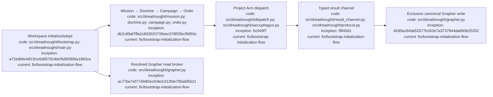

# Dreadnought CLI usage

## Index

- [Purpose](#purpose)
- [Install and help](#install-and-help)
- [Workspace bootstrap](#workspace-bootstrap)
- [Grapher brain commands](#grapher-brain-commands)
- [Mission-to-order commands](#mission-to-order-commands)
- [Protocol commands](#protocol-commands)
- [Project Arm dispatch](#project-arm-dispatch)
- [Command reference](#command-reference)
- [Exit codes and authority notes](#exit-codes-and-authority-notes)
- [Appendix — Process flow](#appendix--process-flow)

## Purpose

This is the compact CLI reference for humans and agents. For workspace initialization details, use [`BOOTSTRAP.md`](BOOTSTRAP.md). For a complete project walkthrough, use [`PROJECT_EXECUTION_TUTORIAL.md`](PROJECT_EXECUTION_TUTORIAL.md). The executable entrypoint in `src/dreadnought/main.py` plus the parser in `src/dreadnought/cli.py` define the command surface.

## Install and help

Requires Python 3.11+.

```bash
python3 -m venv .venv
source .venv/bin/activate
python -m pip install -e .
dreadnought --version
dreadnought help
```

The current Dreadnought dependency pins Grapher v0.7.0b1.

## Workspace bootstrap

The normal setup command is:

```bash
dreadnought initialize
```

`dreadnought init` is an alias. Run it from the Dreadnought workspace root, not necessarily from the managed project's own root.

Non-interactive example:

```bash
dreadnought initialize \
  "Adopt the existing project brain and continue work without rewriting history" \
  --root /path/to/workspace \
  --project-root pt-site-overhaul \
  --project-id pt-site-overhaul \
  --requirement "Dreadnought is the sole Grapher writer" \
  --non-interactive
```

Bootstrap discovers/selects the managed project, initializes or adopts Grapher, writes a ready bootstrap Mission, and generates `.dreadnought/INSTRUCTIONS.md`. Existing schema-v2 graphs are adopted non-destructively.

## Grapher brain commands

Low-level initialization for a genuinely new managed project brain:

```bash
dreadnought grapher init --root /path/to/project
```

This refuses to overwrite an existing graph. For inherited graphs, use workspace bootstrap instead.

Verify compatibility and routing:

```bash
dreadnought grapher doctor --root /path/to/workspace
```

A healthy workspace returns `compatible: true` and identifies both the Dreadnought workspace and resolved managed project root.

Search through the Dreadnought read broker:

```bash
dreadnought grapher query "authentication regression" \
  --root /path/to/workspace \
  --limit 8
```

Mission-scoped search:

```bash
dreadnought grapher query "known failures" \
  --root /path/to/workspace \
  --mission mission-123 \
  --limit 8
```

Read one node:

```bash
dreadnought grapher get claim-123 --root /path/to/workspace
```

`query` and `get` are brokered reads. There is intentionally no general subordinate `dreadnought grapher add` command.

## Mission-to-order commands

Workspace bootstrap creates the initial ready Mission. Additional missions can be authored interactively:

```bash
dreadnought mission build --root .
```

Or create the control hierarchy directly:

```bash
dreadnought mission init "Fix the regression" --root . --actor human:user
dreadnought doctrine init "Fix it without breaking existing behavior" --root . --actor human:user
dreadnought campaign init --doctrine <doctrine-id> --task-group regression-fix --root .
dreadnought order init "Implement and test the fix" \
  --doctrine <doctrine-id> \
  --campaign <campaign-id> \
  --operation regression-op-1 \
  --project-arm project-arm-1 \
  --root .
```

Validate or inspect typed documents:

```bash
dreadnought mission validate <mission-path>
dreadnought doctrine validate <doctrine-path>
dreadnought campaign validate <campaign-path>
dreadnought order validate <order-path>
dreadnought order show <order-path>
```

Creating these documents does not itself execute work or establish acceptance.

## Protocol commands

Validate agent/human/control-plane testimony:

```bash
dreadnought protocol validate /path/to/record.json
dreadnought protocol show /path/to/record.json
```

Canonical ingestion:

```bash
dreadnought protocol ingest /path/to/record.json --root /path/to/workspace
```

`protocol ingest` validates/admit the typed record through Dreadnought, then projects it through `GrapherControlPlane` into the resolved managed project brain. The original protocol payload and submitting actor/perspective remain in Grapher metadata.

An agent-authored claim remains agent testimony. Ingestion does not convert it into observer evidence or an evaluation verdict.

## Project Arm dispatch

Scratch must live outside the canonical managed project/workspace boundary:

```bash
mkdir -p ../dreadnought-scratch/arm-001
```

Illustrative dispatch:

```bash
dreadnought arm dispatch /path/to/order.json \
  --root /path/to/workspace \
  --scratch /external/dreadnought-scratch/arm-001 \
  --adapter codex \
  --executable codex \
  --agent-arg "exec" \
  --agent-arg "{order}" \
  --agent-arg "--result" \
  --agent-arg "{result}" \
  --timeout 300
```

Adapter syntax is provider-specific. Supported Dreadnought template tokens are defined in `src/dreadnought/agent.py`, including `{order}`, `{scratch}`, `{workspace}`, `{project_arm}`, `{objective}`, and `{result}`.

The Project Arm writes newline-delimited typed protocol records to the result channel in scratch. Observer/evaluation kinds are reserved and rejected from the agent result channel.

## Command reference

| Command | Purpose |
| --- | --- |
| `dreadnought initialize [brief]` | Bootstrap/adopt a workspace from human intent and generate Dreadnought instructions |
| `dreadnought init [brief]` | Alias for `initialize` |
| `dreadnought grapher init --root <project>` | Low-level initialization of a brand-new managed Grapher brain |
| `dreadnought grapher doctor --root <workspace>` | Check routing, embedded API, graph version, and required policy/config |
| `dreadnought grapher query <text> ...` | Broker a Grapher search through Dreadnought |
| `dreadnought grapher get <node-id> ...` | Broker a single-node read through Dreadnought |
| `dreadnought mission build/list/edit/review/ready` | Guided mission authoring and readiness |
| `dreadnought mission init/validate/show` | Scripted Mission creation/inspection |
| `dreadnought doctrine init/validate/show` | Create or inspect Doctrine records |
| `dreadnought campaign init/validate/show` | Create or inspect Campaign Plans |
| `dreadnought order init/validate/show` | Create or inspect Project Arm Orders |
| `dreadnought protocol validate/show` | Validate or inspect ProtocolRecords |
| `dreadnought protocol ingest <path>` | Admit a typed record through Dreadnought into the managed Grapher brain |
| `dreadnought arm dispatch <order> ...` | Execute one bounded Order through Sarcophagus/Project Arm dispatch |

## Exit codes and authority notes

Typed document validation uses `0` for valid, `1` for validation errors, and `2` for unreadable/invalid input or runtime setup errors. `grapher doctor` returns `0` only when compatibility checks pass. `arm dispatch` returns the external execution status mapping defined by the dispatcher.

Authority rules:

- Dreadnought is the sole Grapher writer inside a Dreadnought-controlled workspace.
- Grapher remains independently usable outside that execution boundary.
- inherited Grapher nodes are preserved during adoption; they are not silently rewritten as current truth;
- `grapher query` and `grapher get` are read-only broker surfaces;
- Project Arms return testimony/evidence; they do not gain canonical write authority;
- successful process exit is evidence, not acceptance;
- scratch is disposable writable space outside the canonical workspace/project;
- Grapher owns durable representation, truth policy, integrity, structured history, transitions, and publication after Dreadnought admits a record.

## Appendix — Process flow


