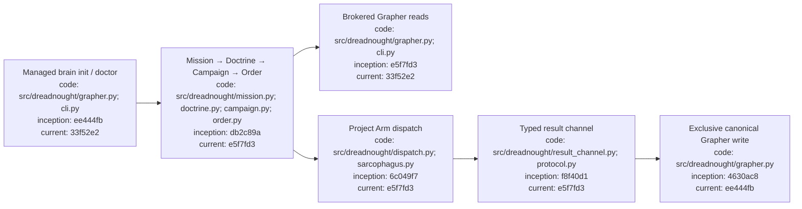

# Dreadnought CLI usage

## Index

- [Purpose](#purpose)
- [Install and help](#install-and-help)
- [Grapher brain commands](#grapher-brain-commands)
- [Mission-to-order commands](#mission-to-order-commands)
- [Protocol commands](#protocol-commands)
- [Project Arm dispatch](#project-arm-dispatch)
- [Command reference](#command-reference)
- [Exit codes and authority notes](#exit-codes-and-authority-notes)
- [Appendix — Process flow](#appendix--process-flow)

## Purpose

This is the compact CLI reference for humans and agents. For a complete project walkthrough, use [`PROJECT_EXECUTION_TUTORIAL.md`](PROJECT_EXECUTION_TUTORIAL.md). The executable parser in [`src/dreadnought/cli.py`](../src/dreadnought/cli.py) is authoritative.

## Install and help

Requires Python 3.11+.

```bash
python3 -m venv .venv
source .venv/bin/activate
python -m pip install -e .
dreadnought --help
```

The current Dreadnought dependency targets the Grapher 0.6.1 compatibility ref.

## Grapher brain commands

Initialize a new managed project brain:

```bash
dreadnought grapher init --root /path/to/project
```

This creates Grapher through the Dreadnought control plane and installs the Dreadnought projection policy. It refuses to overwrite an existing graph.

Verify compatibility/configuration:

```bash
dreadnought grapher doctor --root /path/to/project
```

A healthy workspace returns `compatible: true`.

Search through the Dreadnought read broker:

```bash
dreadnought grapher query "authentication regression" \
  --root /path/to/project \
  --limit 8
```

Mission-scoped search:

```bash
dreadnought grapher query "known failures" \
  --root /path/to/project \
  --mission mission-123 \
  --limit 8
```

Read one node:

```bash
dreadnought grapher get claim-123 --root /path/to/project
```

`query` and `get` are brokered reads. There is intentionally no general `dreadnought grapher add` command for Project Arms. Runtime writes enter through typed protocol ingestion and `GrapherControlPlane`.

## Mission-to-order commands

Create the control hierarchy:

```bash
dreadnought mission init "Fix the regression" --root . --actor human:user
dreadnought doctrine init "Fix it without breaking existing behavior" --root . --actor human:user
dreadnought campaign init --doctrine <doctrine-id> --task-group regression-fix --root .
dreadnought order init "Implement and test the fix" \
  --doctrine <doctrine-id> \
  --campaign <campaign-id> \
  --operation regression-op-1 \
  --project-arm project-arm-1 \
  --root .
```

Validate or inspect typed documents:

```bash
dreadnought mission validate <mission-path>
dreadnought doctrine validate <doctrine-path>
dreadnought campaign validate <campaign-path>
dreadnought order validate <order-path>
dreadnought order show <order-path>
```

Creating these documents does not itself execute work or establish acceptance.

## Protocol commands

Validate agent/human/control-plane testimony:

```bash
dreadnought protocol validate /path/to/record.json
dreadnought protocol show /path/to/record.json
```

Canonical ingestion:

```bash
dreadnought protocol ingest /path/to/record.json --root /canonical/workspace
```

`protocol ingest` performs Dreadnought validation/admission, projects the record into a `dreadnought_*` Grapher node, and calls Grapher's embedded canonical mutation path. The original protocol payload is preserved in node metadata.

An agent-authored claim remains agent testimony. Ingestion does not convert it into observer evidence or an evaluation verdict.

## Project Arm dispatch

Scratch must live outside the canonical workspace:

```bash
mkdir -p ../dreadnought-scratch/arm-001
```

Illustrative dispatch:

```bash
dreadnought arm dispatch /path/to/order.json \
  --root /canonical/workspace \
  --scratch /external/dreadnought-scratch/arm-001 \
  --adapter codex \
  --executable codex \
  --agent-arg "exec" \
  --agent-arg "{order}" \
  --agent-arg "--result" \
  --agent-arg "{result}" \
  --timeout 300
```

Adapter syntax is provider-specific. Supported Dreadnought template tokens are defined in `src/dreadnought/agent.py`, including `{order}`, `{scratch}`, `{workspace}`, `{project_arm}`, `{objective}`, and `{result}`.

The Project Arm writes newline-delimited typed protocol records to the result channel in scratch. Observer/evaluation kinds are reserved and rejected from the agent channel.

## Command reference

| Command | Purpose |
| --- | --- |
| `dreadnought grapher init --root <project>` | Initialize a Dreadnought-managed Grapher brain and config |
| `dreadnought grapher doctor --root <project>` | Check embedded API, graph version, and required policy/config |
| `dreadnought grapher query <text> ...` | Broker a Grapher search through Dreadnought |
| `dreadnought grapher get <node-id> ...` | Broker a single-node read through Dreadnought |
| `dreadnought mission init/validate/show` | Create or inspect Mission records |
| `dreadnought doctrine init/validate/show` | Create or inspect Doctrine records |
| `dreadnought campaign init/validate/show` | Create or inspect Campaign Plans |
| `dreadnought order init/validate/show` | Create or inspect Project Arm Orders |
| `dreadnought protocol validate/show` | Validate or inspect ProtocolRecords |
| `dreadnought protocol ingest <path>` | Admit a typed record and write it through Dreadnought into Grapher |
| `dreadnought arm dispatch <order> ...` | Execute one bounded Order through Sarcophagus/Project Arm dispatch |

## Exit codes and authority notes

Typed document validation uses `0` for valid, `1` for validation errors, and `2` for unreadable/invalid input or runtime setup errors. `grapher doctor` returns `0` only when the compatibility checks pass. `arm dispatch` returns the external execution status mapping defined by the dispatcher.

Authority rules:

- Dreadnought is the sole Grapher writer in a Dreadnought-controlled workspace.
- `grapher query` and `grapher get` are read-only broker surfaces.
- Project Arms return testimony/evidence; they do not gain canonical write authority.
- successful process exit is evidence, not acceptance;
- scratch is disposable writable space outside the canonical workspace;
- Grapher owns durable representation, truth policy, integrity, structured history, transitions, and publication after Dreadnought admits a record.

## Appendix — Process flow


