# Decision Ledger

## Index

- [D-0001 — Dreadnought is a new architecture](#d-0001--dreadnought-is-a-new-architecture)
- [D-0002 — Separate machine protocol from human notes](#d-0002--separate-machine-protocol-from-human-notes)
- [D-0003 — Grapher is a subsystem](#d-0003--grapher-is-a-dreadnought-subsystem-not-the-whole-control-plane)
- [D-0004 — Taxonomy grows through observed use](#d-0004--taxonomy-grows-through-observed-use)
- [D-0005 — Mission configuration is not authority](#d-0005--mission-configuration-is-not-authority)
- [D-0006 — Doctrine precedes execution orders](#d-0006--doctrine-precedes-execution-orders)
- [D-0007 — Task Group and Project Arm nomenclature](#d-0007--use-task-group-and-project-arm-nomenclature)
- [D-0008 — Creative agency is explicit and scoped](#d-0008--creative-agency-is-explicit-and-scoped)
- [D-0009 — Least necessary strategic context](#d-0009--project-arms-receive-least-necessary-strategic-context)
- [D-0010 — Dreadnought owns canonical Grapher writes](#d-0010--dreadnought-owns-canonical-grapher-protocol-writes)
- [D-0011 — Verification is deterministic](#d-0011--verification-is-deterministic-and-verifier-specific)
- [D-0012 — Agent result channel is testimony-only](#d-0012--agent-result-channel-is-testimony-only)
- [D-0013 — Repository changes update canonical Grapher state](#d-0013--repository-changes-update-canonical-grapher-state)
- [D-0014 — Every repository change must actually use Grapher](#d-0014--every-repository-change-must-actually-use-grapher)
- [Appendix — Process flow](#appendix--process-flow)

Architectural decisions are recorded as decisions, not rewritten later as if inevitable. Superseded decisions remain in history. [Process map](#appendix--process-flow)

## D-0001 — Dreadnought is a new architecture

**Date:** 2026-09-06  
**Status:** current

**Decision:** Build Dreadnought as a new project informed by Agent Hub and Grapher rather than evolving Agent Hub in place.

**Rationale:** The emerging design has a materially different authority model: control plane, observer, verifier, capability broker, and protocol compiler.

## D-0002 — Separate machine protocol from human notes

**Date:** 2026-09-06  
**Status:** current

**Decision:** Machine-significant claims, observations, actions, requirements, risks, artifacts, and verdicts use typed/schema-backed records. Freeform language remains for human-facing notes, rationale, handoffs, and review commentary.

## D-0003 — Grapher is a Dreadnought subsystem, not the whole control plane

**Date:** 2026-09-06  
**Status:** proposed

**Decision:** Preserve Grapher as independently usable evidence/provenance while Dreadnought is its privileged control-plane client.

## D-0004 — Taxonomy grows through observed use

**Date:** 2026-09-06  
**Status:** current

**Decision:** Begin with a deliberately small protocol taxonomy and expand enums/schema through real runs and failure analysis.

## D-0005 — Mission configuration is not authority

**Date:** 2026-09-06  
**Status:** current

**Decision:** Mission documents may request sources, access modes, and capabilities, but do not themselves grant privileges. Effective authority is derived from mission intent intersected with control-plane/workspace policy.

**Implementation reference:** `11bfb29754008a8756b7d58efcf62a939bd9876d`.

## D-0006 — Doctrine precedes execution orders

**Date:** 2026-09-06  
**Time:** 07:54 MDT / 13:54 UTC  
**Status:** current

**Decision:** Freeform human input and supporting artifacts are normalized into versioned Doctrine before decomposition into PR-sized Operations. Doctrine preserves provenance, requirements/preferences/unresolved questions, acceptance, constraints, priorities, and creative authority.

## D-0007 — Use Task Group and Project Arm nomenclature

**Date:** 2026-09-06  
**Time:** 07:54 MDT / 13:54 UTC  
**Status:** current

**Decision:** Use `Dreadnought → Task Group → Project Arm → Agent`. Campaign Plans decompose Doctrine into Operations; a Project Arm receives a compartmentalized Order.

## D-0008 — Creative agency is explicit and scoped

**Date:** 2026-09-06  
**Time:** 07:54 MDT / 13:54 UTC  
**Status:** current

**Decision:** Orders carry a structured creative-authority envelope so initiative is explicitly high, medium, low, approval-required, or prohibited by dimension.

## D-0009 — Project Arms receive least necessary strategic context

**Date:** 2026-09-06  
**Time:** 07:55 MDT / 13:55 UTC  
**Status:** current

**Decision:** An Order is a compartmentalized execution package, not a copy of complete project context. Dreadnought supplies only the Doctrine fragments, sources, graph references, dependencies, acceptance criteria, capabilities, and creative authority needed for the Operation.

## D-0010 — Dreadnought owns canonical Grapher protocol writes

**Date:** 2026-09-06  
**Time:** approximately 08:26 MDT / 14:26 UTC  
**Status:** current

**Decision:** Project Arms/agents submit typed `ProtocolRecord`s to Dreadnought; the control plane validates them and is the only software component projecting those records into canonical `.grapher/knowledge.json` and `.grapher/history.jsonl`.

**Rationale:** Actor identity and write authority are distinct; agent authorship is preserved while canonical writing belongs to `dreadnought:control-plane`.

## D-0011 — Verification is deterministic and verifier-specific

**Date:** 2026-09-06  
**Time:** approximately 08:32 MDT / 14:32 UTC  
**Status:** current

**Decision:** Dreadnought evaluates claims only through named deterministic verifiers with explicit inputs and observations. Unsupported requests resolve to `unverifiable` rather than guessed truth.

## D-0012 — Agent result channel is testimony-only

**Date:** 2026-09-06  
**Time:** approximately 17:12 MDT / 23:12 UTC  
**Status:** current

**Decision:** External agents may return typed machine-significant records through a scratch-resident result channel, but only with agent perspective and testimony-authorized kinds. Observer/evaluation kinds remain reserved to Dreadnought. Dreadnought binds unbound records to the active Order and rejects records claiming another Order.

**Rationale:** Structured output must not let an agent self-promote testimony into observation or verdict authority. [Process map](#appendix--process-flow)

## D-0013 — Repository changes update canonical Grapher state

**Date:** 2026-09-06  
**Status:** current

**Decision:** Every substantive Dreadnought repository change advances `.grapher/knowledge.json` and `.grapher/history.jsonl`; CI rejects change sets that omit Grapher state.

**Rationale:** Durable semantic state belongs in Grapher rather than being reconstructed from PR descriptions or chat history.

## D-0014 — Every repository change must actually use Grapher

**Date:** 2026-09-08  
**Time:** 03:54 UTC / 21:54 MDT (September 7)  
**Status:** current

**Decision:** Repository work must invoke the repository-supported Grapher mutation path. Hand-authored `.grapher/shared/` evidence, pass records, commit messages, PR text, or manually edited canonical JSON do not satisfy the rule by themselves.

**Enforcement:** A valid change must advance canonical `.grapher/knowledge.json`, append `.grapher/history.jsonl`, contain a structured Grapher mutation event with an operation ID/target/transitions, and pass `grapher validate`. Dreadnought-generated workspace instructions inherit this rule.

**Grapher record:** `decision-always-use-grapher`, operation `governance-always-use-grapher-2026-09-08`.

## Appendix — Process flow

```mermaid
flowchart LR
    N["New architecture<br/>inception: 3bea73dd2ca73199b86b49998e049fb0f30c454f<br/>current: f8f40d1d072d0c37a1ba4d63c430a234339c1a54"] --> M["Mission is request, not authority<br/>inception: 2ddda47a622cc66b90e4a5ec65ea09262e002644<br/>current: f8f40d1d072d0c37a1ba4d63c430a234339c1a54"]
    M --> D["Doctrine / bounded Orders<br/>inception: db2c89af7ffa2c803020739eec578f20bcf5850c<br/>current: f8f40d1d072d0c37a1ba4d63c430a234339c1a54"]
    D --> P["Typed testimony / authority classes<br/>inception: d6692863d9d43372f3fffc7b5c6fb821b6dafee1<br/>current: f8f40d1d072d0c37a1ba4d63c430a234339c1a54"]
    P --> G["Dreadnought-owned Grapher writes<br/>inception: 4630ac84da52677b343e7a3737844da683b25202<br/>current: f8f40d1d072d0c37a1ba4d63c430a234339c1a54"]
    G --> R["Mandatory Grapher use for repo changes<br/>inception: b748f868fe45c1f2af7d29db4d401eeb6ea39623<br/>current: 97ad3f13ad114f541e3cdf98f93f7ac67e359863"]
    R --> V["Deterministic verification<br/>inception: 07721476c042df38edf6fc6fed1777a3f3c7004b<br/>current: 97ad3f13ad114f541e3cdf98f93f7ac67e359863"]
    V --> S["Kernel boundary / Project Arm result channel<br/>inception: ce853e50706259b32585e7311b1d74638cb2bda5<br/>current: 97ad3f13ad114f541e3cdf98f93f7ac67e359863"]
```

Commit references are the full hashes embedded in each node; all resolve under `https://github.com/seanbman/dreadnought/commit/<hash>`.
