# Development Ledger

## Index

- [Project founding](#2026-09-06--project-founding)
- [Mission schema and CLI skeleton](#2026-09-06--mission-schema-and-cli-skeleton)
- [Doctrine, Campaign Plan, and Project Arm Orders](#2026-09-06--doctrine-campaign-plan-and-project-arm-orders)
- [Typed protocol verified and Grapher write boundary begun](#2026-09-06--typed-protocol-verified-and-grapher-write-boundary-begun)
- [Primary agent kernel boundary and project minion policy](#2026-09-08--primary-agent-kernel-boundary-and-project-minion-policy)
- [Appendix — Process flow](#appendix--process-flow)

Chronological record of Dreadnought's development. Entries describe what was actually done and why, with evidence references where possible. [Process map](#appendix--process-flow)

## 2026-09-06 — Project founding

**Time:** 07:31 MDT / 13:31 UTC  
**Repository:** `seanbman/dreadnought`  
**Founding commit:** `3bea73dd2ca73199b86b49998e049fb0f30c454f`

### Context

Dreadnought begins as a new architecture rather than a rename or direct continuation of Agent Hub. Agent Hub and Grapher are treated as experimental predecessors and evidence sources. The immediate design direction is a control plane that normalizes human mission directives, constrains agent capabilities, independently observes execution, and compares structured agent claims with deterministic evidence.

### Research-record decision

Development will maintain two complementary records:

1. `.grapher/` for machine-readable knowledge, provenance, relationships, and eventually normalized protocol records.
2. `docs/` ledgers for human-readable rationale, experiments, failures, and architectural evolution.

The human record is intentionally commit-addressable so later conclusions can be compared with what was believed at the time.

### Initial next step

Bootstrap the repository with the research ledgers, architecture charter, Grapher root, and the first PR roadmap before implementing orchestration code. [Process map](#appendix--process-flow)

## 2026-09-06 — Mission schema and CLI skeleton

**Time:** approximately 07:41 MDT / 13:41 UTC  
**Branch:** `feature/mission-schema-cli`  
**Predecessor merge:** PR #1, merge commit `96725840db44eef1d982b32376c69be3050cba3d`

### Hypothesis

A Dreadnought mission should exist as a typed artifact before any agent is invoked. Human natural-language intent may be preserved as source input, but execution-relevant state should be represented by explicit fields and bounded enums rather than inferred repeatedly from prose.

### Implementation

The first executable substrate is intentionally small and uses the Python standard library. It adds an installable `dreadnought` CLI entry point; a mission model with lifecycle, source, access, and capability enums; `mission init`, `validate`, and `show`; a versioned JSON Schema; and baseline tests.

Relevant implementation commits include `11bfb29754008a8756b7d58efcf62a939bd9876d`, `a0845201208198460c184e151a65cb2a8bf2ea8e`, `2054c23cbd3cfdeac62aa6c0dad5787e73ed8d6e`, `eba4b07292ed7cc8843d69c9e4dd1edb14230ccb`, and `f243fd92b1b62419ff0352fee88c0b8c01ef9fd3`.

### Deliberate limitations

This is not yet an agent launcher, natural-language semantic normalizer, policy engine, or Grapher write path. Capability fields describe requested mission configuration; they do not grant authority.

### What we are testing

Whether a minimal mission contract is expressive enough to carry real work into the upcoming typed protocol without prematurely inventing a large ontology. [Process map](#appendix--process-flow)

## 2026-09-06 — Doctrine, Campaign Plan, and Project Arm Orders

**Time:** approximately 07:55 MDT / 13:55 UTC  
**Branch:** `feature/doctrine-campaign-orders`  
**Predecessor merge:** PR #2, squash merge commit `2ddda47a622cc66b90e4a5ec65ea09262e002644`

### Hypothesis

A mission record alone is too close to raw human input to serve as an execution order. Dreadnought needs an explicit interpretation layer that preserves source provenance, resolves intent into structured constraints and acceptance conditions, and then exposes only operation-relevant context to subordinate execution arms.

### Implementation under test

The branch introduces three distinct artifacts: `Doctrine`, the versioned authoritative interpretation of human intent; `CampaignPlan`, project-level decomposition into Operations; and `Order`, the compartmentalized package issued to one Project Arm.

Initial implementation commits include `68838280131c15ab0ea3d6e37b7235af4469e9e4`, `d91daef001a241121b1164b3c53812782797d475`, `28e99746581cf6bcd77650f50b78f2ee8c0723da`, `191a8432f9336af8ec7cb87558febabe29725fc5`, and `c6212bc68f250b5c7b5e80ee52034240896a1f53`.

### Deliberate limitations

This PR does not claim to solve semantic normalization from arbitrary human prose, automatic PR creation, source ingestion, or policy enforcement. It establishes the typed boundary those later mechanisms must target.

### Research question

Can Doctrine → Campaign Plan → Order provide enough context for useful implementation while materially reducing context leakage and unauthorized strategic decision-making by Project Arms? [Process map](#appendix--process-flow)

## 2026-09-06 — Typed protocol verified and Grapher write boundary begun

**Time:** approximately 08:26 MDT / 14:26 UTC  
**Predecessor merge:** PR #4, squash merge commit `d6692863d9d43372f3fffc7b5c6fb821b6dafee1`  
**CI evidence:** GitHub Actions run `34039039889`, pytest job `101502308833`, conclusion `success`

PR #4 is the first Dreadnought change with attached CI execution evidence. The typed protocol and authority-boundary tests passed before merge.

### Grapher integration hypothesis

Agent authorship and canonical write authority can be separated cleanly: a Project Arm may author a claim while only Dreadnought writes the canonical Grapher projection. The graph must preserve both identities rather than replacing the submitting actor with the writer.

### Implementation under test

Branch `feature/grapher-control-plane` adds a privileged `GrapherControlPlane` adapter and `dreadnought protocol ingest`. Records are validated before mutation, duplicate record IDs are rejected, writes are projected into `.grapher/knowledge.json`, a compact append event is written to `.grapher/history.jsonl`, and provenance records both `submitted_by` and `dreadnought:control-plane`.

Initial commits: `ac29c56cba711458213e1be6582c69355332e85b`, `df5f1644dc93b838f6731b6d93fa7eaa413d01b7`, and `fecdd45323b8dcfb9746d3becccfdc951d39f1fb`.

### Deliberate limitation

This is a software authority boundary, not yet a kernel-enforced one. Direct filesystem access to `.grapher/` remains possible until the Sarcophagus milestone removes that authority from Project Arms. [Process map](#appendix--process-flow)

## 2026-09-08 — Primary agent kernel boundary and project minion policy

**Branch:** `fix/init-kernel-boundaries`  
**Implementation commit:** `1b03ab95241518552672051fc0eedc604670c756`  
**Grapher record:** `record-08d4a9469adc`

### Failure addressed

The primary Dreadnought chat still launched as an ordinary host subprocess with the canonical workspace as its working directory. The architecture described authority separation, but the primary process retained direct filesystem mutation authority. That made the control plane advisory rather than a hard boundary.

### Implementation

Primary agents are now normalized through `dreadnought kernel launch`. Bubblewrap exposes canonical workspace state read-only, provides a dedicated writable scratch area, strips GitHub/SSH credential channels, and fails closed when the kernel backend is unavailable. A host-side Unix-socket broker exposes the limited control-plane operations required by the primary: Grapher query/get, usage statistics, and minion commissioning.

Initialization now captures project-scoped `max_minions`; the same value is reflected in the bootstrap Mission and stored as runtime project policy. Concurrent minion leases are enforced per project, while stricter mission limits remain effective. Primary-to-minion communication is brokered through Dreadnought rather than allowing a direct agent channel.

Token statistics also expose currently active native primary sessions that lack provider counters. Those sessions remain explicitly unmetered instead of being represented as measured zero-token activity.

### Boundary under test

The intended authority path is now `human → Dreadnought primary → Dreadnought control plane → Project Arm/minion → Sarcophagus`, with canonical mutation returning through Dreadnought-owned admission paths. Tests cover legacy config migration, project-scoped minion capacity, active usage coverage, credential stripping, and read-only canonical filesystem behavior. [Process map](#appendix--process-flow)

## Appendix — Process flow

```mermaid
flowchart LR
    F["Project founding / research substrate<br/>inception: 3bea73dd2ca73199b86b49998e049fb0f30c454f<br/>current: f8f40d1d072d0c37a1ba4d63c430a234339c1a54"] --> M["Mission contract<br/>inception: 2ddda47a622cc66b90e4a5ec65ea09262e002644<br/>current: f8f40d1d072d0c37a1ba4d63c430a234339c1a54"]
    M --> D["Doctrine / Campaign / Orders<br/>inception: db2c89af7ffa2c803020739eec578f20bcf5850c<br/>current: f8f40d1d072d0c37a1ba4d63c430a234339c1a54"]
    D --> P["Typed protocol<br/>inception: d6692863d9d43372f3fffc7b5c6fb821b6dafee1<br/>current: f8f40d1d072d0c37a1ba4d63c430a234339c1a54"]
    P --> G["Grapher authority boundary<br/>inception: 4630ac84da52677b343e7a3737844da683b25202<br/>current: f8f40d1d072d0c37a1ba4d63c430a234339c1a54"]
    G --> V["Verification<br/>inception: 07721476c042df38edf6fc6fed1777a3f3c7004b<br/>current: f8f40d1d072d0c37a1ba4d63c430a234339c1a54"]
    V --> S["Sarcophagus + Project Arm<br/>inception: ce853e50706259b32585e7311b1d74638cb2bda5<br/>current: f8f40d1d072d0c37a1ba4d63c430a234339c1a54"]
    S --> K["Primary kernel + broker-only minions<br/>code: src/dreadnought/kernel.py; src/dreadnought/control.py; src/dreadnought/secure_bootstrap.py<br/>inception: 1b03ab95241518552672051fc0eedc604670c756<br/>current: 1b03ab95241518552672051fc0eedc604670c756"]
```

Commit references are the full hashes embedded in each node; all resolve under `https://github.com/seanbman/dreadnought/commit/<hash>`.
