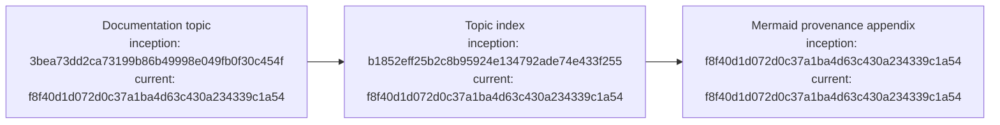

# Documentation diagram and provenance standard

## Index

- [Purpose](#purpose)
- [Required document structure](#required-document-structure)
- [Node provenance](#node-provenance)
- [Maintenance](#maintenance)
- [Appendix — Process flow](#appendix--process-flow)

## Purpose

Every durable Markdown document in this repository must be navigable on its own and must expose the process or authority flow behind its subject. Topic sections link to the document appendix rather than leaving diagrams detached from the prose. See the [process-flow appendix](#appendix--process-flow).

## Required document structure

Every Markdown document must contain an `Index` near the beginning and an `Appendix — Process flow` at the end. The index links both substantive topics and the appendix. Substantive topic sections should include a `Process map` link to the appendix when the relationship is not already obvious from the index.

## Node provenance

Every Mermaid process node carries two Git commit references:

- **inception** — the commit at which the represented code/concept first entered this repository;
- **current** — a commit that contains the current code state represented by the node.

A current hash is a snapshot reference, not necessarily the commit that most recently edited that component. Historical nodes that do not map to executable code still reference the repository commit where the concept/evidence first entered the Dreadnought record. Full commit hashes should be used so provenance is unambiguous.

## Maintenance

Documentation changes must update indexes and diagrams in the same PR when their process flow changes. CI checks structural presence; reviewers remain responsible for semantic correctness of node-to-commit provenance.

## Appendix — Process flow

Commit references: [project founding](https://github.com/seanbman/dreadnought/commit/3bea73dd2ca73199b86b49998e049fb0f30c454f), [documentation index](https://github.com/seanbman/dreadnought/commit/b1852eff25b2c8b95924e134792ade74e433f255), [current code snapshot](https://github.com/seanbman/dreadnought/commit/f8f40d1d072d0c37a1ba4d63c430a234339c1a54).
