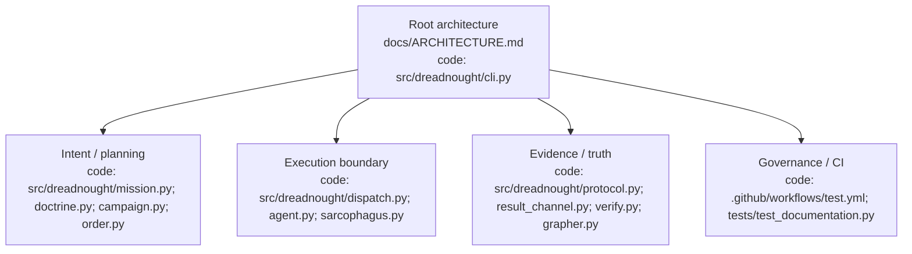
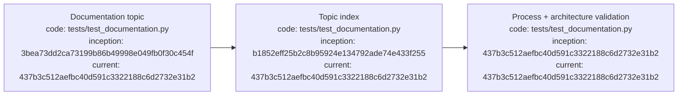

# Documentation diagram and provenance standard

## Index

- [Purpose](#purpose)
- [Required document structure](#required-document-structure)
- [Process-node provenance](#process-node-provenance)
- [Architecture diagrams](#architecture-diagrams)
- [Architecture hierarchy](#architecture-hierarchy)
- [Maintenance](#maintenance)
- [Appendix — Process flow](#appendix--process-flow)

## Purpose

Every durable Markdown document must be navigable on its own and expose the process or authority flow behind its subject. Architectural documents additionally expose the static component boundaries behind that process. Diagrams are not decorative: they are code-addressable navigation surfaces. See the [process-flow appendix](#appendix--process-flow).

## Required document structure

Every durable Markdown document must contain an `Index` near the beginning and an `Appendix — Process flow` at the end. Architecture-bearing documents must also contain an `Architecture diagram` section before the process appendix. The repository-level architecture lives in [`ARCHITECTURE.md`](ARCHITECTURE.md); subsystem documents refine only the part they own.

## Process-node provenance

Every Mermaid process node must identify the implementation source for the represented step and two Git commit references:

- **code** — one or more repository code paths implementing or enforcing the step;
- **inception** — the commit at which the represented code/concept first entered this repository;
- **current** — a commit that contains the current represented code state.

Use concrete paths such as `src/dreadnought/dispatch.py`, `src/dreadnought/protocol.py`, or `.github/workflows/test.yml`. A node representing documentation governance may reference the executable validator that enforces it, for example `tests/test_documentation.py`. Full commit hashes are required.

## Architecture diagrams

Architecture diagrams describe **what exists and where authority lives**; process diagrams describe **what happens over time**. Do not collapse the two.

Each architecture node must identify its principal code path(s). Root architecture diagrams show major control-plane components and trust boundaries. Subsystem architecture diagrams expand only their relevant root node while retaining links back to the root architecture document.

## Architecture hierarchy

Subsystem documents must link back to [`ARCHITECTURE.md`](ARCHITECTURE.md) and may link laterally where a boundary crosses another subsystem.

## Maintenance

Documentation changes must update indexes and diagrams in the same PR when their process or component architecture changes. CI checks required structure and code-path references; reviewers remain responsible for semantic correctness of node-to-code and node-to-commit provenance.

## Appendix — Process flow

Commit references: [project founding](https://github.com/seanbman/dreadnought/commit/3bea73dd2ca73199b86b49998e049fb0f30c454f), [documentation index](https://github.com/seanbman/dreadnought/commit/b1852eff25b2c8b95924e134792ade74e433f255), [documentation contract](https://github.com/seanbman/dreadnought/commit/437b3c512aefbc40d591c3322188c6d2732e31b2).
