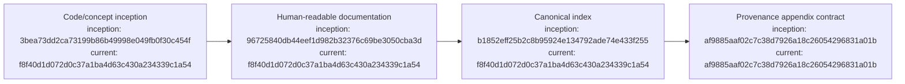

# Documentation Ledger

## Index

- [DOC-0001 — Indexed provenance diagrams](#doc-0001--indexed-provenance-diagrams)
- [Appendix — Process flow](#appendix--process-flow)

## DOC-0001 — Indexed provenance diagrams

**Date:** 2026-09-06  
**Status:** implementation under verification

All durable Markdown documentation is being migrated to a self-indexing format with a linked Mermaid process-flow appendix. Each process node records the full Git commit hash for the node's inception state and the code snapshot representing its current state. `docs/DIAGRAM_STANDARD.md` defines the maintenance contract and `tests/test_documentation.py` makes structural omissions fail CI.

This migration deliberately distinguishes a **current snapshot** from a **last-modified commit**: the current hash asserts that the represented state exists in that repository snapshot, not that every node was edited by that commit. [Process map](#appendix--process-flow)

## Appendix — Process flow

Commit references: [founding](https://github.com/seanbman/dreadnought/commit/3bea73dd2ca73199b86b49998e049fb0f30c454f), [research substrate](https://github.com/seanbman/dreadnought/commit/96725840db44eef1d982b32376c69be3050cba3d), [index inception](https://github.com/seanbman/dreadnought/commit/b1852eff25b2c8b95924e134792ade74e433f255), [diagram standard inception](https://github.com/seanbman/dreadnought/commit/af9885aaf02c7c38d7926a18c26054296831a01b).
