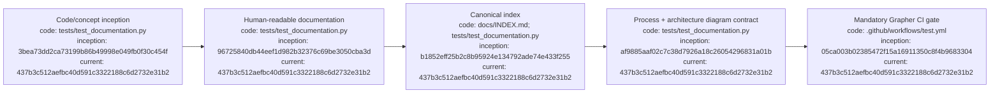

# Documentation Ledger

## Index

- [DOC-0001 — Indexed provenance diagrams](#doc-0001--indexed-provenance-diagrams)
- [DOC-0002 — Grapher is a CI invariant](#doc-0002--grapher-is-a-ci-invariant)
- [DOC-0003 — Code-linked architecture hierarchy](#doc-0003--code-linked-architecture-hierarchy)
- [Appendix — Process flow](#appendix--process-flow)

## DOC-0001 — Indexed provenance diagrams

**Date:** 2026-09-06  
**Status:** merged in PR #12

All durable Markdown documentation is self-indexing with a linked Mermaid process-flow appendix. Each process node records the full Git commit hash for the node's inception state and the code snapshot representing its current state. `docs/DIAGRAM_STANDARD.md` defines the maintenance contract and `tests/test_documentation.py` makes structural omissions fail CI.

This migration deliberately distinguishes a **current snapshot** from a **last-modified commit**: the current hash asserts that the represented state exists in that repository snapshot, not that every node was edited by that commit. [Process map](#appendix--process-flow)

## DOC-0002 — Grapher is a CI invariant

**Date:** 2026-09-06  
**Status:** merged in PR #12

Every repository change set must update `.grapher/knowledge.json` and append `.grapher/history.jsonl`. The GitHub Actions workflow checks this before running tests and fails closed when either file is absent from the diff. The rule applies to pull requests and direct changes to `main`, so documentation-only, code-only, test-only, and workflow-only changes all require Grapher provenance. [Process map](#appendix--process-flow)

The policy is also stated in `AGENTS.md`. Grapher node `decision-grapher-ci-gate` records the decision. The append-only history file was initialized in PR #12 rather than backdated, and the same repair event records cleanup of legacy invalid workflow-state values already present in the graph.

Implementation references: `05ca003b02385472f15a16911350c8f4b9683304` (CI gate), `b5cb2c2083ee40ee5a36240fa6984909ef403105` (canonical graph update), and `7d56e10a5db690806c91ead60f351b0a84ac35a9` (history initialization).

## DOC-0003 — Code-linked architecture hierarchy

**Date:** 2026-09-07  
**Status:** implementation under verification

A new root [`ARCHITECTURE.md`](ARCHITECTURE.md) maps the control plane at high level. Architecture-bearing subsystem documents now contain their own architecture diagrams in addition to their process-flow appendices. The root diagram identifies the major planning, execution, evidence, and governance components; subsystem diagrams expand their local node without redefining the whole system.

Process nodes in architecture-bearing documents now include concrete repository `code:` paths alongside `inception:` and `current:` commit provenance. Architecture nodes likewise identify the principal implementation file(s). `tests/test_documentation.py` enforces the presence of separate architecture/process Mermaid blocks, root-architecture links, and per-process-node code/commit markers. [Process map](#appendix--process-flow)

Grapher node `design-code-linked-architecture-docs` records the design change and links it to the existing Grapher CI enforcement decision.

## Appendix — Process flow

Commit references: [founding](https://github.com/seanbman/dreadnought/commit/3bea73dd2ca73199b86b49998e049fb0f30c454f), [research substrate](https://github.com/seanbman/dreadnought/commit/96725840db44eef1d982b32376c69be3050cba3d), [index inception](https://github.com/seanbman/dreadnought/commit/b1852eff25b2c8b95924e134792ade74e433f255), [diagram standard inception](https://github.com/seanbman/dreadnought/commit/af9885aaf02c7c38d7926a18c26054296831a01b), [Grapher CI gate](https://github.com/seanbman/dreadnought/commit/05ca003b02385472f15a16911350c8f4b9683304), [documentation baseline](https://github.com/seanbman/dreadnought/commit/437b3c512aefbc40d591c3322188c6d2732e31b2).
