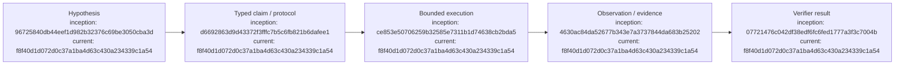

# Experiment Ledger

## Index

- [Experiment discipline](#experiment-discipline)
- [E-0001 — Typed protocol can make agent claims mechanically testable](#e-0001--typed-protocol-can-make-agent-claims-mechanically-testable)
- [E-0002 — Authority mediation can make Grapher protocol difficult to bypass](#e-0002--authority-mediation-can-make-grapher-protocol-difficult-to-bypass)
- [E-0003 — Granite wrapper-first autonomy via CommandAgentAdapter](#e-0003--granite-wrapper-first-autonomy-via-commandagentadapter)
- [E-0004 — Koffer Training Episode corpus](#e-0004--koffer-training-episode-corpus)
- [Appendix — Process flow](#appendix--process-flow)

## Experiment discipline

Experiments should state falsifiable hypotheses where possible. Agent opinions may propose tests; deterministic observations should determine machine verdicts when a suitable predicate exists. [Process map](#appendix--process-flow)

## E-0001 — Typed protocol can make agent claims mechanically testable

**Date opened:** 2026-09-06  
**Status:** planned

**Hypothesis:** For common software-agent assertions such as test success, build success, file mutation scope, Git state, and artifact existence, a normalized claim schema can map the assertion to deterministic evidence without an LLM deciding truth.

**Initial procedure:** Implement a minimal claim taxonomy and verifiers for command exit status, filesystem state, hashes/diffs, and Git state. Run one real agent mission and compare its submitted claims with Dreadnought observations.

**Success criterion:** Dreadnought can classify supported/contradicted/unverified claims from authoritative observations while preserving the original agent claim. [Process map](#appendix--process-flow)

## E-0002 — Authority mediation can make Grapher protocol difficult to bypass

**Date opened:** 2026-09-06  
**Status:** planned

**Hypothesis:** If authoritative mutations are owned by Dreadnought rather than the agent, Grapher recording can become a property of the mutation path instead of a voluntary agent behavior.

**Initial procedure:** Prototype a read-only canonical workspace plus writable scratch/overlay and require Dreadnought mediation for authoritative changes.

**Success criterion:** An agent lacking control-plane credentials cannot mutate canonical project state without traversing the recorded Dreadnought path. [Process map](#appendix--process-flow)

## E-0003 — Granite wrapper-first autonomy via CommandAgentAdapter

**Date opened:** 2026-09-10  
**Status:** planned

**Hypothesis:** A thin Granite CLI wrapped through existing `CommandAgentAdapter` / `dreadnought arm dispatch` can satisfy Order → scratch work → agent-perspective protocol JSONL → Dreadnought evaluation without first adding a first-class `GraniteMinionAdapter`, and without teaching the model to write Grapher or observer/verdict records.

**Initial procedure:** Land research briefs [`research/001-granite-instruct-code-training.md`](research/001-granite-instruct-code-training.md) (IF+code competence) and [`research/002-granite-dreadnought-autonomy.md`](research/002-granite-dreadnought-autonomy.md) (control-plane contracts). Implement a disposable-workspace wrapper that consumes `{order}` / `{scratch}` / `{result}` tokens, then compare schema-valid testimony rates against a prompt-pack baseline. Keep minion `control commission` on codex|cursor until Phase 1 evidence exists.

**Success criterion:** On a real disposable workspace, a Granite wrapper produces evaluable agent JSONL for at least one Order with deterministic verifiers, while malicious observer/verdict perspectives are rejected by `AgentResultChannel`. Scratch artifact success ≠ canonical-tree landing (no scratch→canonical broker). No results recorded yet — experiment opened only.

**Research:** [`research/002-granite-dreadnought-autonomy.md`](research/002-granite-dreadnought-autonomy.md). [Process map](#appendix--process-flow)

## E-0004 — Koffer Training Episode corpus

**Date opened:** 2026-10-03
**Status:** planned

**Hypothesis:** A real application developed from explicit product documentation can generate a higher-quality future fine-tuning corpus when Dreadnought records each bounded execution as Order + testimony + deterministic evaluation + human correction, rather than treating successful code or Grapher state alone as training data.

**Initial procedure:** Use Koffer's documented Linux-desktop requirements as the first live case study. Enable Training Episode capture, issue bounded Orders with deterministic acceptance criteria, preserve all outcomes, add human `accept|reject|revise` feedback, and export a reviewed corpus after enough episodes accumulate.

**Success criterion:** The corpus contains reproducible accepted examples, failed/contradicted examples, and corrected examples with explicit provenance, no dependency on a Granite chat template, and no requirement to reinterpret Grapher as flat training text.

**Training gate:** Do not begin weight updates merely because the recorder exists. Accumulate and review a meaningful corpus first, reserve a held-out evaluation set, then run a small LoRA/QLoRA experiment against the Granite research plan.

**Grapher evidence:** `decision-training-episode-derived-corpus`, `implementation-training-episode-v1`.

## Appendix — Process flow

```mermaid
flowchart LR
    H["Hypothesis<br/>inception: 96725840db44eef1d982b32376c69be3050cba3d<br/>current: f8f40d1d072d0c37a1ba4d63c430a234339c1a54"] --> P["Typed claim / protocol<br/>inception: d6692863d9d43372f3fffc7b5c6fb821b6dafee1<br/>current: f8f40d1d072d0c37a1ba4d63c430a234339c1a54"]
    P --> X["Bounded execution<br/>inception: ce853e50706259b32585e7311b1d74638cb2bda5<br/>current: f8f40d1d072d0c37a1ba4d63c430a234339c1a54"]
    X --> O["Observation / evidence<br/>inception: 4630ac84da52677b343e7a3737844da683b25202<br/>current: f8f40d1d072d0c37a1ba4d63c430a234339c1a54"]
    O --> V["Verifier result<br/>inception: 07721476c042df38edf6fc6fed1777a3f3c7004b<br/>current: f8f40d1d072d0c37a1ba4d63c430a234339c1a54"]
```

Commit references: [research substrate](https://github.com/seanbman/dreadnought/commit/96725840db44eef1d982b32376c69be3050cba3d), [protocol](https://github.com/seanbman/dreadnought/commit/d6692863d9d43372f3fffc7b5c6fb821b6dafee1), [Grapher](https://github.com/seanbman/dreadnought/commit/4630ac84da52677b343e7a3737844da683b25202), [verification](https://github.com/seanbman/dreadnought/commit/07721476c042df38edf6fc6fed1777a3f3c7004b), [Sarcophagus](https://github.com/seanbman/dreadnought/commit/ce853e50706259b32585e7311b1d74638cb2bda5), [current snapshot](https://github.com/seanbman/dreadnought/commit/f8f40d1d072d0c37a1ba4d63c430a234339c1a54).
