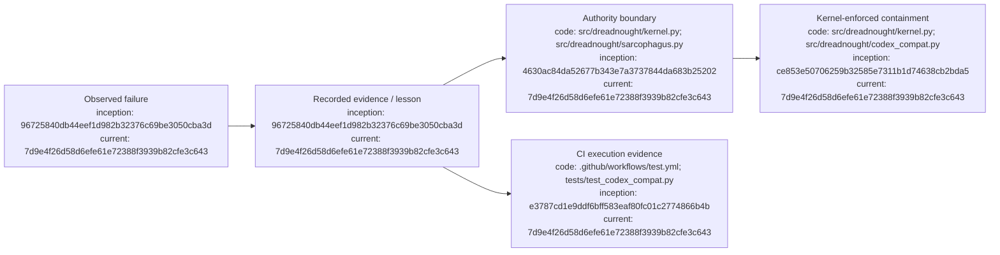

# Failure Ledger

## Index

- [Failure discipline](#failure-discipline)
- [F-0001 — Agent Hub orchestration contamination](#f-0001--agent-hub-orchestration-contamination)
- [F-0002 — Voluntary Grapher use is not enforcement](#f-0002--voluntary-grapher-use-is-not-enforcement)
- [F-0003 — Verification infrastructure was absent during PR #3 development](#f-0003--verification-infrastructure-was-absent-during-pr-3-development)
- [F-0004 — Codex UnifiedExec repair passed the wrong integration boundary](#f-0004--codex-unifiedexec-repair-passed-the-wrong-integration-boundary)
- [Appendix — Process flow](#appendix--process-flow)

## Failure discipline

Failures are retained because they are design evidence. Do not clean them out of the narrative when later work succeeds. [Process map](#appendix--process-flow)

## F-0001 — Agent Hub orchestration contamination

**Date recorded:** 2026-09-06  
**Historical source period:** prior Agent Hub / Dreadnought case-study work

**Observed problem:** Earlier orchestration work demonstrated that an orchestration layer can introduce assumptions, procedural rules, or closure behavior that are not grounded in authoritative project evidence. In at least one case-study workflow, role-boundary interference contaminated the evidence needed to establish authentic agent acceptance/closure.

**Lesson carried forward:** Dreadnought must distinguish user authority, mission protocol, agent testimony, observer evidence, verification, acceptance, and closure rather than allowing conversational inference to collapse them together.

**Evidence status:** Historical evidence exists in the Agent Hub and case-study source material. It should be imported and cited explicitly in a later evidence-ingestion PR rather than expanded here from memory. [Process map](#appendix--process-flow)

## F-0002 — Voluntary Grapher use is not enforcement

**Date recorded:** 2026-09-06

**Observed problem:** An instruction telling an agent to record its work cannot prevent direct filesystem, Git, or network actions that bypass the recorder when the agent has equivalent authority.

**Lesson carried forward:** Grapher compliance must eventually be enforced by the control-plane capability boundary, not prompt wording or CLI etiquette. [Process map](#appendix--process-flow)

## F-0003 — Verification infrastructure was absent during PR #3 development

**Date recorded:** 2026-09-06  
**Time:** approximately 08:20 MDT / 14:20 UTC

**Observed problem:** PR #3 added tests but the repository had no GitHub Actions workflow, so there was no automatic execution evidence attached to the pull request. The connected environment also could not clone the repository directly to run the suite externally.

**Response:** Added `.github/workflows/test.yml` on PR #3 at commit `e3787cd1e9ddf6bff583eaf80fc01c2774866b4b`. The workflow runs `pytest` on pull requests and pushes to `main`.

**Lesson carried forward:** Dreadnought's own development should not treat the presence of tests as equivalent to observed test execution. Verification evidence must be produced by an executing system, not inferred from source files. [Process map](#appendix--process-flow)

## F-0004 — Codex UnifiedExec repair passed the wrong integration boundary

**Date recorded:** 2026-09-08  
**Observed failure:** A live primary Codex launched through the Dreadnought kernel could not execute even `/bin/true` or `ls`, failing with `Failed to create unified exec process: Permission denied (os error 13)` before it could inspect the bootstrap Mission or use the control plane.

**Why the earlier verification was wrong:** The v0.2.0b4 repair asserted that `-c features.unified_exec=false` disabled Codex UnifiedExec. Dreadnought tested argument construction and ordinary child-process spawning under Bubblewrap, but did not execute a real Codex shell tool inside that kernel. Codex treats a normal CLI feature opt-out as non-authoritative and re-enables UnifiedExec unless a managed feature requirement pins it.

**Response:** Dreadnought now creates a private Codex system-requirements overlay that preserves existing `/etc/codex` policy while pinning `[features] unified_exec = false`, then mounts that overlay read-only inside the outer Bubblewrap boundary for both primary and Sarcophagus Codex runtimes. The canonical workspace remains read-only and Dreadnought remains the external sandbox authority.

**Lesson carried forward:** Provider compatibility claims must be tested through the provider's actual tool execution path. Constructing provider arguments or proving that an unrelated `/bin/sh` child can spawn is not sufficient integration evidence. [Process map](#appendix--process-flow)

## Appendix — Process flow

Commit references: [research substrate](https://github.com/seanbman/dreadnought/commit/96725840db44eef1d982b32376c69be3050cba3d), [CI inception](https://github.com/seanbman/dreadnought/commit/e3787cd1e9ddf6bff583eaf80fc01c2774866b4b), [Grapher authority](https://github.com/seanbman/dreadnought/commit/4630ac84da52677b343e7a3737844da683b25202), [Sarcophagus](https://github.com/seanbman/dreadnought/commit/ce853e50706259b32585e7311b1d74638cb2bda5), [Codex compatibility repair](https://github.com/seanbman/dreadnought/commit/7d9e4f26d58d6efe61e72388f3939b82cfe3c643).