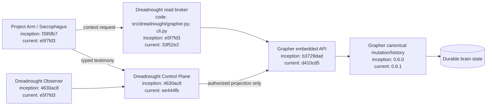
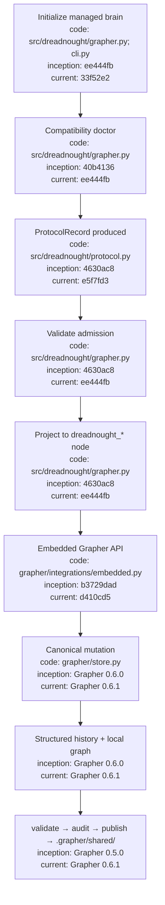

# Dreadnought / Grapher Integration

## Index

- [Authority model](#authority-model)
- [Compatibility baseline](#compatibility-baseline)
- [Configuration flow](#configuration-flow)
- [Read brokering](#read-brokering)
- [Write mediation](#write-mediation)
- [Architecture](#architecture)
- [Appendix — Process flow](#appendix--process-flow)

## Authority model

Dreadnought encapsulates Grapher as its durable cognitive substrate. Grapher remains independently operable, but inside a Dreadnought-controlled workspace **Dreadnought is the sole Grapher writer**.

Project Arms inside Sarcophagus do not mutate Grapher. They submit typed `ProtocolRecord` testimony to the Dreadnought control plane. Dreadnought validates authority and protocol semantics, projects the record into a Dreadnought-specific Grapher type, and calls `grapher.integrations.embedded`. Grapher then owns canonical persistence, truth policy, semantic integrity, status transitions, provenance history, and rollback.

Dreadnought may also create its own observations. Agent testimony and Dreadnought observations remain distinguishable through protocol perspective, actor metadata, and provenance.

## Compatibility baseline

Dreadnought targets Grapher 0.6.1 through the stable `v0.6.1` repository ref. Grapher 0.6.1 is the first compatibility baseline that formally documents the host-agnostic embedded/brokering interface.

Check a workspace with:

```bash
dreadnought grapher doctor --root /path/to/project
```

## Configuration flow

1. Install Dreadnought; its dependency installs the compatible Grapher line.
2. Initialize a new controlled workspace with `dreadnought grapher init --root <project>`.
3. Dreadnought creates Grapher and materializes the required Dreadnought projection policy.
4. `.grapher/config.json` registers the `dreadnought_*` node types and requires explicit truth status.
5. Mission/order/session context supplies scope and actor provenance.
6. `ProtocolRecord.validate()` is the admission gate.
7. `GrapherControlPlane` projects the complete record losslessly into `meta.protocol` and a `dreadnought_*` node type.
8. Grapher's embedded API performs canonical mutation and structured history.
9. Git governance evidence is published under `.grapher/shared/`; local runtime graph/history are not the Git publication contract.

Initialization fails closed if an existing graph is present rather than overwriting it.

## Read brokering

Dreadnought exposes bounded read access without exposing Grapher write authority:

```bash
dreadnought grapher query "known failures" --root . --limit 8
dreadnought grapher query "known failures" --root . --mission <mission-id> --limit 8
dreadnought grapher get <node-id> --root .
```

Programmatic callers use `GrapherControlPlane.query()` and `GrapherControlPlane.get()`.

Project Arms should receive relevant Grapher context through this broker. This lets Dreadnought control mission scope and context volume while preserving the exclusive-writer boundary.

## Write mediation

The canonical write path is:

```text
Project Arm testimony or Dreadnought observation
→ ProtocolRecord
→ Dreadnought validation/admission
→ Dreadnought protocol projection
→ grapher.integrations.embedded
→ Grapher save_graph_mutation()
→ local graph + structured history
```

The original Dreadnought protocol payload is preserved losslessly in node metadata. Dreadnought uses `dreadnought_*` node types so host protocol semantics are not confused with Grapher's strict native semantic-entry contracts.

There is intentionally no general-purpose subordinate `grapher add` path through Dreadnought. Mutations are private to the control plane.

## Architecture



## Appendix — Process flow



The central invariant is intentionally asymmetric: **reads may be brokered to subordinate agents, but all mutations are mediated by Dreadnought.**
