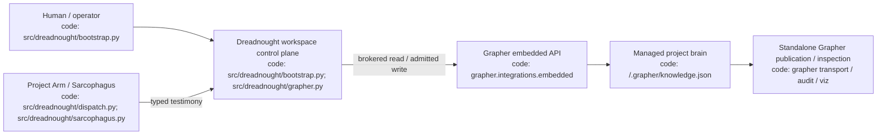
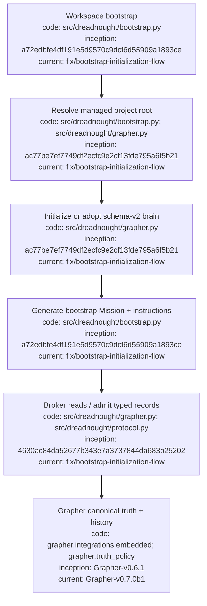

# Dreadnought / Grapher Integration

## Index

- [Authority model](#authority-model)
- [Compatibility baseline](#compatibility-baseline)
- [Workspace bootstrap](#workspace-bootstrap)
- [Existing brain adoption](#existing-brain-adoption)
- [Read brokering](#read-brokering)
- [Write mediation](#write-mediation)
- [Standalone Grapher](#standalone-grapher)
- [Architecture](#architecture)
- [Appendix — Process flow](#appendix--process-flow)

## Authority model

Grapher remains independently operable, but inside a Dreadnought-controlled workspace **Dreadnought is the sole Grapher writer**. Project Arms / Sarcophagus agents receive brokered context and submit typed `ProtocolRecord` testimony. Dreadnought validates admission and authority and projects through `grapher.integrations.embedded`; Grapher owns canonical persistence, truth policy, semantic integrity, transitions, provenance history, and publication.

Agent testimony and Dreadnought observations remain distinct. Successful execution does not establish acceptance.

## Compatibility baseline

The current public pairing is **Dreadnought v0.2.0b2 → Grapher v0.7.0b1**, pinned in `pyproject.toml`.

Check the managed brain from the Dreadnought workspace root:

```bash
dreadnought grapher doctor --root .
```

A healthy result reports the Dreadnought workspace, resolved managed project root, Grapher version, schema-v2 brain, explicit truth-status policy, required Dreadnought projection types, and `compatible: true`.

## Workspace bootstrap

For normal setup, use Dreadnought rather than initializing Grapher separately:

```bash
cd /path/to/workspace
dreadnought initialize
```

`dreadnought init` is an alias. Bootstrap captures operator intent, identifies the managed project root, stores that routing in `.dreadnought/config.json`, initializes or adopts the project brain, creates a ready bootstrap Mission, and generates `.dreadnought/INSTRUCTIONS.md`.

A workspace may encapsulate a nested standalone project:

```text
workspace/
├── .dreadnought/
└── project/
    └── .grapher/
```

Once `project_root` is configured, all `GrapherControlPlane(workspace)` operations resolve `project/.grapher` transparently. Dreadnought state does not require relocating the project's brain.

## Existing brain adoption

If the managed project already contains `.grapher/knowledge.json`, bootstrap calls the Dreadnought adoption path instead of reinitializing it.

Adoption:

- requires Grapher schema v2;
- does not rewrite existing graph nodes;
- preserves existing custom node types;
- preserves existing truth-status legacy allowlist entries;
- adds the required `dreadnought_*` projection types;
- enables explicit truth status for future authored nodes;
- grandfatheres inherited missing/`unclassified` node IDs into Grapher's legacy allowlist.

The legacy allowlist is intentionally keyed by node ID, matching Grapher's truth-policy contract. Historical state remains historical evidence rather than being silently reclassified during Dreadnought adoption.

`dreadnought grapher init --root <project>` remains a low-level new-brain command and still fails closed if a graph already exists. For an inherited project, use `dreadnought initialize` at the workspace boundary.

## Read brokering

```bash
dreadnought grapher query "known failures" --root . --limit 8
dreadnought grapher query "known failures" --root . --mission <mission-id> --limit 8
dreadnought grapher get <node-id> --root .
```

Programmatic callers use `GrapherControlPlane.query()` and `.get()`. Project Arms receive relevant context through this broker without receiving mutation authority.

## Write mediation

```text
Project Arm testimony or Dreadnought observation
→ ProtocolRecord
→ Dreadnought validation/admission
→ Dreadnought protocol projection
→ Grapher embedded API
→ Grapher canonical mutation/history
```

There is intentionally no general-purpose subordinate `grapher add` path through Dreadnought. The original typed protocol payload is retained in Grapher metadata, including the submitting actor and perspective.

## Standalone Grapher

Dreadnought does not make Grapher unusable on its own. The managed project can still use Grapher's standalone validation, audit, visualization, sync, and publication surfaces outside a Dreadnought-controlled execution context. The restriction is architectural: **agents operating under Dreadnought do not bypass Dreadnought to mutate the brain**.

## Architecture



## Appendix — Process flow


