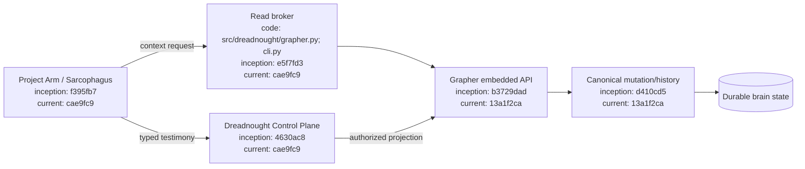
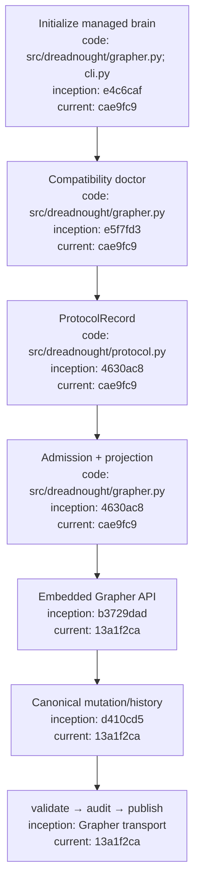

# Dreadnought / Grapher Integration

## Index

- [Authority model](#authority-model)
- [Compatibility baseline](#compatibility-baseline)
- [Configuration flow](#configuration-flow)
- [Read brokering](#read-brokering)
- [Write mediation](#write-mediation)
- [Architecture](#architecture)
- [Appendix — Process flow](#appendix--process-flow)

## Authority model

Grapher remains independently operable, but inside a Dreadnought-controlled workspace **Dreadnought is the sole Grapher writer**. Project Arms submit typed `ProtocolRecord` testimony. Dreadnought validates admission/authority and projects through `grapher.integrations.embedded`; Grapher owns canonical persistence, truth policy, semantic integrity, transitions, provenance history, and rollback. Agent testimony and Dreadnought observations remain distinct.

## Compatibility baseline

Current public pairing: **Dreadnought v0.2.0b1 → Grapher v0.7.0b1**. Grapher v0.6.1 is the historical first formally documented embedded/brokering compatibility baseline; v0.7.0b1 carries that boundary forward and adds Linux distribution/update discovery.

```bash
dreadnought grapher doctor --root /path/to/project
```

See [`INSTALLATION_AND_UPDATES.md`](INSTALLATION_AND_UPDATES.md) for installation/version behavior.

## Configuration flow

1. Install Dreadnought and its matched Grapher dependency.
2. Run `dreadnought grapher init --root <project>`.
3. Dreadnought creates Grapher and its `dreadnought_*` projection policy with explicit truth status.
4. Mission/order/session context supplies scope/provenance.
5. `ProtocolRecord.validate()` gates admission.
6. `GrapherControlPlane` preserves the original payload in `meta.protocol` and projects to a Dreadnought node type.
7. Grapher performs canonical mutation/history.
8. Git governance/publication evidence lives under `.grapher/shared/`.

Initialization fails closed if a graph already exists.

## Read brokering

```bash
dreadnought grapher query "known failures" --root . --limit 8
dreadnought grapher query "known failures" --root . --mission <mission-id> --limit 8
dreadnought grapher get <node-id> --root .
```

Programmatic callers use `GrapherControlPlane.query()` and `.get()`. Project Arms receive relevant context through the broker without receiving mutation authority.

## Write mediation

```text
Project Arm testimony or Dreadnought observation
→ ProtocolRecord
→ Dreadnought validation/admission
→ Dreadnought protocol projection
→ grapher.integrations.embedded
→ Grapher canonical mutation
→ local graph + structured history
```

There is intentionally no general-purpose subordinate `grapher add` path through Dreadnought.

## Architecture



## Appendix — Process flow



**Reads may be brokered to subordinate agents, but all mutations are mediated by Dreadnought.**
