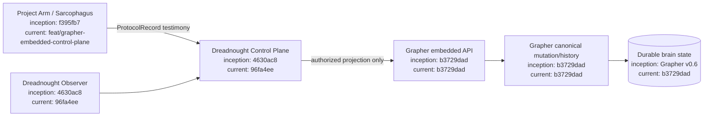
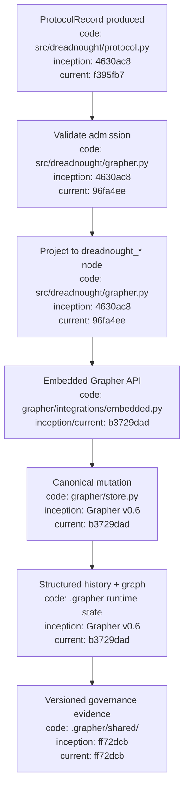

# Dreadnought / Grapher Integration

Dreadnought encapsulates Grapher as its durable cognitive substrate. Grapher remains independently operable, but inside a Dreadnought-controlled workspace **Dreadnought is the sole Grapher writer**.

Project Arms inside Sarcophagus do not mutate Grapher. They submit typed `ProtocolRecord` testimony to the Dreadnought control plane. Dreadnought validates authority and protocol semantics, projects the record into a Dreadnought-specific Grapher type, and calls `grapher.integrations.embedded`. Grapher then owns canonical persistence, truth policy, semantic integrity, status transitions, provenance history, and rollback.

Dreadnought may also create its own observations. Agent testimony and Dreadnought observations remain distinguishable through protocol perspective, actor metadata, and provenance.

## Configuration flow

1. Dreadnought pins a known-compatible Grapher commit/version.
2. `.grapher/config.json` registers Dreadnought projection node types and requires explicit truth status.
3. Mission/order/session context supplies scope and actor provenance.
4. `ProtocolRecord.validate()` is the admission gate.
5. `GrapherControlPlane` projects the complete record losslessly into `meta.protocol` and a `dreadnought_*` node type.
6. Grapher's embedded API performs canonical mutation and structured history.
7. Git governance evidence is published under `.grapher/shared/`; local runtime graph/history are not the CI publication contract.

## Architecture

## Process-flow appendix

The central invariant is intentionally asymmetric: **reads may be brokered to subordinate agents, but all mutations are mediated by Dreadnought.**
