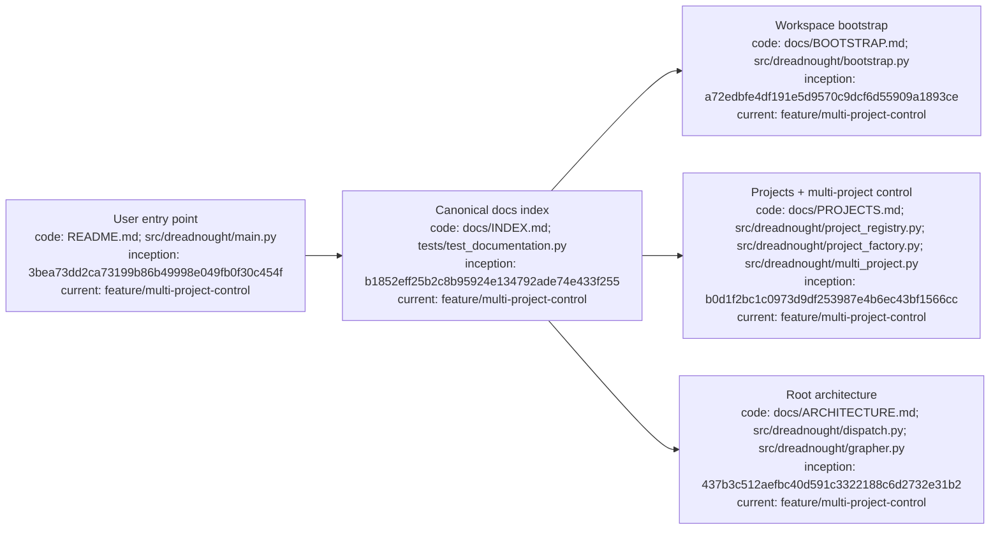

# Dreadnought documentation index

## Index

- [Start here](#start-here)
- [Architecture](#architecture)
- [Ledgers](#ledgers)
- [Machine-readable counterparts](#machine-readable-counterparts)
- [Document authority and update rules](#document-authority-and-update-rules)
- [Current milestone boundary](#current-milestone-boundary)
- [Appendix — Process flow](#appendix--process-flow)

This is the canonical durable documentation map. **New users should begin with the root [`README.md`](../README.md).**

## Start here

- [`README.md`](../README.md) — user-friendly overview and Linux quick start.
- [`BOOTSTRAP.md`](BOOTSTRAP.md) — workspace initialization, inherited Grapher adoption, generated instructions, and nested-project routing.
- [`PROJECTS.md`](PROJECTS.md) — multi-project registry, project creation, linked docs, synchronous multi-project control, project-targeted Orders, compatibility, and CLI.
- [`MISSION_BUILDER.md`](MISSION_BUILDER.md) — guided mission prompt, source-document, requirement, notes, capability, review, and readiness workflow.
- [`INSTALLATION_AND_UPDATES.md`](INSTALLATION_AND_UPDATES.md) — Linux installation, updates, release checks, dependency, troubleshooting.
- [`INLINE_CLI.md`](INLINE_CLI.md) — inline numbered/arrow-key menus, cancellation semantics, help command, and `man dreadnought`.
- [`RELEASE_0.2.0b2.md`](RELEASE_0.2.0b2.md) — current beta patch baseline and upgrade paths.
- [`RELEASE_0.2.0b1.md`](RELEASE_0.2.0b1.md) — previous beta baseline and verification.
- [`PROJECT_EXECUTION_TUTORIAL.md`](PROJECT_EXECUTION_TUTORIAL.md) — canonical setup-to-execution walkthrough.
- [`INTERACTIVE_CLI_AND_TOKEN_USAGE.md`](INTERACTIVE_CLI_AND_TOKEN_USAGE.md) — menu, primary-agent chat, configuration, token accounting.
- [`CLI_USAGE.md`](CLI_USAGE.md) — compact command reference and authority boundaries.
- [`AGENTS.md`](../AGENTS.md) — repository operating instructions.
- [`README.md`](README.md) — research-record conventions.
- [`DIAGRAM_STANDARD.md`](DIAGRAM_STANDARD.md) — documentation/diagram provenance contract.
- [`ROADMAP.md`](ROADMAP.md) — milestone sequence and deferred work.

## Architecture

- [`ARCHITECTURE.md`](ARCHITECTURE.md) — root component and trust-boundary map, including the workspace project registry and multi-project coordinator.
- [`ARCHITECTURE_CHARTER.md`](ARCHITECTURE_CHARTER.md) — principles and authority model.
- [`GRAPHER_INTEGRATION.md`](GRAPHER_INTEGRATION.md) — Dreadnought/Grapher authority, v0.7.0b1 compatibility, initialization, brokering, projection, publication.
- [`PROJECT_ARM_LEDGER.md`](PROJECT_ARM_LEDGER.md) — dispatch/adapters/result-channel architecture.
- [`SARCOPHAGUS_LEDGER.md`](SARCOPHAGUS_LEDGER.md) — isolation and scratch/canonical workspace architecture.
- [`PROTOCOL_LEDGER.md`](PROTOCOL_LEDGER.md) — typed epistemic protocol architecture.

## Ledgers

- [`DEVELOPMENT_LEDGER.md`](DEVELOPMENT_LEDGER.md) — chronological implementation record.
- [`DECISION_LEDGER.md`](DECISION_LEDGER.md) — decisions and supersession history.
- [`DOCUMENTATION_LEDGER.md`](DOCUMENTATION_LEDGER.md) — documentation governance and Grapher CI enforcement.
- [`EXPERIMENT_LEDGER.md`](EXPERIMENT_LEDGER.md) — hypotheses, experiments, evidence, conclusions.
- [`FAILURE_LEDGER.md`](FAILURE_LEDGER.md) — failures and lessons.
- [`PROTOCOL_LEDGER.md`](PROTOCOL_LEDGER.md) — protocol evolution.
- [`SARCOPHAGUS_LEDGER.md`](SARCOPHAGUS_LEDGER.md) — execution-isolation experiments.
- [`PROJECT_ARM_LEDGER.md`](PROJECT_ARM_LEDGER.md) — Project Arm dispatch/result-channel experiments.

## Machine-readable counterparts

Local runtime brain state lives under each project's `.grapher/` directory. Git-versioned governance/publication evidence lives under [`.grapher/shared/`](../.grapher/shared/) for this repository. Dreadnought workspace configuration/token accounting and mission documents live under [`.dreadnought/`](../.dreadnought/), including the multi-project registry. Contracts are under [`schemas/`](../schemas/), executable code under [`src/dreadnought/`](../src/dreadnought/), verification under [`tests/`](../tests/). Dreadnought runtime Grapher mutations pass through project-scoped `GrapherControlPlane` instances or `MultiProjectControlPlane`; repository changes carry versioned Grapher evidence.

## Document authority and update rules

Current typed schema/code and validated machine state define executable behavior; the Architecture Charter/current decisions define intended architecture; Roadmap defines active sequence; ledgers preserve contemporaneous beliefs. CLI parser/help is executable authority. [`BOOTSTRAP.md`](BOOTSTRAP.md) is workspace-initialization authority, [`PROJECTS.md`](PROJECTS.md) is workspace-project registry/creation/multi-project-control authority, [`MISSION_BUILDER.md`](MISSION_BUILDER.md) is mission-authoring authority, [`INSTALLATION_AND_UPDATES.md`](INSTALLATION_AND_UPDATES.md) is distribution authority, [`INLINE_CLI.md`](INLINE_CLI.md) is interactive-terminal authority, and [`PROJECT_EXECUTION_TUTORIAL.md`](PROJECT_EXECUTION_TUTORIAL.md) is the canonical execution walkthrough. New durable Markdown must be indexed here, contain `## Index`, and include the required Mermaid provenance appendix. Architecture-bearing docs link to [`ARCHITECTURE.md`](ARCHITECTURE.md).

## Current milestone boundary

Current public beta: **Dreadnought v0.2.0b2** with **Grapher v0.7.0b1**. The current development line now includes generated workspace bootstrap, a multi-project registry, complete project creation from name/directive, linked documentation, explicit per-project Grapher routing, deterministic synchronous workspace-wide status/query operations, and project-targeted Orders/dispatch without changing global project selection.

## Appendix — Process flow

