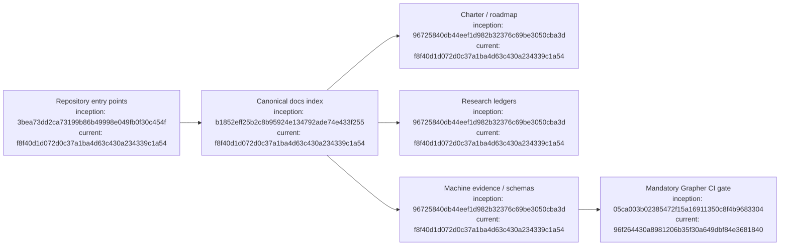

# Dreadnought documentation index

## Index

- [Start here](#start-here)
- [Ledgers](#ledgers)
- [Machine-readable counterparts](#machine-readable-counterparts)
- [Document authority and update rules](#document-authority-and-update-rules)
- [Current milestone boundary](#current-milestone-boundary)
- [Appendix — Process flow](#appendix--process-flow)

This is the canonical index for the repository's human-readable record. Every durable Markdown document is listed here or is an explicitly indexed repository entry point. [Process map](#appendix--process-flow)

## Start here

- [`README.md`](../README.md) — project overview and entry point.
- [`AGENTS.md`](../AGENTS.md) — repository operating instructions.
- [`README.md`](README.md) — research-record conventions.
- [`DIAGRAM_STANDARD.md`](DIAGRAM_STANDARD.md) — document indexes, Mermaid appendices, and commit-provenance requirements.
- [`ARCHITECTURE_CHARTER.md`](ARCHITECTURE_CHARTER.md) — architectural principles and system boundaries.
- [`ROADMAP.md`](ROADMAP.md) — milestone sequence and deferred work.

[Process map](#appendix--process-flow)

## Ledgers

- [`DEVELOPMENT_LEDGER.md`](DEVELOPMENT_LEDGER.md) — chronological implementation record.
- [`DECISION_LEDGER.md`](DECISION_LEDGER.md) — architectural decisions and supersession history.
- [`DOCUMENTATION_LEDGER.md`](DOCUMENTATION_LEDGER.md) — documentation governance, including mandatory Grapher CI enforcement.
- [`EXPERIMENT_LEDGER.md`](EXPERIMENT_LEDGER.md) — hypotheses, experiments, evidence, and conclusions.
- [`FAILURE_LEDGER.md`](FAILURE_LEDGER.md) — failures and lessons.
- [`PROTOCOL_LEDGER.md`](PROTOCOL_LEDGER.md) — typed protocol evolution.
- [`SARCOPHAGUS_LEDGER.md`](SARCOPHAGUS_LEDGER.md) — execution-isolation experiments.
- [`PROJECT_ARM_LEDGER.md`](PROJECT_ARM_LEDGER.md) — Project Arm dispatch and result-channel experiments.

[Process map](#appendix--process-flow)

## Machine-readable counterparts

Human-readable Markdown is not the canonical machine evidence store. Machine-readable state lives under [`.grapher/`](../.grapher/): `knowledge.json`, `history.jsonl`, and `config.json`. Versioned contracts live under [`schemas/`](../schemas/); executable code under [`src/dreadnought/`](../src/dreadnought/); verification under [`tests/`](../tests/). Every change set must modify `knowledge.json` and append `history.jsonl`; CI fails closed otherwise. [Process map](#appendix--process-flow)

## Document authority and update rules

When documents disagree: current typed schema/code and validated machine state define executable behavior; the Architecture Charter and current decisions define intended architecture; the Roadmap defines active sequence; ledgers preserve contemporaneous beliefs; freeform notes never silently become machine authority. New durable Markdown must be indexed here, contain its own `Index`, and include the required Mermaid provenance appendix. Every repository change set must also carry a Grapher update and append-only history event. [Process map](#appendix--process-flow)

## Current milestone boundary

Sarcophagus, Project Arm dispatch, and the typed agent result channel are merged. Milestone 8 still requires a real vendor adapter and bounded real-workspace run before empirical validation. [Process map](#appendix--process-flow)

## Appendix — Process flow

Commit references: [founding](https://github.com/seanbman/dreadnought/commit/3bea73dd2ca73199b86b49998e049fb0f30c454f), [research substrate](https://github.com/seanbman/dreadnought/commit/96725840db44eef1d982b32376c69be3050cba3d), [canonical index inception](https://github.com/seanbman/dreadnought/commit/b1852eff25b2c8b95924e134792ade74e433f255), [Grapher CI gate](https://github.com/seanbman/dreadnought/commit/05ca003b02385472f15a16911350c8f4b9683304), [current snapshot](https://github.com/seanbman/dreadnought/commit/96f264430a8981206b35f30a649dbf84e3681840).
