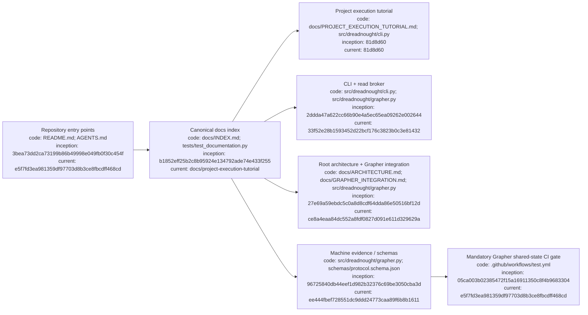

# Dreadnought documentation index

## Index

- [Start here](#start-here)
- [Architecture](#architecture)
- [Ledgers](#ledgers)
- [Machine-readable counterparts](#machine-readable-counterparts)
- [Document authority and update rules](#document-authority-and-update-rules)
- [Current milestone boundary](#current-milestone-boundary)
- [Appendix — Process flow](#appendix--process-flow)

This is the canonical index for the repository's human-readable record. Every durable Markdown document is listed here or is an explicitly indexed repository entry point. [Process map](#appendix--process-flow)

## Start here

- [`README.md`](../README.md) — project overview and entry point.
- [`AGENTS.md`](../AGENTS.md) — repository operating instructions.
- [`README.md`](README.md) — research-record conventions.
- [`PROJECT_EXECUTION_TUTORIAL.md`](PROJECT_EXECUTION_TUTORIAL.md) — end-to-end setup, managed Grapher initialization, Mission-to-Order flow, brokered reads, Project Arm dispatch, protocol ingest, and publication.
- [`CLI_USAGE.md`](CLI_USAGE.md) — compact human/agent command-line reference and authority boundaries.
- [`DIAGRAM_STANDARD.md`](DIAGRAM_STANDARD.md) — document indexes, process diagrams, architecture diagrams, code-path references, and commit provenance requirements.
- [`ROADMAP.md`](ROADMAP.md) — milestone sequence and deferred work.

## Architecture

- [`ARCHITECTURE.md`](ARCHITECTURE.md) — root component and trust-boundary map for the entire control plane.
- [`ARCHITECTURE_CHARTER.md`](ARCHITECTURE_CHARTER.md) — architectural principles and authority model.
- [`GRAPHER_INTEGRATION.md`](GRAPHER_INTEGRATION.md) — exclusive Dreadnought write authority, Grapher 0.6.1 compatibility, managed initialization, read brokering, protocol projection, and publication model.
- [`PROJECT_ARM_LEDGER.md`](PROJECT_ARM_LEDGER.md) — dispatch/adapters/result-channel architecture.
- [`SARCOPHAGUS_LEDGER.md`](SARCOPHAGUS_LEDGER.md) — isolation and scratch/canonical workspace architecture.
- [`PROTOCOL_LEDGER.md`](PROTOCOL_LEDGER.md) — typed epistemic protocol architecture.

[Process map](#appendix--process-flow)

## Ledgers

- [`DEVELOPMENT_LEDGER.md`](DEVELOPMENT_LEDGER.md) — chronological implementation record.
- [`DECISION_LEDGER.md`](DECISION_LEDGER.md) — architectural decisions and supersession history.
- [`DOCUMENTATION_LEDGER.md`](DOCUMENTATION_LEDGER.md) — documentation governance, including mandatory Grapher CI enforcement.
- [`EXPERIMENT_LEDGER.md`](EXPERIMENT_LEDGER.md) — hypotheses, experiments, evidence, and conclusions.
- [`FAILURE_LEDGER.md`](FAILURE_LEDGER.md) — failures and lessons.
- [`PROTOCOL_LEDGER.md`](PROTOCOL_LEDGER.md) — typed protocol evolution.
- [`SARCOPHAGUS_LEDGER.md`](SARCOPHAGUS_LEDGER.md) — execution-isolation experiments.
- [`PROJECT_ARM_LEDGER.md`](PROJECT_ARM_LEDGER.md) — Project Arm dispatch and result-channel experiments.

[Process map](#appendix--process-flow)

## Machine-readable counterparts

Local runtime brain state lives under [`.grapher/`](../.grapher/) as `knowledge.json`, `history.jsonl`, `config.json`, and related sidecars. Git-versioned governance/publication evidence lives under [`.grapher/shared/`](../.grapher/shared/). Versioned contracts live under [`schemas/`](../schemas/); executable code under [`src/dreadnought/`](../src/dreadnought/), with the CLI entry point in [`src/dreadnought/cli.py`](../src/dreadnought/cli.py); verification lives under [`tests/`](../tests/). Dreadnought runtime mutations must pass through `GrapherControlPlane`; repository changes must carry versioned Grapher evidence under `.grapher/shared/`. [Process map](#appendix--process-flow)

## Document authority and update rules

When documents disagree: current typed schema/code and validated machine state define executable behavior; the Architecture Charter and current decisions define intended architecture; the Roadmap defines active sequence; ledgers preserve contemporaneous beliefs; freeform notes never silently become machine authority. For CLI syntax, [`src/dreadnought/cli.py`](../src/dreadnought/cli.py) and `dreadnought --help` define executable behavior, while [`CLI_USAGE.md`](CLI_USAGE.md) is the compact operational guide and [`PROJECT_EXECUTION_TUTORIAL.md`](PROJECT_EXECUTION_TUTORIAL.md) is the canonical end-to-end walkthrough. New durable Markdown must be indexed here, contain its own `Index`, and include the required Mermaid provenance appendix. Architecture-bearing documents must also include a code-linked architecture diagram and link back to the root [`ARCHITECTURE.md`](ARCHITECTURE.md). Every repository change set must also carry Grapher publication evidence under `.grapher/shared/`. [Process map](#appendix--process-flow)

## Current milestone boundary

Sarcophagus, Project Arm dispatch, the typed agent result channel, and the exclusive Grapher control-plane integration are merged. New controlled projects can initialize their Grapher brain through Dreadnought and expose read-only broker commands without giving subordinate agents write authority. Milestone 8 still requires a real vendor adapter and bounded real-workspace run before empirical validation. [Process map](#appendix--process-flow)

## Appendix — Process flow

Commit references: [founding](https://github.com/seanbman/dreadnought/commit/3bea73dd2ca73199b86b49998e049fb0f30c454f), [research substrate](https://github.com/seanbman/dreadnought/commit/96725840db44eef1d982b32376c69be3050cba3d), [Mission/CLI inception](https://github.com/seanbman/dreadnought/commit/2ddda47a622cc66b90e4a5ec65ea09262e002644), [Grapher control-plane integration](https://github.com/seanbman/dreadnought/commit/e5f7fd3ea981359df97703d8b3ce8fbcdff468cd).
