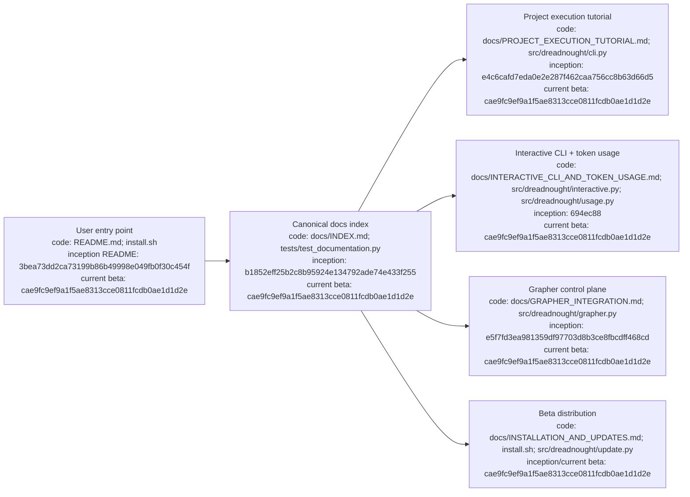

# Dreadnought documentation index

## Index

- [Start here](#start-here)
- [Architecture](#architecture)
- [Ledgers](#ledgers)
- [Machine-readable counterparts](#machine-readable-counterparts)
- [Document authority and update rules](#document-authority-and-update-rules)
- [Current milestone boundary](#current-milestone-boundary)
- [Appendix — Process flow](#appendix--process-flow)

This is the canonical index for the repository's human-readable record. **New users should begin with the root [`README.md`](../README.md)**; this page provides the complete durable documentation map.

## Start here

- [`README.md`](../README.md) — user-friendly project overview, Linux quick start, mental model, and routes into deeper documentation.
- [`INSTALLATION_AND_UPDATES.md`](INSTALLATION_AND_UPDATES.md) — canonical Linux installation, update, release-check, Grapher dependency, and troubleshooting guide.
- [`RELEASE_0.2.0b1.md`](RELEASE_0.2.0b1.md) — current public beta baseline and verification record.
- [`PROJECT_EXECUTION_TUTORIAL.md`](PROJECT_EXECUTION_TUTORIAL.md) — end-to-end setup, managed Grapher initialization, Mission-to-Order flow, brokered reads, Project Arm dispatch, protocol ingest, and publication.
- [`INTERACTIVE_CLI_AND_TOKEN_USAGE.md`](INTERACTIVE_CLI_AND_TOKEN_USAGE.md) — guided setup, arrow-key menu, direct primary-agent chat, project configuration, and token accounting by agent/project/task.
- [`CLI_USAGE.md`](CLI_USAGE.md) — compact human/agent command-line reference and authority boundaries.
- [`AGENTS.md`](../AGENTS.md) — repository operating instructions for human and agent contributors.
- [`README.md`](README.md) — research-record conventions.
- [`DIAGRAM_STANDARD.md`](DIAGRAM_STANDARD.md) — document indexes, process diagrams, architecture diagrams, code-path references, and commit provenance requirements.
- [`ROADMAP.md`](ROADMAP.md) — milestone sequence and deferred work.

## Architecture

- [`ARCHITECTURE.md`](ARCHITECTURE.md) — root component and trust-boundary map for the entire control plane.
- [`ARCHITECTURE_CHARTER.md`](ARCHITECTURE_CHARTER.md) — architectural principles and authority model.
- [`GRAPHER_INTEGRATION.md`](GRAPHER_INTEGRATION.md) — exclusive Dreadnought write authority, matched Grapher beta compatibility, managed initialization, read brokering, protocol projection, and publication model.
- [`PROJECT_ARM_LEDGER.md`](PROJECT_ARM_LEDGER.md) — dispatch/adapters/result-channel architecture.
- [`SARCOPHAGUS_LEDGER.md`](SARCOPHAGUS_LEDGER.md) — isolation and scratch/canonical workspace architecture.
- [`PROTOCOL_LEDGER.md`](PROTOCOL_LEDGER.md) — typed epistemic protocol architecture.

## Ledgers

- [`DEVELOPMENT_LEDGER.md`](DEVELOPMENT_LEDGER.md) — chronological implementation record.
- [`DECISION_LEDGER.md`](DECISION_LEDGER.md) — architectural decisions and supersession history.
- [`DOCUMENTATION_LEDGER.md`](DOCUMENTATION_LEDGER.md) — documentation governance, including mandatory Grapher CI enforcement.
- [`EXPERIMENT_LEDGER.md`](EXPERIMENT_LEDGER.md) — hypotheses, experiments, evidence, and conclusions.
- [`FAILURE_LEDGER.md`](FAILURE_LEDGER.md) — failures and lessons.
- [`PROTOCOL_LEDGER.md`](PROTOCOL_LEDGER.md) — typed protocol evolution.
- [`SARCOPHAGUS_LEDGER.md`](SARCOPHAGUS_LEDGER.md) — execution-isolation experiments.
- [`PROJECT_ARM_LEDGER.md`](PROJECT_ARM_LEDGER.md) — Project Arm dispatch and result-channel experiments.

## Machine-readable counterparts

Local runtime brain state lives under [`.grapher/`](../.grapher/) as `knowledge.json`, `history.jsonl`, `config.json`, and related sidecars. Git-versioned governance/publication evidence lives under [`.grapher/shared/`](../.grapher/shared/). Dreadnought project configuration and token accounting live under [`.dreadnought/`](../.dreadnought/) as `config.json` and `token-usage.jsonl`. Versioned contracts live under [`schemas/`](../schemas/); executable code under [`src/dreadnought/`](../src/dreadnought/); verification lives under [`tests/`](../tests/). Dreadnought runtime mutations must pass through `GrapherControlPlane`; repository changes must carry versioned Grapher evidence under `.grapher/shared/`.

## Document authority and update rules

When documents disagree: current typed schema/code and validated machine state define executable behavior; the Architecture Charter and current decisions define intended architecture; the Roadmap defines active sequence; ledgers preserve contemporaneous beliefs; freeform notes never silently become machine authority. For CLI syntax, executable parser/help output is authoritative. [`CLI_USAGE.md`](CLI_USAGE.md) is the compact reference, [`PROJECT_EXECUTION_TUTORIAL.md`](PROJECT_EXECUTION_TUTORIAL.md) the canonical end-to-end walkthrough, and [`INSTALLATION_AND_UPDATES.md`](INSTALLATION_AND_UPDATES.md) the distribution/update authority. New durable Markdown must be indexed here, contain its own `Index`, and include the required Mermaid provenance appendix. Architecture-bearing documents must also link to root [`ARCHITECTURE.md`](ARCHITECTURE.md). Every repository change set must carry Grapher publication evidence under `.grapher/shared/`.

## Current milestone boundary

The current public beta is **Dreadnought v0.2.0b1**, released from `cae9fc9ef9a1f5ae8313cce0811fcdb0ae1d1d2e`, consuming **Grapher v0.7.0b1**. Sarcophagus, Project Arm dispatch infrastructure, typed result channels, exclusive Grapher control-plane integration, guided initialization, direct primary-agent chat launching, token accounting, Linux release installation, and release-aware update discovery are implemented. Token statistics are exact only when providers/adapters report counts. The next empirical milestone remains a real vendor adapter and bounded real-workspace run before Project Arm execution can be considered validated.

## Appendix — Process flow

