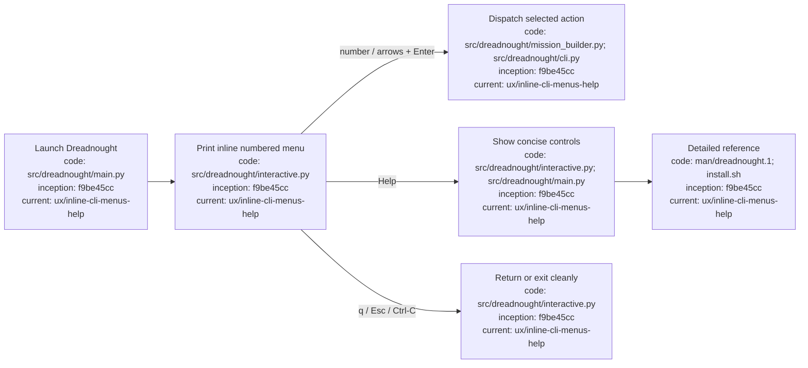

# Inline command-line interface

## Index

- [Interaction model](#interaction-model)
- [Exit and cancellation](#exit-and-cancellation)
- [Help and manual](#help-and-manual)
- [Appendix — Process flow](#appendix--process-flow)

## Interaction model

Dreadnought uses normal terminal output and prompts rather than a full-screen TUI. Menus are printed directly into the command-line history so preceding output remains visible.

Menu controls:

- `↑` / `↓` cycles through the numbered choices.
- `1..N` selects a menu item directly.
- `Enter` accepts the current selection.
- `q` exits or backs out of a menu.

## Exit and cancellation

Text and confirmation prompts must always be escapable. `Esc` and `Ctrl-C` cancel the current interactive prompt and exit Dreadnought cleanly. Typing `q`, `quit`, `exit`, or `back` at a text/confirmation prompt also exits cleanly. This is especially important during `dreadnought init`: cancelling setup must not silently substitute defaults and continue writing configuration.

## Help and manual

The top-level interactive menu contains a **Help** item. Command-line help is available through:

```text
dreadnought help
dreadnought --help
man dreadnought
```

The packaged manual page is `man/dreadnought.1`; the managed installer copies it to `${XDG_DATA_HOME:-$HOME/.local/share}/man/man1/dreadnought.1`.

## Appendix — Process flow


