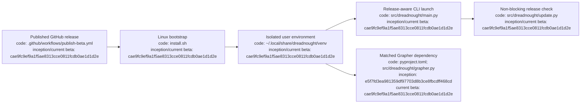

# Dreadnought installation and updates

## Index

- [Supported beta](#supported-beta)
- [Linux installation](#linux-installation)
- [What the installer does](#what-the-installer-does)
- [Verify installation](#verify-installation)
- [Updating](#updating)
- [Update checks](#update-checks)
- [Grapher dependency](#grapher-dependency)
- [Development installation](#development-installation)
- [Troubleshooting](#troubleshooting)
- [Appendix — Process flow](#appendix--process-flow)

This guide is the canonical human-facing installation and update reference for Dreadnought.

## Supported beta

The current public beta line is **v0.2.0b1**. GitHub Releases are the distribution/version authority for normal installations; `main` is development state and is not treated as an installed release.

## Linux installation

Requirements: Linux, Python 3.10+, `git`, and `curl` for the one-line bootstrap.

```bash
curl -fsSL https://raw.githubusercontent.com/seanbman/dreadnought/main/install.sh | bash
```

From an existing repository checkout:

```bash
bash install.sh
```

The installer does not require `sudo`.

## What the installer does

The installer resolves a published Dreadnought GitHub release, creates an isolated Python environment under `~/.local/share/dreadnought/venv`, installs that release and its declared dependencies, and exposes the executable through `~/.local/bin/dreadnought`.

If `~/.local/bin` is not already on `PATH`, add it in your shell profile:

```bash
export PATH="$HOME/.local/bin:$PATH"
```

## Verify installation

```bash
dreadnought --version
dreadnought --help
```

Then use `PROJECT_EXECUTION_TUTORIAL.md` for the complete project setup-to-execution path.

## Updating

Re-run the same installer. It resolves the published release line and replaces the isolated installed environment.

```bash
curl -fsSL https://raw.githubusercontent.com/seanbman/dreadnought/main/install.sh | bash
```

## Update checks

Interactive Dreadnought launches query published GitHub releases and compare the installed semantic version with available releases. A newer release produces a non-blocking notice. Network failure, GitHub unavailability, or offline use does not prevent Dreadnought from starting.

Non-interactive/automation execution stays quiet. To explicitly suppress checks:

```bash
DREADNOUGHT_NO_UPDATE_CHECK=1 dreadnought
```

Update discovery never mutates the controlled workspace and never installs an update automatically.

## Grapher dependency

Dreadnought embeds Grapher behind its control plane. The v0.2.0b1 Dreadnought beta consumes the matched Grapher v0.7.0b1 beta compatibility line. Subordinate Project Arms do not gain direct Grapher mutation authority through installation; Dreadnought remains the admission/write mediator while Grapher owns durable graph semantics.

## Development installation

For repository development:

```bash
python3 -m venv .venv
source .venv/bin/activate
python -m pip install --upgrade pip
python -m pip install -e .
```

This is distinct from the recommended release installation.

## Troubleshooting

If `dreadnought` is not found after installation, verify `~/.local/bin` is on `PATH`. If Python is too old, install Python 3.10+ through the Linux distribution and rerun the installer. Release checks are best-effort; an offline warning is not required and network failure does not block execution.

## Appendix — Process flow



Release anchor: `cae9fc9ef9a1f5ae8313cce0811fcdb0ae1d1d2e` (v0.2.0b1).