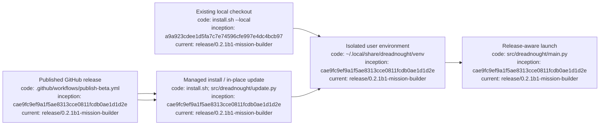

# Dreadnought installation and updates

## Index

- [Supported beta](#supported-beta)
- [Linux installation](#linux-installation)
- [Existing installation upgrade](#existing-installation-upgrade)
- [Existing local checkout](#existing-local-checkout)
- [What the installer does](#what-the-installer-does)
- [Verify installation](#verify-installation)
- [Update checks](#update-checks)
- [Grapher dependency](#grapher-dependency)
- [Development installation](#development-installation)
- [Troubleshooting](#troubleshooting)
- [Appendix — Process flow](#appendix--process-flow)

This guide is the canonical human-facing installation and update reference for Dreadnought.

## Supported beta

The current public beta is **v0.2.0b2**. GitHub Releases are the distribution/version authority for normal installations.

## Linux installation

Requirements: Linux, Python 3.11+, `git`, and `curl` for the one-line bootstrap.

```bash
curl -fsSL https://raw.githubusercontent.com/seanbman/dreadnought/main/install.sh | bash
```

The installer does not require `sudo`.

## Existing installation upgrade

A managed Dreadnought installation can upgrade itself to the newest published release:

```bash
dreadnought update
```

An explicit published version can also be requested:

```bash
dreadnought update --version v0.2.0b2
```

The command upgrades the Python environment containing the running Dreadnought executable. Restart Dreadnought after it completes.

## Existing local checkout

To install the current checked-out repository into the normal managed per-user Dreadnought environment:

```bash
git pull
./install.sh --local
```

This is useful for an existing clone and does not require waiting for release resolution. `./install.sh` without `--local` continues to install the newest published GitHub release.

## What the installer does

The managed installer creates an isolated Python environment under `~/.local/share/dreadnought/venv`, installs Dreadnought and its declared dependencies, and exposes `~/.local/bin/dreadnought`. If needed: `export PATH="$HOME/.local/bin:$PATH"`.

## Verify installation

```bash
dreadnought --version
dreadnought --help
```

## Update checks

Interactive launches compare the installed semantic version with published GitHub releases. A newer release produces a non-blocking notice directing the user to `dreadnought update` or the installer. Network failure does not prevent startup. Non-interactive execution stays quiet. Suppress checks explicitly with `DREADNOUGHT_NO_UPDATE_CHECK=1 dreadnought`. Updates remain explicit and are never installed automatically.

## Grapher dependency

Dreadnought v0.2.0b2 continues to consume Grapher v0.7.0b1. Subordinate Project Arms do not gain direct Grapher mutation authority through installation; Dreadnought remains the admission/write mediator while Grapher owns durable graph semantics.

## Development installation

```bash
python3 -m venv .venv
source .venv/bin/activate
python -m pip install --upgrade pip
python -m pip install -e .
```

## Troubleshooting

If `dreadnought` is not found, verify `~/.local/bin` is on `PATH`. If `dreadnought update` cannot resolve GitHub, rerun it when network access is available or use a local checkout with `./install.sh --local`.

## Appendix — Process flow


