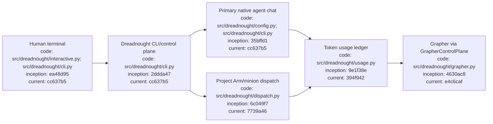

# Interactive CLI, Agent Chat, and Token Usage

## Index

- [Human-first CLI](#human-first-cli)
- [Guided project initialization](#guided-project-initialization)
- [Primary agent configuration and chat](#primary-agent-configuration-and-chat)
- [Menu and configuration editing](#menu-and-configuration-editing)
- [Token usage accounting](#token-usage-accounting)
- [Adapter usage reports](#adapter-usage-reports)
- [Programmatic CLI remains canonical](#programmatic-cli-remains-canonical)
- [Architecture](#architecture)
- [Appendix — Process flow](#appendix--process-flow)

## Human-first CLI

Run Dreadnought with no arguments in a terminal to open the arrow-key menu:

```bash
dreadnought
```

The menu is for humans. Long-form commands remain the stable interface for agents, scripts, CI, and other automation.

## Guided project initialization

The simple setup path is:

```bash
dreadnought init
```

The questionnaire asks for the project ID, primary agent type, executable, optional chat arguments, and whether to open the primary agent chat after setup. It also initializes the Dreadnought-managed Grapher brain when the project does not already have one.

A fully non-interactive equivalent remains available:

```bash
dreadnought init \
  --root /workspace/example \
  --project-id example \
  --agent-type codex \
  --agent-executable codex \
  --non-interactive
```

After initialization:

```bash
dreadnought grapher doctor --root /workspace/example
```

## Primary agent configuration and chat

Configure an agent type directly:

```bash
dreadnought agent init codex --root . --primary
```

Custom executables and native chat arguments are supported:

```bash
dreadnought agent init custom \
  --root . \
  --executable /usr/local/bin/my-agent \
  --agent-arg --interactive \
  --primary
```

Open the configured primary agent's native interactive session:

```bash
dreadnought agent chat --root .
```

Or select a configured type explicitly:

```bash
dreadnought agent chat codex --root .
```

Dreadnought launches the configured command with inherited stdin/stdout and the project root as the working directory. This means the human communicates directly with the primary Dreadnought agent through that provider's native chat interface rather than through a simulated Dreadnought chat protocol.

## Menu and configuration editing

The main menu exposes project initialization/reconfiguration, primary-agent chat, agent configuration, Grapher brain search, token statistics, and project configuration editing. Arrow keys choose menu items; text dialogs use stdin/terminal input.

Programmatic configuration remains available:

```bash
dreadnought config show --root .
dreadnought config set --root . --project-id example
dreadnought config set --root . --primary-agent codex
```

Persistent project configuration lives at `.dreadnought/config.json`.

## Token usage accounting

Dreadnought stores exact provider-reported token usage in `.dreadnought/token-usage.jsonl`. Each usage record carries agent identity, primary/minion role, project, optional task, input tokens, output tokens, cached tokens, reasoning tokens, provider, model, and source.

Record known usage explicitly:

```bash
dreadnought usage record \
  --root . \
  --agent dreadnought-primary \
  --role primary \
  --project example \
  --task task-42 \
  --input-tokens 1200 \
  --output-tokens 400 \
  --cached-tokens 300 \
  --reasoning-tokens 80 \
  --provider openai \
  --model example-model
```

Dreadnought projects the same task/session accounting through `GrapherControlPlane` as a `dreadnought_note` containing the complete structured usage payload. Therefore task-level token cost becomes durable Grapher knowledge without allowing agents to write Grapher directly.

Aggregate all known usage:

```bash
dreadnought usage stats --root .
```

Filter by project, task, or role:

```bash
dreadnought usage stats --root . --project example
dreadnought usage stats --root . --task task-42
dreadnought usage stats --root . --role primary
dreadnought usage stats --root . --role minion
```

Counts are exact only when a provider or adapter reports them. Dreadnought does not fabricate token estimates for opaque native CLI sessions.

## Adapter usage reports

Project Arm adapters can automatically report exact usage. The `CommandAgentAdapter` template token `{usage}` expands to a deterministic JSON path next to the agent result file.

Example adapter arguments:

```bash
--agent-arg --usage-json \
--agent-arg '{usage}'
```

The adapter should write:

```json
{
  "input_tokens": 1000,
  "output_tokens": 250,
  "cached_tokens": 100,
  "reasoning_tokens": 25,
  "provider": "provider-name",
  "model": "model-name"
}
```

After dispatch, Dreadnought ingests this report as **minion** usage, associates it with the Order ID as the task ID, appends it to the local usage ledger, and projects it into Grapher through the exclusive Dreadnought write boundary.

## Programmatic CLI remains canonical

Interactive UI is additive. Existing commands remain supported and should be preferred by agents and automation, including:

```bash
dreadnought mission init ...
dreadnought order init ...
dreadnought arm dispatch ...
dreadnought protocol ingest ...
dreadnought grapher query ...
dreadnought usage stats ...
```

## Architecture



## Appendix — Process flow

```mermaid
flowchart TD
    I[dreadnought / dreadnought init\ncode: src/dreadnought/cli.py\ninception: 2ddda47\ncurrent: cc637b5] --> Q[Arrow-key menu or guided questions\ncode: src/dreadnought/interactive.py\ninception: ea48d95\ncurrent: ea48d95]
    Q --> C[Persist project + agent config\ncode: src/dreadnought/config.py\ninception: 35bffd1\ncurrent: 35bffd1]
    C --> B[Initialize/check Grapher brain\ncode: src/dreadnought/grapher.py\ninception: 4630ac8\ncurrent: e4c6caf]
    C --> A[Launch primary agent chat\ncode: src/dreadnought/cli.py\ninception: cc637b5\ncurrent: cc637b5]
    B --> X[Dispatch minion task\ncode: src/dreadnought/dispatch.py\ninception: 6c049f7\ncurrent: 7739a46]
    X --> R[Optional exact usage report via {usage}\ncode: src/dreadnought/agent.py; src/dreadnought/dispatch.py\ninception: ba8adf8\ncurrent: 7739a46]
    R --> L[Aggregate by role/project/task\ncode: src/dreadnought/usage.py\ninception: 9e1f38e\ncurrent: 394f942]
    L --> G[Project token record through Dreadnought into Grapher\ncode: src/dreadnought/usage.py; src/dreadnought/grapher.py\ninception: 394f942\ncurrent: 394f942]
```
