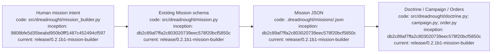

# Mission Builder

## Index

- [Purpose](#purpose)
- [Interactive workflow](#interactive-workflow)
- [Mission fields](#mission-fields)
- [CLI commands](#cli-commands)
- [Readiness](#readiness)
- [Appendix — Process flow](#appendix--process-flow)

## Purpose

Mission Builder is the human-facing interface for defining a Dreadnought mission without hand-editing JSON. It writes the existing `Mission` schema, so interactive and scripted mission workflows remain compatible.

## Interactive workflow

Run `dreadnought`, choose **Missions**, then create or resume a mission. The builder guides the human through the mission prompt/directive, primary objective, source documents, requirements/constraints, human notes, and capability bounds. A mission can be reviewed at any point, saved as a draft, or validated and marked ready.

## Mission fields

Sources may be workspace paths, GitHub locations, Google Drive locators, files, URLs, or other references. Each source carries an explicit access mode: read, propose-write, or write. Capability controls preserve the existing Mission model for canonical workspace access, scratch writes, Git inspection/proposed commits/push, network access, shell access, and maximum minions.

## CLI commands

```bash
dreadnought mission build --root .
dreadnought mission list --root .
dreadnought mission edit <mission-id> --root .
dreadnought mission review <mission-id> --root .
dreadnought mission ready <mission-id> --root .
```

Existing scripted commands remain supported:

```bash
dreadnought mission init "Human directive" --root . --actor human:user
dreadnought mission show .dreadnought/missions/<mission-id>.json
dreadnought mission validate .dreadnought/missions/<mission-id>.json
```

## Readiness

`mission ready` validates the Mission schema and additionally requires a primary objective. It does not imply mission completion, verification, or human acceptance; it means the authored mission package is ready for downstream Doctrine/Campaign/Order work.

## Appendix — Process flow


