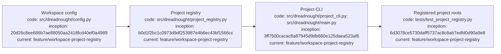

# Dreadnought workspace projects

## Index

- [Purpose](#purpose)
- [Registry model](#registry-model)
- [Commands](#commands)
- [Compatibility](#compatibility)
- [Appendix — Process flow](#appendix--process-flow)

## Purpose

A Dreadnought workspace may contain multiple independently versioned projects. Each registered project has its own root and may keep its own `.git`, `docs/`, and `.grapher/` state. The workspace-level registry records those roots without collapsing them into one project.

## Registry model

`.dreadnought/config.json` stores a `projects` mapping plus `active_project`. The active project is only the default for commands that do not name a project explicitly. It is not an exclusivity boundary: Dreadnought may know about and operate on every registered project.

Each project record contains an ID, workspace-relative root, optional directive, optional documentation root, and whether Dreadnought created/managed the project.

## Commands

```bash
dreadnought project add ./pt-site-overhaul --id pt-site-overhaul
dreadnought project add ./scheduler --id scheduler
dreadnought project list
dreadnought project select pt-site-overhaul
dreadnought project remove scheduler
```

`project remove` only unregisters the project. It never deletes project files.

Project roots must live inside the Dreadnought workspace. This keeps the workspace boundary explicit and prevents an accidental registry entry from claiming unrelated filesystem state.

## Compatibility

Existing single-project `.dreadnought/config.json` files using `project_id` and `project_root` are migrated into the registry when project-registry operations first read them. The old keys remain synchronized as compatibility aliases for the currently selected default project while older code is transitioned to explicit project routing.

## Appendix — Process flow


