# Dreadnought workspace projects

## Index

- [Purpose](#purpose)
- [Registry model](#registry-model)
- [Creating projects](#creating-projects)
- [Linking existing documentation](#linking-existing-documentation)
- [Registry commands](#registry-commands)
- [Compatibility](#compatibility)
- [Appendix — Process flow](#appendix--process-flow)

## Purpose

A Dreadnought workspace may contain multiple independently versioned projects. Each registered project has its own root and may keep its own `.git`, `docs/`, and `.grapher/` state. The workspace-level registry records those roots without collapsing them into one project.

## Registry model

`.dreadnought/config.json` stores a `projects` mapping plus `active_project`. The active project is only the default for commands that do not name a project explicitly. It is not an exclusivity boundary: Dreadnought may know about and operate on every registered project.

Each project record contains an ID, workspace-relative root, optional directive, optional documentation root, and whether Dreadnought created/managed the project.

## Creating projects

Create a complete project from a name and directive:

```bash
dreadnought project create "Telemetry Service" \
  "Build a small telemetry ingestion service with explicit verification and provenance"
```

Dreadnought creates a slugged project directory and initializes:

- `.git/`
- `docs/`
- `.grapher/`
- `.dreadnought/PROJECT_INSTRUCTIONS.md`
- `README.md`
- `AGENTS.md`
- a ready workspace Mission derived from the directive
- a registry entry for the new project

The creation path is rollback-safe for failures after directory creation: a failed create removes the newly created project tree and its initial Mission rather than leaving a half-created project.

## Linking existing documentation

An existing documentation directory can be linked into a new project:

```bash
dreadnought project create "Site Overhaul" \
  "Rebuild the site using the supplied documentation as evidence" \
  --docs-source /path/to/existing/docs
```

`project/docs` is created as a directory symlink to the explicit source. Dreadnought does not overwrite or copy the source directory. Project-specific generated instructions remain under `.dreadnought/PROJECT_INSTRUCTIONS.md`, so linking documentation does not inject generated files into the external documentation source.

## Registry commands

```bash
dreadnought project add ./pt-site-overhaul --id pt-site-overhaul
dreadnought project add ./scheduler --id scheduler
dreadnought project list
dreadnought project select pt-site-overhaul
dreadnought project remove scheduler
```

`project add` registers an existing project without creating or deleting its files. `project remove` only unregisters the project. It never deletes project files.

Project roots must live inside the Dreadnought workspace. This keeps the workspace boundary explicit and prevents an accidental registry entry from claiming unrelated filesystem state. Linked documentation may live outside the workspace because the link is explicit operator input.

## Compatibility

Existing single-project `.dreadnought/config.json` files using `project_id` and `project_root` are migrated into the registry when project-registry operations first read them. The old keys remain synchronized as compatibility aliases for the currently selected default project while older code is transitioned to explicit project routing.

## Appendix — Process flow

```mermaid
flowchart LR
    W["Workspace registry\ncode: src/dreadnought/project_registry.py\ninception: b0d1f2bc1c0973d9df253987e4b6ec43bf1566cc\ncurrent: feature/project-creation"] --> C["Create project\ncode: src/dreadnought/project_factory.py\ninception: e810d13461ff2a9634e515b37866884781e57e53\ncurrent: feature/project-creation"]
    C --> G["Initialize Git + Grapher + docs\ncode: src/dreadnought/project_factory.py; src/dreadnought/grapher.py\ninception: e810d13461ff2a9634e515b37866884781e57e53\ncurrent: feature/project-creation"]
    G --> M["Initial Mission + generated instructions\ncode: src/dreadnought/project_factory.py; src/dreadnought/mission.py\ninception: 79e635890ccada4b6442d69d4145c33be064122e\ncurrent: feature/project-creation"]
    M --> R["Registered managed project\ncode: src/dreadnought/project_registry.py; tests/test_project_factory.py\ninception: ba900855ccb1c39553676a25cd48c354b5c325c9\ncurrent: feature/project-creation"]
```


