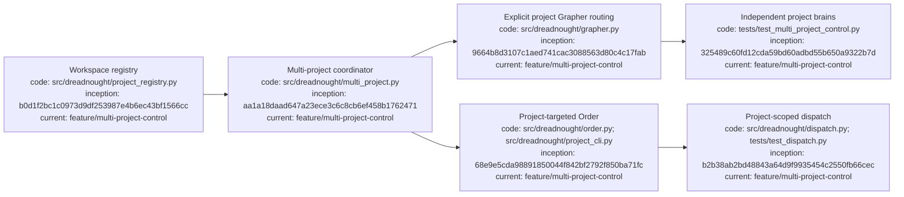

# Dreadnought workspace projects

## Index

- [Purpose](#purpose)
- [Registry model](#registry-model)
- [Creating projects](#creating-projects)
- [Linking existing documentation](#linking-existing-documentation)
- [Synchronous multi-project control](#synchronous-multi-project-control)
- [Project-targeted orders](#project-targeted-orders)
- [Registry commands](#registry-commands)
- [Compatibility](#compatibility)
- [Appendix — Process flow](#appendix--process-flow)

## Purpose

A Dreadnought workspace may contain multiple independently versioned projects. Each registered project has its own root and may keep its own `.git`, `docs/`, and `.grapher/` state. The workspace-level registry records those roots without collapsing them into one project.

## Registry model

`.dreadnought/config.json` stores a `projects` mapping plus `active_project`. The active project is only the default for commands that do not name a project explicitly. It is not an exclusivity boundary: Dreadnought may know about and operate on every registered project.

Each project record contains an ID, workspace-relative root, optional directive, optional documentation root, and whether Dreadnought created/managed the project.

## Creating projects

Create a complete project from a name and directive:

```bash
dreadnought project create "Telemetry Service" \
  "Build a small telemetry ingestion service with explicit verification and provenance"
```

Dreadnought creates a slugged project directory and initializes `.git/`, `docs/`, `.grapher/`, generated project instructions, `README.md`, `AGENTS.md`, an initial ready Mission, and the workspace registry entry.

The creation path is rollback-safe for failures after directory creation: a failed create removes the newly created project tree and its initial Mission rather than leaving a half-created project.

## Linking existing documentation

An existing documentation directory can be linked into a new project:

```bash
dreadnought project create "Site Overhaul" \
  "Rebuild the site using the supplied documentation as evidence" \
  --docs-source /path/to/existing/docs
```

`project/docs` is created as a directory symlink to the explicit source. Dreadnought does not overwrite or copy the source directory. Project-specific generated instructions remain under `.dreadnought/PROJECT_INSTRUCTIONS.md`, so linking documentation does not inject generated files into the external documentation source.

## Synchronous multi-project control

Dreadnought can address multiple registered projects in the same control-plane session without changing `active_project`. Workspace-wide operations resolve the project set once and process it deterministically in registry order. Each operation remains project-scoped and each project keeps an independent Grapher brain.

```bash
# check every registered project
dreadnought project status

# check only selected projects
dreadnought project status pt-site-overhaul scheduler

# query every project brain
dreadnought project query "current launch blockers"

# query an explicit subset
dreadnought project query "current launch blockers" \
  --project pt-site-overhaul \
  --project scheduler

# ingest typed testimony to one explicit project brain
dreadnought project ingest scheduler ./result.json
```

These commands do not mutate the default project selection. Programmatic callers use `MultiProjectControlPlane`, while `GrapherControlPlane(workspace, project_id="...")` provides explicit single-project routing without global state changes.

## Project-targeted orders

Orders can carry `project_id`. Create one explicitly:

```bash
dreadnought project order scheduler \
  "Implement the bounded scheduling change" \
  --doctrine doctrine-123 \
  --campaign campaign-123 \
  --operation operation-123
```

The resulting normal Order can be dispatched through the existing Project Arm dispatcher. Dreadnought routes the agent's canonical working directory, project scratch namespace, observer testimony, token accounting, and Grapher writes to the Order's project without changing the workspace default.

This allows one Dreadnought process to keep several projects live at once while every execution remains explicitly attributable to exactly one project brain.

## Registry commands

```bash
dreadnought project add ./pt-site-overhaul --id pt-site-overhaul
dreadnought project add ./scheduler --id scheduler
dreadnought project list
dreadnought project select pt-site-overhaul
dreadnought project remove scheduler
```

`project add` registers an existing project without creating or deleting its files. `project remove` only unregisters the project. It never deletes project files.

Project roots must live inside the Dreadnought workspace. This keeps the workspace boundary explicit and prevents an accidental registry entry from claiming unrelated filesystem state. Linked documentation may live outside the workspace because the link is explicit operator input.

## Compatibility

Existing single-project `.dreadnought/config.json` files using `project_id` and `project_root` are migrated into the registry when project-registry operations first read them. The old keys remain synchronized as compatibility aliases for the currently selected default project. Existing unscoped commands continue to use that default; new multi-project commands and project-targeted Orders bypass the alias and route explicitly.

## Appendix — Process flow


