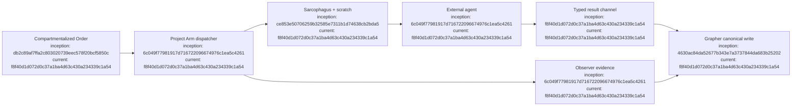

# Project Arm Ledger

## Index

- [Purpose](#purpose)
- [PA-0001 — First dispatcher substrate](#2026-09-06--pa-0001-first-dispatcher-substrate)
- [PA-0002 — Typed agent result channel](#2026-09-06--pa-0002-typed-agent-result-channel)
- [Process note — accidental PR #9](#process-note--accidental-pr-9)
- [Appendix — Process flow](#appendix--process-flow)

## Purpose

Human-readable research record for dispatching compartmentalized Orders to subordinate execution arms. [Process map](#appendix--process-flow)

## 2026-09-06 — PA-0001: First dispatcher substrate

- **Time:** approximately 17:08 MDT / 23:08 UTC
- **Status:** merged in PR #10
- **Predecessor:** Sarcophagus PR #8, squash merge `ce853e50706259b32585e7311b1d74638cb2bda5`
- **Objective:** establish one-Order/one-Project-Arm dispatch through a provider-neutral command adapter without giving the subordinate project-wide strategic context.
- **Order transport:** Dreadnought serializes the normalized Order into external scratch, not the canonical workspace.
- **Execution:** the adapter command is executed through Sarcophagus rather than directly on the host.
- **Observation:** Dreadnought records process exit code, stdout, stderr, adapter identity, and Order reference as observer evidence through Grapher.
- **Verification:** GitHub Actions run `34066144031` completed successfully before merge.
- **Merge:** squash merge `6c049f77981917d716722096674976c1ea5c4261`.
- **Not yet claimed:** no Codex/Cursor/local-model adapter has been validated on a real workspace yet; no scratch-to-canonical mutation broker exists yet.

[Process map](#appendix--process-flow)

## 2026-09-06 — PA-0002: Typed agent result channel

- **Time:** approximately 17:12 MDT / 23:12 UTC
- **Status:** merged in PR #11; CI passed
- **Objective:** let an external agent report structured claims and artifacts without allowing it to create observer or evaluation authority.
- **Transport:** each dispatch reserves a scratch-resident JSONL result path exposed through `{result}`.
- **Accepted records:** agent-perspective claim, action, artifact, requirement, risk, and note records.
- **Rejected records:** any non-agent perspective and all observer/evaluation-reserved kinds.
- **Order binding:** records without `order_ref` are bound to the active Order; records naming a different Order are rejected.
- **Canonical write:** validated agent records are written through `GrapherControlPlane`, preserving agent authorship while Dreadnought remains the writer.
- **Merge:** squash merge `f8f40d1d072d0c37a1ba4d63c430a234339c1a54`.

[Process map](#appendix--process-flow)

## Process note — accidental PR #9

A no-op draft PR #9 was opened accidentally during transition from the Sarcophagus merge and immediately closed without merge. It carried no new branch state and is retained in GitHub history rather than hidden or repurposed.

## Appendix — Process flow

Commit references: [Doctrine/Orders](https://github.com/seanbman/dreadnought/commit/db2c89af7ffa2c803020739eec578f20bcf5850c), [Grapher](https://github.com/seanbman/dreadnought/commit/4630ac84da52677b343e7a3737844da683b25202), [Sarcophagus](https://github.com/seanbman/dreadnought/commit/ce853e50706259b32585e7311b1d74638cb2bda5), [dispatch](https://github.com/seanbman/dreadnought/commit/6c049f77981917d716722096674976c1ea5c4261), [typed result channel/current snapshot](https://github.com/seanbman/dreadnought/commit/f8f40d1d072d0c37a1ba4d63c430a234339c1a54).
