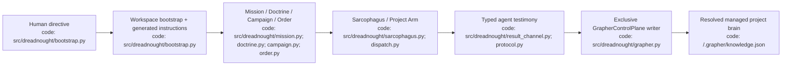
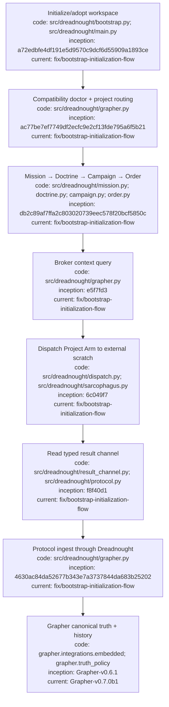

# Dreadnought Project Execution Tutorial

## Index

- [What this tutorial covers](#what-this-tutorial-covers)
- [1. Bootstrap the workspace](#1-bootstrap-the-workspace)
- [2. Verify the managed Grapher brain](#2-verify-the-managed-grapher-brain)
- [3. Refine Mission and Doctrine](#3-refine-mission-and-doctrine)
- [4. Create Campaign and Order](#4-create-campaign-and-order)
- [5. Inspect brokered Grapher context](#5-inspect-brokered-grapher-context)
- [6. Prepare Sarcophagus scratch](#6-prepare-sarcophagus-scratch)
- [7. Dispatch a Project Arm](#7-dispatch-a-project-arm)
- [8. Ingest typed testimony](#8-ingest-typed-testimony)
- [9. Verify resulting brain state](#9-verify-resulting-brain-state)
- [10. Validate and publish Grapher state](#10-validate-and-publish-grapher-state)
- [Operational rules](#operational-rules)
- [Appendix — Architecture](#appendix--architecture)
- [Appendix — Process flow](#appendix--process-flow)

## What this tutorial covers

This is the canonical practical walkthrough for taking a workspace from human intent to one bounded Project Arm execution while keeping Grapher behind the Dreadnought control plane.

The authority rule is simple: **Project Arms may read context through Dreadnought and return typed testimony, but only Dreadnought mutates Grapher inside the controlled workspace.** Grapher remains the durable brain and can still operate independently outside that boundary.

The current public dependency pairing is Dreadnought v0.2.0b2 with Grapher v0.7.0b1.

## 1. Bootstrap the workspace

Move to the workspace Dreadnought should encapsulate. The managed project may be the workspace itself or a nested project:

```text
workspace/
└── project/
    └── .grapher/
```

Run:

```bash
dreadnought initialize
```

`dreadnought init` is an alias. The bootstrap flow captures the human directive and primary objective, selects/discovers the managed project, initializes or adopts Grapher, creates a ready bootstrap Mission, and generates `.dreadnought/INSTRUCTIONS.md`.

If a nested project already has a schema-v2 Grapher brain, Dreadnought **adopts it without rewriting historical nodes**. Existing `unclassified` nodes are grandfathered by node ID through Grapher's legacy allowlist before future explicit-status policy is enforced.

A scripted equivalent is:

```bash
dreadnought initialize \
  "Continue the existing project under Dreadnought control" \
  --root /path/to/workspace \
  --project-root project \
  --project-id project \
  --requirement "Preserve inherited Grapher provenance" \
  --non-interactive
```

## 2. Verify the managed Grapher brain

From the Dreadnought workspace root:

```bash
dreadnought grapher doctor --root .
```

A healthy result reports `compatible: true`, Grapher v0.7.0b1, a v2 graph, explicit truth status, Dreadnought projection types, and both the Dreadnought workspace and resolved managed project root.

Use `dreadnought grapher init` only for a genuinely new brain when you specifically want the low-level operation. It refuses to overwrite existing Grapher state.

## 3. Refine Mission and Doctrine

Bootstrap already created a ready Mission from the operator's initialization input. List or inspect missions:

```bash
dreadnought mission list --root .
dreadnought mission review <mission-id> --root .
```

Additional/refined missions can be authored interactively:

```bash
dreadnought mission build --root .
```

Create the authoritative Doctrine for the work:

```bash
DOCTRINE_PATH="$(dreadnought doctrine init \
  "Implement the requested change without breaking established behavior" \
  --root . \
  --actor human:user)"
DOCTRINE_ID="$(basename "$DOCTRINE_PATH" .json)"

dreadnought doctrine validate "$DOCTRINE_PATH"
```

Mission preserves the human directive and working context. Doctrine expresses authoritative project intent for downstream campaign planning.

## 4. Create Campaign and Order

Create a Campaign Plan linked to Doctrine:

```bash
CAMPAIGN_PATH="$(dreadnought campaign init \
  --doctrine "$DOCTRINE_ID" \
  --task-group bounded-change \
  --root .)"
CAMPAIGN_ID="$(basename "$CAMPAIGN_PATH" .json)"
```

Create one bounded Order:

```bash
ORDER_PATH="$(dreadnought order init \
  "Implement and test the bounded change" \
  --doctrine "$DOCTRINE_ID" \
  --campaign "$CAMPAIGN_ID" \
  --operation bounded-change-1 \
  --project-arm project-arm-1 \
  --root .)"
```

Validate it:

```bash
dreadnought order validate "$ORDER_PATH"
```

An Order is a compartmentalized execution unit. Creating it does not itself execute anything or prove completion.

## 5. Inspect brokered Grapher context

Subordinate agents should not bypass Dreadnought to query or mutate the project brain during controlled execution. Use the read broker:

```bash
dreadnought grapher query "relevant implementation history" --root . --limit 8
```

Mission-scoped search is also available:

```bash
dreadnought grapher query "known regressions" \
  --root . \
  --mission <mission-id> \
  --limit 8
```

Read a known node:

```bash
dreadnought grapher get <node-id> --root .
```

Because `project_root` routing lives in `.dreadnought/config.json`, these commands can be run from the workspace root while the actual brain remains inside a nested managed project.

## 6. Prepare Sarcophagus scratch

The Project Arm needs writable scratch outside the canonical workspace/project:

```bash
mkdir -p ../dreadnought-scratch/project-arm-1
SCRATCH="$(cd ../dreadnought-scratch/project-arm-1 && pwd)"
```

Scratch is disposable working space and the one-way result-channel target. It is not canonical project truth.

## 7. Dispatch a Project Arm

Dispatch uses an adapter executable plus repeatable adapter arguments:

```bash
dreadnought arm dispatch "$ORDER_PATH" \
  --root . \
  --scratch "$SCRATCH" \
  --adapter codex \
  --executable codex \
  --agent-arg "exec" \
  --agent-arg "{order}" \
  --agent-arg "--result" \
  --agent-arg "{result}" \
  --timeout 300
```

The exact adapter arguments are provider-specific. Supported Dreadnought template tokens are defined in `src/dreadnought/agent.py`, including `{order}`, `{scratch}`, `{workspace}`, `{project_arm}`, `{objective}`, and `{result}`.

The agent writes machine-significant result records to the supplied result path as newline-delimited `ProtocolRecord` JSON. Agent output is testimony, not observer truth and not acceptance.

## 8. Ingest typed testimony

Validate a standalone record before ingest:

```bash
dreadnought protocol validate /path/to/record.json
```

Ingest it through Dreadnought's exclusive writer:

```bash
dreadnought protocol ingest /path/to/record.json --root .
```

The flow is:

```text
ProtocolRecord
→ Dreadnought validation/admission
→ Dreadnought protocol projection
→ Grapher embedded API
→ managed project brain mutation/history
```

Dreadnought preserves the original protocol payload and submitting perspective in Grapher metadata.

## 9. Verify resulting brain state

Search for newly ingested information through Dreadnought:

```bash
dreadnought grapher query "bounded change" --root .
```

Then inspect the exact node:

```bash
dreadnought grapher get <record-id> --root .
```

Re-run compatibility checks after dependency/configuration changes:

```bash
dreadnought grapher doctor --root .
```

Dreadnought observations must remain distinguishable from Project Arm testimony through actor, perspective, provenance, and protocol metadata.

## 10. Validate and publish Grapher state

Dreadnought owns controlled runtime mutation authority, while Grapher owns validation, audit, and publication mechanics. From the managed project root, standalone Grapher may be used for those operations:

```bash
grapher validate
grapher audit
grapher publish
```

Version the published boundary under `.grapher/shared/` according to that project's Git policy. Local runtime graph/history/vector/sync state remains distinct from Git-shared publication evidence.

## Operational rules

- Dreadnought bootstrap generates the initial Mission and workspace instruction substrate from human intent.
- Dreadnought is the sole Grapher writer inside controlled execution.
- Grapher remains independently operable outside that boundary.
- Existing Grapher history is adopted, not rewritten, when a project enters a new Dreadnought workspace.
- Project Arms do not mutate Grapher directly.
- Project Arms do not gain canonical workspace write authority merely because they were dispatched.
- Agent claims do not become observer observations merely by being ingested.
- A successful process exit is execution evidence, not automatic acceptance.
- Scratch is disposable and external to the canonical workspace/project.
- Re-run `dreadnought grapher doctor` whenever Grapher version/configuration changes.

## Appendix — Architecture



## Appendix — Process flow


