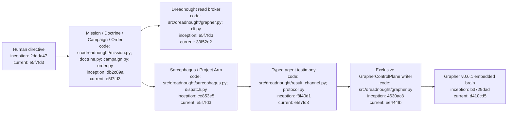
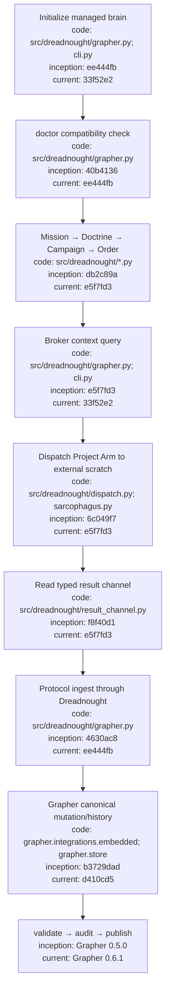

# Dreadnought Project Execution Tutorial

## Index

- [What this tutorial covers](#what-this-tutorial-covers)
- [1. Install Dreadnought and Grapher](#1-install-dreadnought-and-grapher)
- [2. Initialize the project brain](#2-initialize-the-project-brain)
- [3. Create Mission and Doctrine](#3-create-mission-and-doctrine)
- [4. Create Campaign and Order](#4-create-campaign-and-order)
- [5. Inspect brokered Grapher context](#5-inspect-brokered-grapher-context)
- [6. Prepare Sarcophagus scratch](#6-prepare-sarcophagus-scratch)
- [7. Dispatch a Project Arm](#7-dispatch-a-project-arm)
- [8. Ingest typed testimony](#8-ingest-typed-testimony)
- [9. Verify the resulting brain state](#9-verify-the-resulting-brain-state)
- [10. Validate and publish Grapher state](#10-validate-and-publish-grapher-state)
- [Operational rules](#operational-rules)
- [Appendix — Architecture](#appendix--architecture)
- [Appendix — Process flow](#appendix--process-flow)

## What this tutorial covers

This is the canonical practical walkthrough for taking a new project from setup to one bounded Project Arm execution while keeping Grapher behind the Dreadnought control plane.

The authority rule is simple: **Project Arms may read context through Dreadnought and may return typed testimony, but only Dreadnought mutates Grapher.** Grapher remains the durable brain; Dreadnought is the encapsulating control system.

## 1. Install Dreadnought and Grapher

From a Dreadnought checkout:

```bash
python3 -m venv .venv
source .venv/bin/activate
python -m pip install --upgrade pip
python -m pip install -e .
```

Dreadnought installs the Grapher compatibility line referenced by `pyproject.toml`. The current floor is Grapher 0.6.1 via the stable `v0.6.1` repository ref.

Confirm the CLI is available:

```bash
dreadnought --help
dreadnought grapher --help
```

## 2. Initialize the project brain

Move to the project Dreadnought will manage:

```bash
cd /path/to/project
```

Initialize Grapher **through Dreadnought**:

```bash
dreadnought grapher init --root .
```

This creates the local `.grapher/knowledge.json` context and applies the Dreadnought projection policy, including the `dreadnought_*` node types and explicit truth-status requirement.

Immediately run compatibility checks:

```bash
dreadnought grapher doctor --root .
```

A healthy result reports `compatible: true`, a v2 graph, the embedded API, explicit truth status, and all Dreadnought projection types.

Do not run `dreadnought grapher init` over an existing graph. It fails closed instead of overwriting state.

## 3. Create Mission and Doctrine

Create a Mission from the human directive:

```bash
MISSION_PATH="$(dreadnought mission init \
  "Fix the track-clearing bug without breaking existing sequencing" \
  --root . \
  --actor human:user)"
MISSION_ID="$(basename "$MISSION_PATH" .json)"
```

Inspect and validate it:

```bash
dreadnought mission show "$MISSION_PATH"
dreadnought mission validate "$MISSION_PATH"
```

Create the authoritative Doctrine:

```bash
DOCTRINE_PATH="$(dreadnought doctrine init \
  "Track clearing must deterministically remove all sequences while preserving unrelated tracks" \
  --root . \
  --actor human:user)"
DOCTRINE_ID="$(basename "$DOCTRINE_PATH" .json)"
```

Then validate:

```bash
dreadnought doctrine validate "$DOCTRINE_PATH"
```

Mission preserves the directive and working context. Doctrine expresses the authoritative objective the campaign and orders should obey.

## 4. Create Campaign and Order

Create a Campaign Plan linked to Doctrine:

```bash
CAMPAIGN_PATH="$(dreadnought campaign init \
  --doctrine "$DOCTRINE_ID" \
  --task-group track-clear-fix \
  --root .)"
CAMPAIGN_ID="$(basename "$CAMPAIGN_PATH" .json)"
```

Create one bounded Order:

```bash
ORDER_PATH="$(dreadnought order init \
  "Implement and test deterministic track clearing" \
  --doctrine "$DOCTRINE_ID" \
  --campaign "$CAMPAIGN_ID" \
  --operation track-clear-operation-1 \
  --project-arm project-arm-1 \
  --root .)"
ORDER_ID="$(basename "$ORDER_PATH" .json)"
```

Inspect and validate it:

```bash
dreadnought order show "$ORDER_PATH"
dreadnought order validate "$ORDER_PATH"
```

An Order is a compartmentalized execution unit. Creating it does not itself execute anything or prove completion.

## 5. Inspect brokered Grapher context

Subordinate agents should not query Grapher directly in a Dreadnought-controlled workspace. Use the Dreadnought read broker:

```bash
dreadnought grapher query "track clearing" --root . --limit 8
```

Scope a query to a Mission when relevant:

```bash
dreadnought grapher query "known regressions" \
  --root . \
  --mission "$MISSION_ID" \
  --limit 8
```

Read one known node:

```bash
dreadnought grapher get <node-id> --root .
```

These are read-only broker operations. They do not expose Grapher mutation commands to the Project Arm.

Programmatic callers can use the same broker through:

```python
from dreadnought.grapher import GrapherControlPlane

brain = GrapherControlPlane("/path/to/project")
hits = brain.query("track clearing", limit=8, mission="mission-id")
detail = brain.get("node-id")
```

## 6. Prepare Sarcophagus scratch

The Project Arm needs writable scratch **outside** the canonical workspace:

```bash
mkdir -p ../dreadnought-scratch/project-arm-1
SCRATCH="$(cd ../dreadnought-scratch/project-arm-1 && pwd)"
```

The canonical project remains the authority source. Scratch is disposable working space and the one-way result channel target.

## 7. Dispatch a Project Arm

Dispatch uses an adapter executable plus repeatable adapter arguments:

```bash
dreadnought arm dispatch "$ORDER_PATH" \
  --root . \
  --scratch "$SCRATCH" \
  --adapter codex \
  --executable codex \
  --agent-arg "exec" \
  --agent-arg "{order}" \
  --agent-arg "--result" \
  --agent-arg "{result}" \
  --timeout 300
```

The exact adapter arguments are provider-specific. The example above illustrates Dreadnought's template substitution; verify the real vendor CLI before using it. Supported template tokens are defined in `src/dreadnought/agent.py`, including `{order}`, `{scratch}`, `{workspace}`, `{project_arm}`, `{objective}`, and `{result}`.

The agent must write its machine-significant result records to the supplied result path as newline-delimited `ProtocolRecord` JSON. Agent output is testimony, not observer truth and not acceptance.

## 8. Ingest typed testimony

A Project Arm may submit allowed agent kinds such as claim, action, artifact, requirement, risk, or note. Observer and evaluation records are reserved from the agent result channel.

A representative agent claim looks like:

```json
{
  "id": "claim-track-clear-1",
  "kind": "claim",
  "perspective": "agent",
  "actor_id": "agent:project-arm-1",
  "created_at": "2026-09-07T15:00:00+00:00",
  "schema_version": 1,
  "mission_ref": "<mission-id>",
  "doctrine_ref": "<doctrine-id>",
  "order_ref": "<order-id>",
  "subject_ref": "artifact:track-clear-implementation",
  "data": {
    "predicate": "exists"
  },
  "evidence_refs": []
}
```

Validate a standalone record before ingest:

```bash
dreadnought protocol validate /path/to/record.json
```

Ingest it through the exclusive writer:

```bash
dreadnought protocol ingest /path/to/record.json --root .
```

The flow is:

```text
ProtocolRecord
→ Dreadnought validation/admission
→ Dreadnought protocol projection
→ Grapher embedded API
→ Grapher canonical mutation/history
```

Dreadnought preserves the original protocol payload in Grapher metadata while projecting it to a `dreadnought_*` node type.

## 9. Verify the resulting brain state

Search for the newly ingested information through Dreadnought:

```bash
dreadnought grapher query "track clear implementation" --root .
```

Then inspect the exact node:

```bash
dreadnought grapher get claim-track-clear-1 --root .
```

Run the compatibility doctor again after configuration or dependency changes:

```bash
dreadnought grapher doctor --root .
```

Dreadnought may independently produce observer records. Those observations must remain distinguishable from Project Arm testimony through actor, perspective, provenance, and protocol metadata.

## 10. Validate and publish Grapher state

Dreadnought owns runtime mutation authority, but Grapher still owns its validation/audit/publication mechanics.

From the project root:

```bash
grapher validate
grapher audit
grapher publish
```

Version the published state rather than local runtime files:

```bash
git add .grapher/shared
git commit -m "Publish Grapher project knowledge"
git push
```

After another checkout pulls shared Grapher state:

```bash
git pull
grapher sync
```

Local `.grapher/knowledge.json`, `.grapher/history.jsonl`, vector state, and sync sidecars are runtime state. `.grapher/shared/` is the Git publication boundary.

## Operational rules

- Project Arms do not mutate Grapher directly.
- Project Arms do not write the canonical workspace merely because they were dispatched.
- Agent claims do not become observer observations merely by being ingested.
- A successful process exit is evidence about execution, not automatic acceptance.
- Dreadnought's `GrapherControlPlane` is the software write authority.
- Grapher decides how accepted records are persisted, validated, historied, transitioned, and published.
- Brokered `query` and `get` operations are safe read surfaces; mutation remains private to Dreadnought.
- Re-run `dreadnought grapher doctor` whenever Grapher version/configuration changes.

## Appendix — Architecture



## Appendix — Process flow


