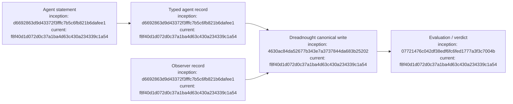

# Protocol Ledger

## Index

- [Purpose](#purpose)
- [P-0001 — Initial typed protocol](#2026-09-06--p-0001-initial-typed-protocol)
- [Appendix — Process flow](#appendix--process-flow)

## Purpose

Human-readable research record for the Dreadnought machine protocol. This ledger tracks taxonomy choices, authority boundaries, schema revisions, and evidence from real use. Entries are not rewritten when later revisions supersede them. [Process map](#appendix--process-flow)

## 2026-09-06 — P-0001: Initial typed protocol

**Time:** approximately 08:23 MDT / 14:23 UTC  
**Branch:** `feature/typed-agent-protocol`  
**Predecessor:** PR #3, squash merge `db2c89af7ffa2c803020739eec578f20bcf5850c`

### Hypothesis

Execution-relevant agent communication should enter Dreadnought as typed records rather than freeform prose. Human-facing prose remains available as `note`, but notes must have no automatic machine semantics.

### Initial record taxonomy

`claim`, `observation`, `action`, `artifact`, `requirement`, `risk`, `note`, and `verdict`. This taxonomy is intentionally provisional.

### Authority boundary

An agent may author claims and request/propose actions, but it may not author an authoritative `observation`. Observation is reserved to the Dreadnought observer perspective. Only evaluation may issue a `verdict` or mark a requirement `verified`.

### Claims

The first claim shape uses a structured `subject_ref` plus bounded predicates: `exists`, `absent`, `equals`, `succeeds`, `fails`, `complete`, and `unchanged`.

### Verdicts

Initial verdict statuses are `supported`, `contradicted`, `partially_supported`, `unverifiable`, `not_yet_verified`, and `malformed`. Evidence-bearing verdicts require explicit evidence references where a truth judgment is reached.

### Human notes

`note` is explicitly human-facing and requires `audience=human`. Notes are not parsed automatically into claims, requirements, or state transitions.

### Implementation references

- `42a90b2f072a3bfa3d42cce935ee354a55d51f3c` — initial protocol types and validation
- `4b698c5d71c32f40dea0c29cc60c929a533fc46c` — authority-boundary tests
- `b5201b5e9634887b33733422304e7562f1b5487d` — versioned JSON Schema

### Open questions

The current predicate set may be too generic or too small. Artifact and risk enums may also need refinement. Project Arm runs should generate evidence for revision. [Process map](#appendix--process-flow)

## Appendix — Process flow

Commit references: [typed protocol](https://github.com/seanbman/dreadnought/commit/d6692863d9d43372f3fffc7b5c6fb821b6dafee1), [Grapher control plane](https://github.com/seanbman/dreadnought/commit/4630ac84da52677b343e7a3737844da683b25202), [verification](https://github.com/seanbman/dreadnought/commit/07721476c042df38edf6fc6fed1777a3f3c7004b), [current snapshot](https://github.com/seanbman/dreadnought/commit/f8f40d1d072d0c37a1ba4d63c430a234339c1a54).
