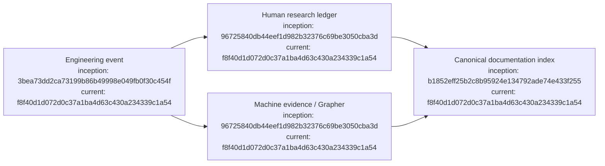

# Dreadnought research record

## Index

- [Purpose](#purpose)
- [Core documents](#core-documents)
- [Ledgers](#ledgers)
- [Entry discipline](#entry-discipline)
- [Appendix — Process flow](#appendix--process-flow)

## Purpose

These documents are the human-readable counterpart to `.grapher/`. They are deliberately kept in version control so the evolution of the architecture can be studied against dates, commits, PRs, experiments, and machine evidence. Use [`INDEX.md`](INDEX.md) as the canonical documentation map and [`DIAGRAM_STANDARD.md`](DIAGRAM_STANDARD.md) for diagram/provenance rules. [Process map](#appendix--process-flow)

The ledgers are a contemporaneous research notebook. Preserve wrong turns, superseded hypotheses, failed experiments, and uncertainty when those are part of what actually happened.

## Core documents

- [`INDEX.md`](INDEX.md) — canonical map of all human-readable project documents and their authority.
- [`ARCHITECTURE_CHARTER.md`](ARCHITECTURE_CHARTER.md) — current architectural principles and system boundaries.
- [`ROADMAP.md`](ROADMAP.md) — active milestone sequence, completed work, and deferred work.
- [`DIAGRAM_STANDARD.md`](DIAGRAM_STANDARD.md) — required document indexes, Mermaid appendices, and node provenance.

[Process map](#appendix--process-flow)

## Ledgers

- [`DEVELOPMENT_LEDGER.md`](DEVELOPMENT_LEDGER.md) — chronological project record.
- [`DECISION_LEDGER.md`](DECISION_LEDGER.md) — architectural decisions and alternatives.
- [`EXPERIMENT_LEDGER.md`](EXPERIMENT_LEDGER.md) — testable hypotheses and results.
- [`FAILURE_LEDGER.md`](FAILURE_LEDGER.md) — failures and lessons without rewriting history.
- [`PROTOCOL_LEDGER.md`](PROTOCOL_LEDGER.md) — typed protocol taxonomy, authority boundaries, and protocol evolution.
- [`SARCOPHAGUS_LEDGER.md`](SARCOPHAGUS_LEDGER.md) — process/filesystem isolation experiments and containment limits.
- [`PROJECT_ARM_LEDGER.md`](PROJECT_ARM_LEDGER.md) — Order dispatch, adapter boundaries, Project Arm execution, and observations.

[Process map](#appendix--process-flow)

## Entry discipline

Prefer an entry containing: timestamp, scope, rationale or hypothesis, work performed, observed outcome, evidence references, commit/PR references, and follow-up. If a field is unknown, say so rather than reconstructing it from memory. Historical ledger entries are append-oriented. New durable Markdown must be added to `INDEX.md`, contain its own `Index`, and end with a provenance-bearing Mermaid appendix. [Process map](#appendix--process-flow)

## Appendix — Process flow

Commit references: [founding](https://github.com/seanbman/dreadnought/commit/3bea73dd2ca73199b86b49998e049fb0f30c454f), [research substrate](https://github.com/seanbman/dreadnought/commit/96725840db44eef1d982b32376c69be3050cba3d), [documentation index](https://github.com/seanbman/dreadnought/commit/b1852eff25b2c8b95924e134792ade74e433f255), [current snapshot](https://github.com/seanbman/dreadnought/commit/f8f40d1d072d0c37a1ba4d63c430a234339c1a54).
