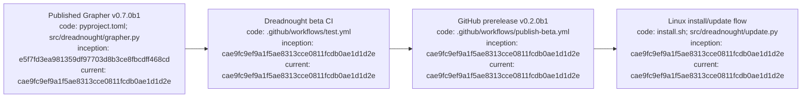

# Dreadnought v0.2.0b1 beta release

## Index

- [Status](#status)
- [What changed](#what-changed)
- [Installation](#installation)
- [Grapher compatibility](#grapher-compatibility)
- [Verification](#verification)
- [Current boundary](#current-boundary)
- [Appendix — Process flow](#appendix--process-flow)

## Status

v0.2.0b1 is the current public Dreadnought beta, published as a GitHub prerelease from merge commit `cae9fc9ef9a1f5ae8313cce0811fcdb0ae1d1d2e`.

## What changed

The beta establishes a Linux end-user distribution path with a no-sudo per-user installer, isolated environment, launcher under `~/.local/bin`, semantic-version GitHub Release discovery, non-blocking interactive update notices, and automated beta publication. It retains the long-form CLI as the deterministic automation interface.

## Installation

Use [`INSTALLATION_AND_UPDATES.md`](INSTALLATION_AND_UPDATES.md), then [`PROJECT_EXECUTION_TUTORIAL.md`](PROJECT_EXECUTION_TUTORIAL.md).

## Grapher compatibility

Dreadnought v0.2.0b1 consumes Grapher v0.7.0b1. Dreadnought remains the controlled-workspace admission/write mediator; Grapher owns durable representation, truth policy, semantic integrity, transitions, history, rollback, and publication semantics.

## Verification

Beta CI installed Dreadnought against the published Grapher v0.7.0b1 dependency and passed the repository suite plus mandatory Grapher shared-state governance before merge and prerelease publication.

## Current boundary

A real vendor adapter and bounded real-workspace execution remain the next validation milestone. Process exit alone is not acceptance.

## Appendix — Process flow

