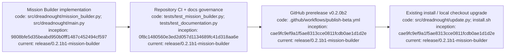

# Dreadnought v0.2.0b2 beta patch

## Index

- [Status](#status)
- [Mission Builder](#mission-builder)
- [Upgrade paths](#upgrade-paths)
- [Compatibility](#compatibility)
- [Verification](#verification)
- [Appendix — Process flow](#appendix--process-flow)

## Status

v0.2.0b2 is the beta patch following v0.2.0b1. It adds guided mission authoring and in-place upgrade paths while preserving the existing Mission schema and scripted CLI commands.

## Mission Builder

The root interactive menu now exposes **Missions**. Humans can create, resume, review, and validate mission packages containing a directive, primary objective, typed source documents, requirements/constraints, notes, and capability bounds. See [`MISSION_BUILDER.md`](MISSION_BUILDER.md).

## Upgrade paths

Existing managed installation:

```bash
dreadnought update
```

Existing repository checkout:

```bash
git pull
./install.sh --local
```

Release installer:

```bash
curl -fsSL https://raw.githubusercontent.com/seanbman/dreadnought/main/install.sh | bash
```

## Compatibility

Existing `dreadnought mission init/show/validate` commands remain supported. Dreadnought v0.2.0b2 continues to consume Grapher v0.7.0b1.

## Verification

Release acceptance requires repository tests, documentation governance checks, Grapher pass-record evidence, and GitHub prerelease publication from the merged release commit.

## Appendix — Process flow


