# Initial PR Roadmap

## Index

- [Milestones 1–3 — intent and planning substrate](#milestones-13--intent-and-planning-substrate)
- [Milestones 4–6 — protocol, evidence, verification](#milestones-46--protocol-evidence-verification)
- [Milestone 7 — Sarcophagus](#milestone-7--sarcophagus)
- [Milestone 8 — Project Arm dispatch](#milestone-8--project-arm-dispatch)
- [Milestone 9 — Closure and audit semantics](#milestone-9--closure-and-audit-semantics)
- [Deferred](#deferred)
- [Appendix — Process flow](#appendix--process-flow)

This sequence is a working experimental plan, not a commitment to preserve boundaries that evidence shows are wrong. [Process map](#appendix--process-flow)

## Milestones 1–3 — intent and planning substrate

**Milestone 1 / PR #1:** research substrate, ledgers, `.grapher/`, charter. Merge `96725840db44eef1d982b32376c69be3050cba3d`.

**Milestone 2 / PR #2:** Mission schema and CLI. Merge `2ddda47a622cc66b90e4a5ec65ea09262e002644`.

**Milestone 3 / PR #3:** Doctrine, Campaign Plan, Operations, Project Arm Orders. Merge `db2c89af7ffa2c803020739eec578f20bcf5850c`.

[Process map](#appendix--process-flow)

## Milestones 4–6 — protocol, evidence, verification

**Milestone 4 / PR #4:** typed claim/observation/action/artifact/requirement/risk/note/verdict protocol. Merge `d6692863d9d43372f3fffc7b5c6fb821b6dafee1`.

**Milestone 5 / PR #5:** Dreadnought-owned Grapher writes and provenance split. Merge `4630ac84da52677b343e7a3737844da683b25202`.

**Milestone 6 / PR #6:** deterministic verifier registry. Merge `07721476c042df38edf6fc6fed1777a3f3c7004b`.

Documentation indexing maintenance merged in PR #7 at `b1852eff25b2c8b95924e134792ade74e433f255` and does not consume an architecture milestone. [Process map](#appendix--process-flow)

## Milestone 7 — Sarcophagus

Merged in PR #8 at `ce853e50706259b32585e7311b1d74638cb2bda5`. Established Bubblewrap execution, canonical workspace read-only, external writable scratch, default network isolation, environment allowlisting, and fail-closed behavior. PR #9 was an accidental no-op draft and was closed without merge. [Process map](#appendix--process-flow)

## Milestone 8 — Project Arm dispatch

PR #10 established provider-neutral dispatch, Order packets in scratch, Sarcophagus execution, observer process evidence, Grapher ingestion, and `dreadnought arm dispatch`. Merge `6c049f77981917d716722096674976c1ea5c4261`; Actions `34066144031` succeeded.

PR #11 established the typed scratch-resident agent result channel and merged at `f8f40d1d072d0c37a1ba4d63c430a234339c1a54`; Actions `34066266462` succeeded. Milestone 8 still requires one vendor-specific coding-agent adapter and a bounded real-workspace run before empirical validation. [Process map](#appendix--process-flow)

## Milestone 9 — Closure and audit semantics

Separate claimed completion, deterministic verification, authority acceptance, and closure. Produce inspection reports tracing Doctrine → Operation → Order → Project Arm → PR → evidence/discrepancies. Correct the early Mission lifecycle so execution state does not conflate completion, acceptance, and closure. [Process map](#appendix--process-flow)

## Deferred

Multi-Project-Arm orchestration, model training, automatic taxonomy expansion, generalized multi-provider autonomy, sophisticated inference, and broad policy engines.

## Appendix — Process flow

```mermaid
flowchart LR
    M1["Research substrate<br/>inception: 96725840db44eef1d982b32376c69be3050cba3d<br/>current: f8f40d1d072d0c37a1ba4d63c430a234339c1a54"] --> M2["Mission<br/>inception: 2ddda47a622cc66b90e4a5ec65ea09262e002644<br/>current: f8f40d1d072d0c37a1ba4d63c430a234339c1a54"]
    M2 --> M3["Doctrine / Orders<br/>inception: db2c89af7ffa2c803020739eec578f20bcf5850c<br/>current: f8f40d1d072d0c37a1ba4d63c430a234339c1a54"]
    M3 --> M4["Typed protocol<br/>inception: d6692863d9d43372f3fffc7b5c6fb821b6dafee1<br/>current: f8f40d1d072d0c37a1ba4d63c430a234339c1a54"]
    M4 --> M5["Grapher control plane<br/>inception: 4630ac84da52677b343e7a3737844da683b25202<br/>current: f8f40d1d072d0c37a1ba4d63c430a234339c1a54"]
    M5 --> M6["Verification<br/>inception: 07721476c042df38edf6fc6fed1777a3f3c7004b<br/>current: f8f40d1d072d0c37a1ba4d63c430a234339c1a54"]
    M6 --> M7["Sarcophagus<br/>inception: ce853e50706259b32585e7311b1d74638cb2bda5<br/>current: f8f40d1d072d0c37a1ba4d63c430a234339c1a54"]
    M7 --> M8["Project Arm + result channel<br/>inception: 6c049f77981917d716722096674976c1ea5c4261<br/>current: f8f40d1d072d0c37a1ba4d63c430a234339c1a54"]
    M8 --> M9["Closure / audit<br/>inception: f8f40d1d072d0c37a1ba4d63c430a234339c1a54<br/>current: f8f40d1d072d0c37a1ba4d63c430a234339c1a54"]
```

Commit references are the full hashes embedded in each node; all resolve under `https://github.com/seanbman/dreadnought/commit/<hash>`. The `current` hash is the code snapshot against which this roadmap appendix was authored.
