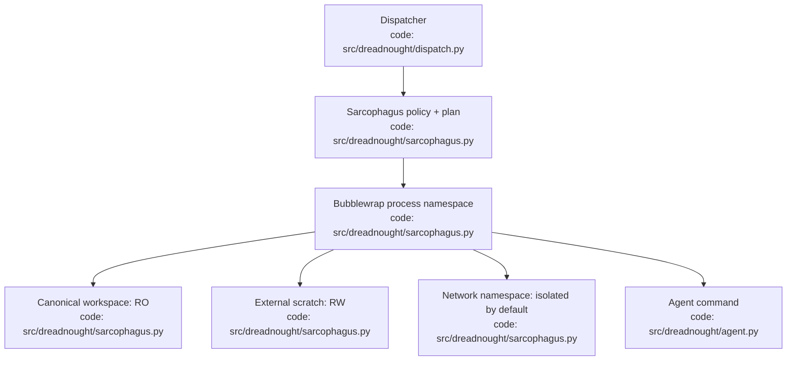
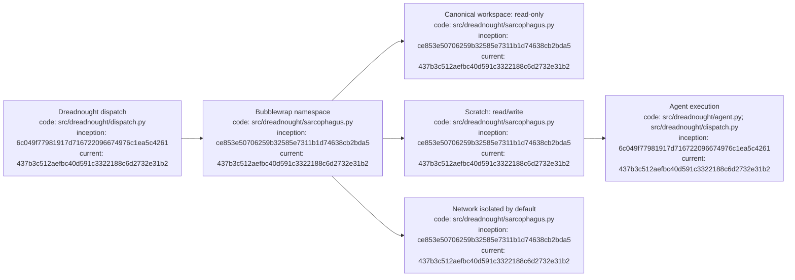

# Sarcophagus Ledger

## Index

- [Purpose](#purpose)
- [S-0001 — First executable isolation boundary](#2026-09-06--s-0001-first-executable-isolation-boundary)
- [Architecture diagram](#architecture-diagram)
- [Appendix — Process flow](#appendix--process-flow)

## Purpose

Human-readable research record for Dreadnought's execution-isolation boundary. This ledger records what the Sarcophagus actually enforces, what remains aspirational, and what fails during adversarial testing. Root context: [`ARCHITECTURE.md`](ARCHITECTURE.md). [Process map](#appendix--process-flow)

## 2026-09-06 — S-0001: First executable isolation boundary

- **Time:** approximately 08:45 MDT / 14:45 UTC
- **Status:** merged in PR #8; CI passed
- **Scope:** Linux execution boundary
- **Hypothesis:** Dreadnought can make bypass materially harder by removing ordinary write and network authority from an agent process rather than relying on prompts or wrappers.
- **Backend:** Bubblewrap (`bwrap`) only in this prototype.
- **Default policy:** canonical workspace read-only; scratch directory writable and outside the workspace; network namespace isolated; environment allowlisted; process dies with parent.
- **Failure behavior:** if Bubblewrap is unavailable, Dreadnought refuses execution. There is deliberately no unsandboxed fallback.
- **Writable-path rule:** explicitly writable paths may be mounted only outside the canonical workspace.
- **Not yet enforced:** brokered network access, seccomp syscall policy, cgroups/resource budgets, Landlock/AppArmor profiles, Git credential brokerage, authoritative mutation broker, and scratch-to-workspace promotion.
- **Security limitation:** Bubblewrap configuration is an initial Linux containment mechanism, not a claim of a complete security boundary. Target-host adversarial testing remains required.
- **Research question:** can this boundary preserve useful coding-agent freedom while making authoritative workspace mutation an explicit Dreadnought-mediated operation?

[Process map](#appendix--process-flow)

## Architecture diagram

## Appendix — Process flow

Commit references: [Sarcophagus](https://github.com/seanbman/dreadnought/commit/ce853e50706259b32585e7311b1d74638cb2bda5), [Project Arm dispatch](https://github.com/seanbman/dreadnought/commit/6c049f77981917d716722096674976c1ea5c4261), [documentation baseline](https://github.com/seanbman/dreadnought/commit/437b3c512aefbc40d591c3322188c6d2732e31b2).
