# Training Data and Execution Episodes

## Index

- [Purpose](#purpose)
- [Three-layer data model](#three-layer-data-model)
- [Training Episode v1](#training-episode-v1)
- [Privacy and safety](#privacy-and-safety)
- [Human feedback](#human-feedback)
- [Koffer pilot](#koffer-pilot)
- [Granite handoff](#granite-handoff)
- [Appendix — Process flow](#appendix---process-flow)

## Purpose

Dreadnought now treats model-training data as a derived research product rather than using Grapher as a training corpus. Grapher remains the durable project brain and provenance system. Project Arm protocol records, observations, deterministic verifier results, and verdicts remain the authoritative execution evidence. A separate normalized corpus records one execution per Training Episode so later model-specific exports can be generated without changing historical evidence.

Training capture is **opt-in per workspace**. It is disabled by default.

## Three-layer data model

1. **Raw evidence** — Orders, agent protocol JSONL, observer records, deterministic verifier evidence, evaluation verdicts, and token-usage records. These retain their existing authority semantics.
2. **Normalized episodes** — `.dreadnought/training/episodes.jsonl`, one execution per JSON object using `schemas/training_episode.schema.json`.
3. **Training exports** — generated JSONL produced from normalized episodes and append-only human feedback. Exports are model-agnostic at this stage; Granite chat-template conversion remains a later pipeline step.

Do not train directly from `.grapher/knowledge.json`. Grapher mixes durable decisions, implementation state, observations, notes, supersession history, and other truth statuses that are useful for project memory but inappropriate as a flat supervised-learning corpus.

## Training Episode v1

Each episode records the bounded Order, safe repository/branch identity when available, project commit before and after execution, adapter/provider/model identity when known, Dreadnought version/revision, generated-instructions hash, prompt profile, execution duration and failure category, retry lineage, structured agent testimony, evaluation rollups, deterministic verdicts, artifact references/fingerprints, token usage when available, and dataset eligibility.

Raw process stdout/stderr are not copied into episodes. Command-verifier stdout/stderr are replaced with byte counts and SHA-256 digests. Managed project/workspace/scratch absolute paths are structurally redacted. Artifact references are normalized to project- or scratch-relative paths; regular artifact files up to 16 MiB receive SHA-256 fingerprints without copying file contents into the corpus.

An accepted, fully supported execution is marked `dataset.eligible=true`. Failed, contradicted, malformed, unverified, and rejected executions are **retained** as research evidence but are not automatically eligible for positive-example export.

## Privacy and safety

Episode recording must be explicitly enabled:

```bash
dreadnought training enable --root /path/to/workspace
```

Disable it with:

```bash
dreadnought training disable --root /path/to/workspace
```

Structural redaction is not a claim that arbitrary human text is secret-free. Orders and testimony can still contain project-specific language. Before external distribution or weight training, review the exported corpus for credentials, customer material, private paths, copyrighted source material, and other content that should not enter model weights.

Core Dreadnought behavior never uploads this corpus. Storage is local under `.dreadnought/training/`. Enabling capture creates `.dreadnought/training/.gitignore` so generated episode/feedback files are ignored by Git by default; operators must make an explicit decision before publishing corpus data.

## Human feedback

Human corrections are append-only records in `.dreadnought/training/feedback.jsonl`; historical episodes are not rewritten to make later judgments look cleaner.

```bash
dreadnought training feedback episode-... \
  --root /path/to/workspace \
  --rating revise \
  --comment "Keep filesystem scanning off the UI thread."
```

Ratings are `accept`, `reject`, or `revise`. Export joins feedback to its episode without mutating the original episode row.

Corpus summary:

```bash
dreadnought training stats --root /path/to/workspace
```

Model-agnostic export:

```bash
dreadnought training export ./training/eligible.jsonl \
  --root /path/to/workspace \
  --mode eligible \
  --eval-percent 20 \
  --split-seed koffer-v1
```

Export modes are `eligible`, `accepted`, and `all`. `--eval-percent` assigns a deterministic train/eval split from the episode ID plus `--split-seed`, so a reviewed held-out set can be reproduced without mutating historical episodes.

## Koffer pilot

Koffer is the first intended live development case study for Training Episode v1. Koffer's living manual and `/docs/AGENTS.md` already define a strong contract around Linux-native behavior, filesystem safety, background work, non-destructive audio preparation, local inference, metadata handling, and testable failure modes. Those requirements are suitable inputs for bounded Dreadnought Orders.

The pilot flow is:

1. explicitly move Koffer from planning into development;
2. initialize/adopt Koffer under Dreadnought;
3. enable training capture in that workspace;
4. translate one documented Koffer requirement into an Order with deterministic acceptance criteria;
5. dispatch a Project Arm;
6. preserve testimony and independent evaluation;
7. add human feedback when architectural or product intent differs from a technically passing result;
8. export only after corpus review.

The Koffer pilot should intentionally preserve both successful and failed/corrected episodes. The goal is not merely a collection of passing code samples; it is evidence of how bounded Orders, claims, verification, and human correction interact.

## Granite handoff

Training Episode v1 is model-neutral. Granite-specific SFT, preference, or tool-use conversion should consume exported episodes rather than canonical Grapher state. This keeps model checkpoints, chat templates, and training recipes replaceable while preserving the original Dreadnought evidence.

See [`research/001-granite-instruct-code-training.md`](research/001-granite-instruct-code-training.md) for model competence and [`research/002-granite-dreadnought-autonomy.md`](research/002-granite-dreadnought-autonomy.md) for Dreadnought contract behavior.

## Appendix — Process flow

```mermaid
flowchart LR
    O[Bounded Order\ncode: src/dreadnought/order.py\ninception: db2c89af7ffa2c803020739eec578f20bcf5850c\ncurrent: dev] --> D[Project Arm dispatch\ncode: src/dreadnought/dispatch.py\ninception: 6c049f77981917d716722096674976c1ea5c4261\ncurrent: dev]
    D --> P[Raw protocol + evaluation evidence\ncode: src/dreadnought/protocol.py; src/dreadnought/evaluation.py\ninception: d6692863d9d43372f3fffc7b5c6fb821b6dafee1\ncurrent: dev]
    P --> E[Training Episode v1\ncode: src/dreadnought/training.py; schemas/training_episode.schema.json\ninception: 6d31200b4684feec139ae4efef5d6cf32f9c728d\ncurrent: dev]
    E --> F[Append-only human feedback\ncode: src/dreadnought/training.py\ninception: 6d31200b4684feec139ae4efef5d6cf32f9c728d\ncurrent: dev]
    F --> X[Model-agnostic export\ncode: src/dreadnought/training.py; src/dreadnought/cli.py\ninception: 6d31200b4684feec139ae4efef5d6cf32f9c728d\ncurrent: dev]
```


