# 001 — Train Granite to follow instructions and produce code

**Status:** research brief at HEAD snapshot (**clean re-author** from public IBM/HF sources — **not** a Digga/Seeka restore)  
**Repo snapshot:** `63abbee86ce9d949bfd33671971dae61d3b0e654` on `dev`  
**Date:** 2026-09-10 (America/Edmonton / MT)  
**Path:** `docs/research/001-granite-instruct-code-training.md`  
**Scope:** IBM Granite instruction-following + code training only — **not** Dreadnought control-plane autonomy (see [`002-granite-dreadnought-autonomy.md`](002-granite-dreadnought-autonomy.md))  
**Provenance stance:** Digga-era local research was wiped from `dev`; this file is rewritten from verified public docs, not recovered Grapher/history trash.  

## Index

- [Bottom line](#bottom-line)
- [Clarify what you are training](#clarify-what-you-are-training)
- [Prefer ready-made instruct checkpoints](#prefer-ready-made-instruct-checkpoints)
- [Decide train depth](#decide-train-depth)
- [Lock chat template and special tokens](#lock-chat-template-and-special-tokens)
- [Build datasets](#build-datasets)
- [Concrete recommended recipe](#concrete-recommended-recipe)
- [Evaluate](#evaluate)
- [Licensing and compliance](#licensing-and-compliance)
- [Common failure modes](#common-failure-modes)
- [End-to-end checklist](#end-to-end-checklist)
- [Handoff to 002](#handoff-to-002)
- [Sources](#sources)
- [Appendix — Process flow](#appendix--process-flow)

## Bottom line

Start from an official **instruct** (post-trained) Granite checkpoint — prefer **Granite 4.2** when you want native reasoning / agentic tool use, or **Granite 4.1** when you want strong IF+code without requiring heavy chain-of-thought. Format every example with that checkpoint’s chat template, then SFT (LoRA/QLoRA is fine for domain adaptation), optionally preference/RL, then evaluate with IFEval + code benches. Do **not** start from a raw base unless you have a concrete reason and the compute budget to re-do post-training. This brief covers **model training**, not Dreadnought adapters or Orders.

## Clarify what you are training

Granite is IBM’s open LLM family under Apache 2.0. It is **not** Meta Llama weights rebranded: architectures, tokenizers, chat templates, and post-training stacks are Granite-specific (`GraniteForCausalLM` in recent mainline releases).

| Lineage | What it is | Use in this brief |
|---|---|---|
| Granite 4.2 language (dense 3B/8B/30B) | Post-trained reasoning instruct models on Granite 4.1 bases | Preferred for agents / CoT / tools |
| Granite 4.1 language (dense 3B/8B/30B) | Instruct (+ base) without requiring 4.2’s native thinking default | Preferred for IF+code without heavy CoT |
| Granite 3.3 instruct | Prior mainline with `<\|start_of_role\|>` template + optional thinking flag | Still valid enterprise baseline |
| Granite Code instruct (3B/8B/20B/34B, CommitPackFT era) | Code-specialized instruct lineage | Historical / code-only; IBM notes newer mainline supersedes for new apps |

## Prefer ready-made instruct checkpoints

HF IDs below were checked against Hugging Face / IBM docs on **2026-09-10**. Prefer these exact repo IDs; do not invent `-instruct` suffixes when the published card omits them.

| Goal | Start from (verified HF ID) | Notes |
|---|---|---|
| IF+code+tools+reasoning | `ibm-granite/granite-4.2-3b`, `ibm-granite/granite-4.2-8b`, `ibm-granite/granite-4.2-30b` | Native thinking; agentic RL lineages; Apache 2.0; released 2026-08-25 |
| IF+code without requiring CoT | `ibm-granite/granite-4.1-3b`, `ibm-granite/granite-4.1-8b`, `ibm-granite/granite-4.1-30b` | Dense instruct; strong coding/IF; bases exist as `…-base` |
| Older enterprise mainline | `ibm-granite/granite-3.3-8b-instruct` | FIM/thinking via template flags; `<\|start_of_role\|>` |
| Code-only lineage (historical) | `ibm-granite/granite-3b-code-instruct-2k`, `ibm-granite/granite-8b-code-instruct-4k`, `ibm-granite/granite-8b-code-instruct-128k`, `ibm-granite/granite-20b-code-instruct-8k`, `ibm-granite/granite-20b-code-instruct-r1.1`, `ibm-granite/granite-34b-code-instruct-8k` | CommitPackFT-era; HF cards steer new apps to mainline Granite |

**Default pick for a new IF+code project today:** `ibm-granite/granite-4.1-8b` if you want direct answers; `ibm-granite/granite-4.2-8b` if you want thinking+tools.

## Decide train depth

1. **Prompt / system pack only** — no weight change; often enough when the instruct checkpoint already scores well on IFEval/HumanEval.
2. **SFT (full or LoRA/QLoRA)** — domain adaptation: your IF+code mix in the correct chat template. Prefer LoRA/QLoRA unless you own multi-GPU post-training infra.
3. **Preference / RL (optional)** — DPO/ORPO or on-policy methods after SFT when you have ranked preference pairs or verifiable rewards (unit tests, IF checkers).
4. **From-base rebuild** — only if instruct checkpoints are wrong for your license/serve stack; otherwise skip.

## Lock chat template and special tokens

**Do not mix templates across families.**

- **Granite 3.3:** `tokenizer.apply_chat_template(..., thinking=True|False)`. Roles render with `<|start_of_role|>…<|end_of_role|>` (and related document/control roles). Special tokens and role names must match the tokenizer shipped with the checkpoint.
- **Granite 4.1:** use that checkpoint’s `apply_chat_template` (tools supported via OpenAI-style function schemas on the published cards).
- **Granite 4.2:** thinking controlled with `enable_thinking=True|False` (and optional `low_effort`); reasoning content uses `<think>…</think>` style markers in published examples; generation prompt conventions differ from 3.3’s `<|start_of_role|>` stack. Serving parsers (vLLM `granite_thinking_parser`, SGLang auto) must match the checkpoint.

Training data must be **rendered through the same `apply_chat_template`** you will use at inference. Truncating or stripping special tokens during packing is a common silent regression.

## Build datasets

Mix categories (illustrative; curate for license):

1. **Instruction following** — multi-constraint prompts (IFEval-style), refusals/safety where required.
2. **Code synthesis** — HumanEval/MBPP-like tasks, repo-local functions, tests-as-oracle.
3. **Code edit / repair** — diff-style or FIM if the chosen lineage supports it (3.3 / code lineage).
4. **Tool / structured output** (optional for 4.1/4.2) — function-call traces compatible with the template.
5. **Negatives** — wrong format, missing constraints, invented APIs — only if you have a preference or critique stage.

Keep train/eval **disjoint** from public bench prompts you will report.

## Concrete recommended recipe

**Rank-1 (recommended):**

1. Choose `ibm-granite/granite-4.1-8b` (IF+code, low CoT pressure) **or** `ibm-granite/granite-4.2-8b` (reasoning/agents).
2. Freeze tokenizer and chat template from that repo.
3. Build 10k–100k high-quality IF+code examples (quality > quantity); render with `apply_chat_template`.
4. SFT with LoRA/QLoRA (attention + MLP projections); short LR warmup; early-stop on held-out IF + code pass@1.
5. Optional: preference step on (chosen=passing tests / meeting constraints, rejected=format failures).
6. Export merged or adapter weights; serve with transformers / vLLM / Ollama only if the template is known-good for that backend.

**Rank-2:** start from `ibm-granite/granite-3.3-8b-instruct` when you need the older role-token stack or an already-validated enterprise serve path.

**Avoid:** continued pretrain on raw web dumps without an instruct stage; training on Llama chat templates; claiming Digga-era local notes as evidence (none remain at HEAD).

## Evaluate

Minimum report set (run before/after SFT):

| Suite | What it stresses |
|---|---|
| IFEval (or successor strict IF) | Constraint following |
| HumanEval / HumanEval+ | Python synthesis |
| MBPP / MBPP+ | Short programming tasks |
| LiveCodeBench (optional) | Contamination-aware coding |
| Your private domain set | The actual product behavior |

For 4.2, also spot-check thinking on/off latency and whether tool-call JSON remains valid with `enable_thinking` both ways. Do **not** invent numeric scores in this brief — fill them when you run the harness.

## Licensing and compliance

- Verified instruct checkpoints above are published under **Apache 2.0** on their HF cards (re-check the card before redistribution).
- Dataset licenses must be compatible with your distribution (permissive instruction/code mixes; avoid non-commercial-only corpora if you need commercial deploy).
- Do not ship customer secrets inside SFT traces.

## Common failure modes

1. Wrong chat template → model ignores system constraints or emits garbage role markers.
2. Training on base weights and expecting instruct behavior.
3. Eval contamination (training on HumanEval solutions).
4. Over-long packing that drops closing special tokens.
5. Serving stack that rewrites the template (Ollama/vLLM mismatch) after a careful SFT.
6. Confusing Granite **Code** historical IDs with current **4.1/4.2** mainline IDs.

## End-to-end checklist

- [ ] Pick verified HF ID from the table above.
- [ ] Pin revision / commit hash of the HF repo you trained from.
- [ ] Lock tokenizer + `apply_chat_template` kwargs (thinking flags explicit).
- [ ] Build license-clean IF+code mix; hold out eval.
- [ ] SFT (LoRA/QLoRA) → optional preference/RL.
- [ ] Run IFEval + HumanEval/MBPP (+ LiveCodeBench if claimed).
- [ ] Document serve path and template kwargs used in production.
- [ ] Hand off to 002 only for Dreadnought contract behavior — not as a substitute for IF+code competence.

## Handoff to 002

001 produces a model that can follow instructions and write code.  
[`002-granite-dreadnought-autonomy.md`](002-granite-dreadnought-autonomy.md) teaches that capability to obey **Dreadnought contracts** (Orders, protocol JSONL, control commission) via **wrapper-first** integration — without restoring Digga/Seeka history.

## Sources

Verified externally (2026-09-10):

- HF: `ibm-granite/granite-4.2-8b` (and 3b/30b siblings); collection / blog references for Granite 4.2
- HF: `ibm-granite/granite-4.1-8b` (and 3b/30b); IBM Granite 4.1 docs listing instruct variants
- HF: `ibm-granite/granite-3.3-8b-instruct`
- HF / GitHub: Granite Code instruct IDs under `ibm-granite/granite-*-code-instruct-*`
- IBM Granite docs: https://www.ibm.com/granite/docs/models/granite4-1 , https://www.ibm.com/granite/docs/models/granite4-2
- GitHub: `ibm-granite/granite-code-models`, `ibm-granite/granite-4.2-language-models`

In-tree at `63abbee86ce9d949bfd33671971dae61d3b0e654`: this file is **new research** under `docs/research/` (directory was absent at HEAD). No Digga/Seeka 001 content was restored.

## Appendix — Process flow

```mermaid
flowchart LR
    C["Choose instruct checkpoint
code: docs/research/001-granite-instruct-code-training.md
inception: 63abbee86ce9d949bfd33671971dae61d3b0e654
current: 63abbee86ce9d949bfd33671971dae61d3b0e654"] --> T["Lock chat template + tokens
code: docs/research/001-granite-instruct-code-training.md
inception: 63abbee86ce9d949bfd33671971dae61d3b0e654
current: 63abbee86ce9d949bfd33671971dae61d3b0e654"]
    T --> D["Build IF + code datasets
code: docs/research/001-granite-instruct-code-training.md
inception: 63abbee86ce9d949bfd33671971dae61d3b0e654
current: 63abbee86ce9d949bfd33671971dae61d3b0e654"]
    D --> S["SFT LoRA/QLoRA optional RL
code: docs/research/001-granite-instruct-code-training.md
inception: 63abbee86ce9d949bfd33671971dae61d3b0e654
current: 63abbee86ce9d949bfd33671971dae61d3b0e654"]
    S --> E["Evaluate IFEval + code benches
code: docs/research/001-granite-instruct-code-training.md
inception: 63abbee86ce9d949bfd33671971dae61d3b0e654
current: 63abbee86ce9d949bfd33671971dae61d3b0e654"]
    E --> H["Hand off model competence to 002
code: docs/research/002-granite-dreadnought-autonomy.md
inception: 63abbee86ce9d949bfd33671971dae61d3b0e654
current: 63abbee86ce9d949bfd33671971dae61d3b0e654"]
```

**Provenance:** new research authored 2026-09-10 against shallow local clone (`git rev-list --count HEAD` = 1). `inception` and `current` both equal `63abbee86ce9d949bfd33671971dae61d3b0e654` because this document did not exist in earlier commits of this tree. Checkpoint IDs were verified via public HF/IBM pages, not from wiped Digga history.
