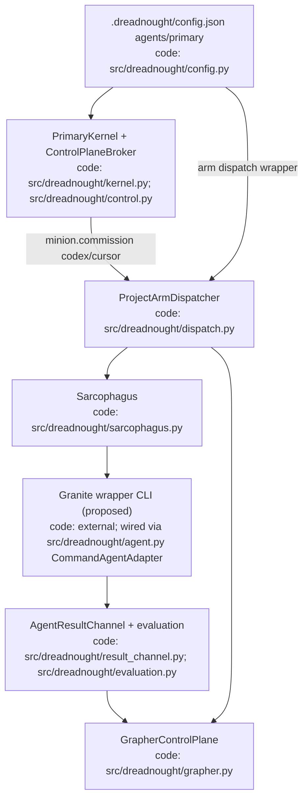

# 002 — Instructing IBM Granite to operate inside Dreadnought (code + spawn)

**Status:** research brief at HEAD snapshot  
**Repo snapshot:** `63abbee86ce9d949bfd33671971dae61d3b0e654` on `dev`  
**Date:** 2026-09-10 (America/Edmonton / MT)  
**Path:** `docs/research/002-granite-dreadnought-autonomy.md`  
**Companion:** [`001-granite-instruct-code-training.md`](001-granite-instruct-code-training.md) (IF+code training; not Digga restore)  
**Skribe map:** survey payload (verified). Prior `docs/research/` absence at HEAD confirmed; 001 recreated cleanly as Granite IF+code only (not Digga restore).

## Index

- [Bottom line](#bottom-line)
- [Relationship to prior Granite training research](#relationship-to-prior-granite-training-research)
- [Target autonomy definition](#target-autonomy-definition)
- [Verified Dreadnought contracts](#verified-dreadnought-contracts)
- [`_minion_prompt` contract](#minion_prompt-contract)
- [Integration options](#integration-options)
- [Instruction / data recipe (wrapper-first)](#instruction--data-recipe-wrapper-first)
- [Runtime topology](#runtime-topology)
- [Config story for spinning off instances](#config-story-for-spinning-off-instances)
- [Eval harness](#eval-harness)
- [Phased plan and non-goals](#phased-plan-and-non-goals)
- [Open questions](#open-questions)
- [Sources](#sources)
- [Architecture diagram](#architecture-diagram)
- [Appendix — Process flow](#appendix--process-flow)

## Bottom line

**Recommend wrapper-first.** Ship a thin Granite/Ollama (or IBM local) CLI that speaks Dreadnought’s existing Order + scratch + protocol-JSONL contracts, and wire it through **`CommandAgentAdapter` / `dreadnought arm dispatch`**. Use the primary’s **`dreadnought control commission`** path only for already-configured first-class minion types (codex/cursor today), or host-side `arm dispatch` for Granite subordinates. Defer a first-class `GraniteMinionAdapter` until one real-workspace loop validates testimony + evaluation. Defer SFT-for-contracts until that harness exists (model IF+code competence belongs in 001). Do **not** depend on Digga/Seeka Grapher history.

## Relationship to prior Granite training research

At `63abbee86ce9d949bfd33671971dae61d3b0e654`, **`docs/research/` was absent**. A clean [`001-granite-instruct-code-training.md`](001-granite-instruct-code-training.md) is authored alongside this brief for **Granite IF+code training only** — not a restore of Digga trash, and not Dreadnought autonomy doctrine.

This 002 brief covers **Dreadnought control-plane behavior**, not model pretraining.

## Target autonomy definition

Success for a Granite-backed agent inside Dreadnought means all of:

1. **Bounded code work** under an Order: read RO canonical workspace, write under **scratch only**.
2. **Emit valid agent-perspective protocol JSONL** to the result path (kinds: claim/action/artifact/requirement/risk/note only).
3. **Attach deterministic verifiers** for acceptance claims (`filesystem.path`, `filesystem.sha256`, `process.command`) matching `_minion_prompt` (see below).
4. **Spawn subordinates only via Dreadnought** (`control commission` or host `arm dispatch` / `minion commission`) — never invent Grapher writes or observer/verdict records.
5. **Never treat process exit as acceptance** — evaluation is Dreadnought-owned (`evaluation.py` / dispatch post-process).

**Scratch ≠ canonical (hard rule for success criteria):** a green eval on scratch artifacts is **not** “the patch landed in the project.” There is **no scratch→canonical mutation broker** today (`PROJECT_ARM_LEDGER.md`, `SARCOPHAGUS_LEDGER.md`). Do not score autonomy success by Git commits, canonical file edits, or Grapher writes performed by the agent. Promotion into the canonical tree remains a separate host/control-plane step outside this brief’s Phase-1 bar.

## Verified Dreadnought contracts

### Config

- `.dreadnought/config.json` version 2 defaults in `config.py` `default_config`.
- Agents kernelized to `dreadnought` + `kernel launch --agent-type …` with `provider_executable` / `provider_args`.
- `configure_agent` accepts arbitrary `agent_type` strings (custom/granite possible for **primary** registration).

### Primary kernel

- Bubblewrap RO workspace + scratch + control socket (`kernel.py`, `control.py`).
- Broker methods only: `grapher.query`, `grapher.get`, `usage.stats`, `minion.commission`.
- Provider env allowlist: codex/cursor only.
- Boot prompt: **codex only**.

### Minion / arm

- `configured_minion_adapter`: codex/cursor only.
- `CommandAgentAdapter` + `arm dispatch`: provider-neutral extension point **usable now**.
- `_minion_prompt` + `AgentResultChannel` define testimony contract.
- `max_minions`: `null` = no numeric cap; `0` = explicit prohibition (`mission.py`, schema).

### `_minion_prompt` contract

Codex/Cursor minion adapters inject `_minion_prompt` from `src/dreadnought/agent.py` (approx. L36–52). A Granite wrapper must teach the **same contract** (via system prompt or `--agent-arg`), even when it does not call that function:

- You are a subordinate executing one compartmentalized Project Arm Order.
- Read the authoritative Order JSON; canonical workspace is **read-only**; writable surface is **scratch only**.
- **Do not mutate Grapher** directly.
- Complete only the bounded `objective`.
- Before exit, write agent testimony as **JSONL** to the result path: `schema_version` 1, `perspective: agent`, kinds limited to claim / action / artifact / requirement / risk / note.
- For each asserted acceptance criterion: at least one claim with `data.acceptance_ref` (zero-based index or exact text) **plus** a deterministic verifier — `filesystem.path` (`exists|absent`), `filesystem.sha256`, or `process.command` (`argv` + `expected_exit`).
- Dreadnought re-runs verification after exit; unsupported/missing verifiers stay unverified.
- Optional human summary: kind `note` with `data.audience=human` and `order_ref`.
- **Do not claim observer or evaluation authority.**


### Instruction files

- Generated `.dreadnought/INSTRUCTIONS.md` (+ secure kernel appendix).
- Mission / Order / Doctrine / Campaign JSON documents.
- Optional `AGENTS.md` pointer (does not overwrite human AGENTS.md).

## Integration options

| Option | Mechanism | Fit | Verdict |
|---|---|---|---|
| **A. Wrapper CLI + arm dispatch** | `CommandAgentAdapter` tokens; host or scripted dispatch | Fastest; matches PA ledger “provider-neutral” substrate | **Choose first** |
| **B. Custom primary + control commission** | `agent init custom|granite`; kernel launch; commission codex/cursor minions | **Primary chat = kernelized provider CLI** (`config.py` `_kernelize_agent`), not `CommandAgentAdapter`. Primary can plan/spawn **if** minion types preconfigured; Granite-as-minion still needs A or C | **Parallel for primary loop** |
| **C. First-class GraniteMinionAdapter** | Extend `configured_minion_adapter`, CLI choices, `_PROVIDER_ENV`, boot prompt | Clean UX; requires code change + real-workspace validation | **Second** |
| **D. Codex-shim / OpenAI-compat fake** | Pretend to be Codex CLI | Conflicts with Codex-specific sandbox/unified_exec handling | **Avoid** |
| **E. SFT/tool-call tune for contracts** | Domain traces of Orders/control/protocol | Roadmap-deferred; needs A harness + 001 competence | **Third / optional** |

## Instruction / data recipe (wrapper-first)

Build an **operational instruction pack** (system + few-shot) for Dreadnought contracts; IF+code model competence is 001’s job:

1. Paste/adapt generated `INSTRUCTIONS.md` + Mission JSON fields (directive, objective, capabilities).
2. Include `_minion_prompt` text verbatim as subordinate contract (`agent.py` L36–52). **Critical:** `dreadnought arm dispatch` / `CommandAgentAdapter` does **not** auto-inject `_minion_prompt` (only first-class `CodexMinionAdapter` / `CursorMinionAdapter` do). The wrapper must embed that contract itself (system prompt or `--agent-arg`), not assume the kernel or dispatcher will.
3. Include one worked Order JSON + one valid JSONL testimony example with `acceptance_ref` + `process.command` verifier.
4. Include allowed control verbs: `dreadnought control query|get|usage|commission` and Unix-socket JSON `{"method","params"}` shape (`control.py`).
5. Explicit negatives: no Grapher hand-edit; no observer/verdict authorship; no claiming `max_minions: null` means zero; no config mutation from inside kernel.

Optional later SFT: synthesize Order→scratch diff→JSONL→eval traces from the Rank-1 harness; keep license/serving choices in 001.

## Runtime topology

```text
[Host]
  dreadnought arm dispatch | minion commission | control broker
    → Sarcophagus (bwrap): RO workspace, RW scratch, env allowlist
         → granite-dreadnought-agent CLI
              → local inference (Ollama/vLLM/llama.cpp) preferably on host network policy as required
              → writes: scratch code + result.jsonl + optional usage.json
    → Dispatcher: observation + result_channel + evaluate_order → Grapher
```

- Prefer **HOST network** only if the wrapper must reach a local inference server; default Sarcophagus policy for adapters without `requires_network` is NONE (`dispatch.py` L72–75). First-class adapters set `requires_network=True` for codex/cursor.
- Token usage: write `{usage}` JSON (`INTERACTIVE_CLI_AND_TOKEN_USAGE.md`).

## Config story for spinning off instances

**Near-term (honest):**

- Human (or host automation) pre-registers agent types in `.dreadnought/config.json`.
- Primary authors Order JSON into allowed paths (`control.py` `_allowed_order`: primary scratch or `.dreadnought/orders`).
- Primary calls `minion.commission` for **codex/cursor** only; Granite work uses **arm dispatch** with wrapper executable.
- “From its own config” ≠ agent edits config; it means **select among configured agents** under `max_minions`.

**Research question (do not implement yet):** host-mediated `agent.register` control method vs keeping config human-only (charter: authority in control plane).

**Minion cannot recursively commission today** (no control socket in Sarcophagus). Nested Campaign/Order documents ≠ nested runtime.

## Eval harness

Minimum fixtures (to implement outside this brief):

1. Order with one acceptance criterion; wrapper writes under **scratch** and claims with a verifier Dreadnought can re-run — pass = schema-valid testimony + evaluation outcome, **not** a canonical-tree diff.
2. Explicit negative: claiming a canonical-workspace path was mutated must **not** count as success (RO mount / no scratch→canonical broker).
3. Malicious JSONL with `perspective: observer` or `kind: verdict` — must be rejected by `AgentResultChannel`.
4. `max_minions: 0` — commission must fail (`test_minion.py` pattern).
5. Primary control `commission` with order outside scratch/orders — must fail path check.
6. Compare untuned Granite wrapper vs prompt-pack wrapper on schema validity rate (not inventing token metrics).

## Phased plan and non-goals

1. **Phase 0:** Land clean `docs/research/001` (IF+code) and `002` (this autonomy brief) — no Digga/Seeka 001 restore (re-author only).
2. **Phase 1:** Wrapper CLI + `arm dispatch` demo on disposable workspace; Experiment Ledger **E-0003**.
3. **Phase 2:** Optional primary custom agent with Granite boot-prompt patch — today the automatic initial prompt in `src/dreadnought/kernel.py` `run_kernel_cli` is **Codex-only**; extend that path (or equivalent) for Granite. Still commission Granite arms via host `arm dispatch` until Phase 3.
4. **Phase 3:** First-class adapter + env allowlist + CLI choices after Phase 1 evidence.
5. **Phase 4:** Optional contract SFT — only with 001 competence + Rank-1 harness evidence.

**Non-goals:** agents writing Grapher; unsupervised multi-arm swarms (roadmap deferred); nested provider sandboxes; treating wiped Digga notes as authoritative training doctrine.

## Open questions

- Best local serve stack for Granite under Bubblewrap (Ollama on host + network vs in-sandbox weights).
- Whether Granite primary needs interactive TTY (`agent chat`) or headless exec like Codex minion.
- How scratch→canonical promotion should look when Milestone-class mutation broker arrives.
- Size/latency of model for Order planning vs code emission split (two adapters?).

## Sources

Verified in-tree at `63abbee86ce9d949bfd33671971dae61d3b0e654`:

- `src/dreadnought/agent.py`, `dispatch.py`, `control.py`, `kernel.py`, `minion.py`, `config.py`, `bootstrap.py`, `secure_bootstrap.py`, `result_channel.py`, `sarcophagus.py`, `mission.py`, `order.py`, `campaign.py`, `limits.py`, `project_policy.py`, `evaluation.py`, `cli.py`
- `schemas/mission.schema.json`, `schemas/protocol.schema.json`
- `docs/PROJECT_ARM_LEDGER.md`, `PROTOCOL_LEDGER.md`, `CLI_USAGE.md`, `ROADMAP.md`, `ARCHITECTURE_CHARTER.md`, `BOOTSTRAP.md`, `INTERACTIVE_CLI_AND_TOKEN_USAGE.md`, `SARCOPHAGUS_LEDGER.md`, `DIAGRAM_STANDARD.md`, `AGENTS.md`
- Tests: `tests/test_minion.py`, `tests/test_dispatch.py`, `tests/test_kernel_boundaries.py`, `tests/test_bootstrap.py`

Falsified at prior HEAD: existence of `docs/research/` (now intentionally created). Digga/Seeka Grapher history was **not** restored.

## Architecture diagram



Root context: `docs/ARCHITECTURE.md`. **Note:** `arm dispatch` builds a free-form `CommandAgentAdapter` and **bypasses** `configured_minion_adapter`’s codex|cursor gate; `minion.commission` / `control commission` do not.

## Appendix — Process flow

```mermaid
flowchart LR
    I["Operator / primary intent
code: src/dreadnought/bootstrap.py; src/dreadnought/order.py
inception: 63abbee86ce9d949bfd33671971dae61d3b0e654
current: 63abbee86ce9d949bfd33671971dae61d3b0e654"] --> O["Order packet in scratch
code: src/dreadnought/dispatch.py
inception: 6c049f77981917d716722096674976c1ea5c4261
current: 63abbee86ce9d949bfd33671971dae61d3b0e654"]
    O --> A["CommandAgentAdapter / wrapper argv
code: src/dreadnought/agent.py
inception: 6c049f77981917d716722096674976c1ea5c4261
current: 63abbee86ce9d949bfd33671971dae61d3b0e654"]
    A --> S["Sarcophagus execution
code: src/dreadnought/sarcophagus.py
inception: ce853e50706259b32585e7311b1d74638cb2bda5
current: 63abbee86ce9d949bfd33671971dae61d3b0e654"]
    S --> T["Agent testimony JSONL
code: src/dreadnought/result_channel.py
inception: f8f40d1d072d0c37a1ba4d63c430a234339c1a54
current: 63abbee86ce9d949bfd33671971dae61d3b0e654"]
    S --> OBS["Observer process record
code: src/dreadnought/dispatch.py
inception: 6c049f77981917d716722096674976c1ea5c4261
current: 63abbee86ce9d949bfd33671971dae61d3b0e654"]
    T --> E["evaluate_order
code: src/dreadnought/evaluation.py
inception: 63abbee86ce9d949bfd33671971dae61d3b0e654
current: 63abbee86ce9d949bfd33671971dae61d3b0e654"]
    OBS --> E --> G["Grapher admit
code: src/dreadnought/grapher.py
inception: 4630ac84da52677b343e7a3737844da683b25202
current: 63abbee86ce9d949bfd33671971dae61d3b0e654"]
    P["Primary control commission
code: src/dreadnought/control.py; src/dreadnought/minion.py
inception: 63abbee86ce9d949bfd33671971dae61d3b0e654
current: 63abbee86ce9d949bfd33671971dae61d3b0e654"] --> O
```



**Provenance honesty:** this clone’s `git rev-list --count HEAD` is 1 (shallow). `current:` uses `63abbee86ce9d949bfd33671971dae61d3b0e654`. Process-node `inception:` hashes for dispatch/agent (`6c049f77…`), sarcophagus (`ce853e50…`), result_channel (`f8f40d1d…`), and grapher (`4630ac84…`) were **verified on origin via GitHub API** (Composio) even though those objects are absent from the local shallow object set. Control/minion commission inception uses `63abbee…` where no earlier verified id was supplied for this landing.
